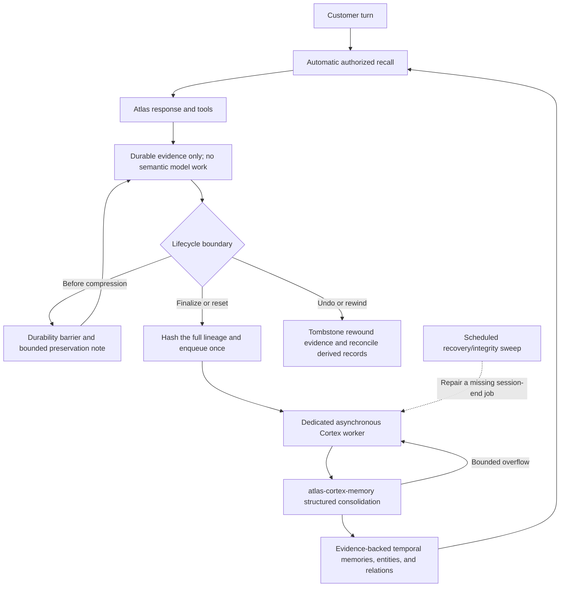

# Atlas Cortex: Customer and Operator Guide

Atlas Cortex is Atlas's native personal memory and knowledge-graph subsystem. It gives each customer agent a profile-scoped brain, captures source evidence durably as the conversation happens, recalls relevant context automatically, consolidates the complete logical-session lineage asynchronously when that session ends, and can search a separately governed Tekion GraphRAG index.

It complements the Atlas context engine; it does not replace it. The context engine keeps the current model window coherent, while Cortex preserves and retrieves information across compressions and sessions.

For the full design history and follow-on plan, see [Atlas Cortex Cognitive Memory and Knowledge Graph](plans/ATLAS_CORTEX_IMPLEMENTATION_PLAN.md).

## What an Atlas customer gets by default

Atlas-branded runtimes default to:

| Capability | Default |
|---|---|
| Cortex provider | Enabled |
| Turn capture | Enabled for user, assistant, and tool evidence |
| Automatic recall | Enabled, up to 8 items / 6,000 characters / 1 graph hop |
| Session-end consolidation | Enabled; one idempotent asynchronous chain per finalized logical session |
| Memory model | Dedicated, explicit route selected during first-run setup; never the chat model |
| Scheduled maintenance | Recovery and integrity only; no nightly semantic cycle |
| Tekion GraphRAG adapter | Enabled, but empty until an index is published |
| Local storage | Active profile's `cortex/cortex.db` |
| Raw Cortex evidence retention | `0`: retain until explicit policy/deletion |
| Context engine | Existing `compressor`; unchanged by Cortex |

Upstream Hermes remains opt-in. An explicit profile or managed configuration overrides product defaults.

Normal capture, recall, graph inspection, and health do not need a separate memory-service API key. Session-end consolidation needs the dedicated cheap-model route. Desktop first-run setup selects that route after the chat model and atomically assigns it to both Cortex consolidation passes. Self-managed setup uses a memory-specific catalog of reviewed structured-output models; it does not reuse the tool-filtered chat catalog. A Tekion index needs a separately built and approved artifact.

## Lifecycle



Important behavior:

- Recall is automatic and inserted into volatile turn context. Large graph snapshots are not placed in `SOUL.md` or the stable system prompt.
- User, assistant, and tool material retain source labels. Assistant output can be stored as history, but the consolidation validator will not promote assistant output as customer truth.
- Every completed turn performs durable capture only. It does not enqueue semantic work, invoke the memory model, or make the visible response wait for consolidation.
- When Cortex is active, Atlas suppresses the legacy mid-session frontier-model memory/skill review fork. Semantic memory judgment is owned exclusively by the dedicated cheap session-end worker; ordinary capture remains deterministic.
- Pre-compression evidence is durable before old context is summarized. The standard Atlas compressor receives a bounded deterministic preservation note identifying material worth carrying in the active window. Compression never invokes or enqueues semantic consolidation. Codex-native compaction currently exposes the durability hook but not a seam for injecting that note into its native summarizer.
- Required Cortex pre-compression capture is fail-closed. Atlas-controlled compaction does not rewrite or rotate the session when the durable write or provider rebind fails. Native Codex auto-compaction is only observable after Codex reports it, so Atlas cannot cancel that internal rewrite; a failed durability hook still fails the turn instead of being acknowledged, while completed turns were already captured synchronously.
- The Codex app-server runtime receives automatic Cortex recall through its native `additionalContext` field marked `untrusted`, while the persisted user row stays unchanged. Cortex controls are exposed through Codex dynamic tools and still receive authorization only from the authoritative current user row.
- Interrupted or errored Codex turns still capture the authoritative user row and any completed tool evidence, but partial assistant output is not promoted as a completed answer.
- Explicit finalization/reset is distinct from completing one response. Cortex atomically commits final evidence capture, an immutable `session_distill_admissions` boundary receipt, and exactly one admitted root job for the full-lineage identity. The dedicated cheap worker runs afterward and concurrently; the boundary itself never waits for a model response. Generic queue APIs cannot create semantic jobs, workers reject missing or broken admission/root/parent provenance before any model call, crash recovery replays only the exact recorded evidence epoch, and bounded overflow or deferred candidates use admission-scoped continuation jobs rather than truncating the session.
- True boundaries are an owned CLI/TUI/API/webhook/one-shot/ACP close, an explicit reset or replacement such as `/new`, and an owned gateway expiry. ACP reset rotates to a new internal head; ACP fork records child lineage without ending its source. Completing a response, pre-compression, resume, branch/fork, route handoff, model switching, a generic `AIAgent.close()`, cache eviction, and process shutdown are not proof that the customer ended the logical session and cannot authorize a new semantic chain.
- Desktop **New Chat** is wired to the canonical `session.close` boundary. The current transcript remains visible until the backend confirms finalization; a busy turn, failed close, or unconfirmed close fails closed. An unended stored transcript with no live runtime is eagerly rebuilt and finalized, an already-ended row resets locally without reopening it, and one stale renderer runtime can recover through the durable row. Profile switches, route recovery, archive, and privacy deletion use nonsemantic renderer resets and cannot accidentally admit session-end consolidation. Workspace and branch handoffs run only after the close succeeds; an unsent draft and its attachments remain untouched on failure and transfer to the fresh workspace on success. During the short post-close Git critical section the draft stays editable, but every submit/session-create path is blocked until the target workspace is ready, and competing session/profile destinations are rejected or invalidate any not-yet-started handoff.
- Gateway `/new` waits for an interrupted turn's synchronous capture before finalizing, and configured idle/daily reset expiry defers any session with a live turn. If an inbound message wins the race with the expiry watcher, the replacement session durably retains the exact predecessor ID and refuses new turn/routing work until that boundary is finalized and compare-and-cleared. Context-exhaustion reset uses the same fail-closed boundary. A successfully owned reset-policy transition is a true logical end; max-age-only routing retention is not. Max-age cleanup may drop only a stale routing entry and never runs hooks, creates a Cortex admission, or marks the SessionDB transcript ended. Gateway branches atomically record their Cortex parent while starting a new logical lineage, so late evidence cannot miss the immutable job and branch nodes do not appear as unrelated roots.
- Undo/rewind marks the affected Cortex evidence and unsupported derived records inactive so deleted conversation tails do not remain automatically recallable.

## Customer controls

Customers can speak naturally:

- “Remember that we always verify the stock number before desking.” creates a protected memory immediately.
- “Actually, correct that: we verify the VIN first.” lets Atlas supersede a prior memory while retaining temporal provenance.
- “Forget that preference.” permanently scrubs the selected Cortex memory, its linked Cortex evidence, and affected derived Cortex projections, while retaining only non-content audit counts.
- “Don't save this …” suppresses that turn from Cortex capture, including later checkpoint, compression, and finalize passes. Internal retry or verification scaffolding cannot clear that customer directive.
- “What do you remember about our delivery checklist?” uses automatic recall; Atlas also has a deep-recall tool for explicit tracing.

Current control boundary:

- Remember, correct, forget, and status are available through the agent's native Cortex control tool.
- Remember, correct, and forget require an explicit request in the current customer's own message. Model-authored arguments, recalled memory, plugin/tool text, fenced quotations, and hypothetical questions cannot authorize a memory mutation. Remembered content is taken from the authoritative user row rather than relabeling model-generated tool arguments as customer evidence.
- When `memory.write_approval: true`, Cortex uses the same approval flow as built-in memory. Interactive approval can be decided inline; background/gateway writes are staged under the active profile for `/memory pending`, `/memory approve <id>`, or `/memory reject <id>`. Pending directories/files use private permissions where supported.
- “Forget” performs permanent erasure inside the active profile's live Cortex store: linked evidence content, observations, work events, affected graph support/projections, summaries, retrieval traces, and SQLite free pages/WAL sidecars are scrubbed. The non-content audit receipt records counts, not the deleted text.
- Explicit session deletion through the native Atlas CLI, TUI/Desktop, session API, or dashboard first revokes queued session-end semantics and permanently scrubs raw and derived Cortex content for the matching logical lineage, including model-job payloads and SQLite free-space copies, then deletes the same complete compression/delegate transcript scope. Only non-content receipts and aggregate audit counts remain. A running semantic lease makes deletion fail closed and retryable; Atlas never summarizes a transcript immediately before deleting it. Retention pruning likewise refuses to split a compression lineage whose continuation survives.
- Cortex `forget` remains a record-level operation and does not delete an ordinary Atlas session transcript. Session deletion still cannot erase model-provider logs, external systems, or historical/offline backups; those domains require their own deletion and backup-rotation workflow, so this is not yet one cross-system legal-erasure transaction.
- “Don't save this” controls Cortex ingestion. It does not promise that the ordinary Atlas session store, provider logs, or external systems will not retain the chat. Those systems need their own retention/deletion policy.
- The desktop Cortex Starmap is currently an inspection surface. Correction, pin/privacy, permanent delete, merge/split, and export controls are not yet exposed there.

## Starmap and graph data

The desktop Starmap loads Cortex first and falls back to the legacy learning graph only if Cortex is unavailable or explicitly disabled. The current surface provides:

- radial chronological playback;
- typed personal, capability, and Tekion nodes and relations;
- node selection, bounded source evidence, neighbors, status, and privacy labels;
- an accessible non-canvas node list;
- memory/entity/job counts, Tekion index version, health refresh, and **Run recovery**;
- profile-switch request invalidation so stale graph results cannot populate another profile.

The graph overview never includes raw evidence or document bodies. Selecting one node performs a separate bounded detail request. Legacy Starmap share codes are disabled for Cortex graphs because the data is private and typed.

## Operator commands

All commands operate on the active Atlas profile and print JSON.

```bash
atlas cortex status
atlas cortex dream
atlas cortex dream --run-now
atlas cortex index list
atlas cortex index import 2026.07
atlas cortex index import 2026.07 --publish
atlas cortex index publish 2026.07
atlas cortex index rollback 2026.06
```

- `status` reports privacy-safe schema, counts, queue state, quality indicators, and active/latest GraphRAG state. It does not print the brain ID or database path.
- `dream` is a compatibility-named manual recovery/integrity command. `--run-now` drains a bounded deterministic-maintenance backlog until the exact job it requested reaches a terminal state, and exits nonzero unless that target succeeds; it never claims semantic session jobs and is not the normal session-end trigger.
- `index import` validates and stages an immutable version without changing retrieval. `--publish` atomically publishes it after staging.
- `publish` makes one staged version active and retains the former active version. `rollback` can reactivate a retained version.

`atlas doctor` also reports whether Cortex is configured, healthy, and accumulating queued work. Profile backup includes the Cortex database and directory.

## Configuration

Desktop setup is the normal configuration path. After choosing the conversational model, the customer confirms a separate memory model. The default self-managed OpenRouter shortlist is `google/gemini-3.1-flash-lite`, followed by `google/gemini-2.5-flash-lite` when the first model is the chat route or is unavailable. If chat uses Nous, Anthropic, or another provider, setup can connect an OpenRouter key for Cortex inline without changing the chat route. A reachable credential rejection is never saved; an unavailable live probe can fail soft, but setup advances only after a refreshed catalog proves that the exact provider is authenticated and exposes an eligible structured-output model.

The memory catalog requires authenticated, explicitly selectable structured JSON models rather than tool calling. Its live OpenRouter metadata cache preserves a missing/retired-model result for the cache interval instead of resurrecting a stale curated row. The save is one profile-scoped transaction for `cortex_triage` and `cortex_reasoning`, clears fallback chains and hidden task endpoint credentials, and rejects blank, `auto`, `main`, policy-disallowed, unavailable, unstructured, unauthenticated, or chat-identical routes. Desktop Settings and the native terminal model menu use the same catalog. Generic helper-model resets preserve both Cortex routes; a global Desktop reset preserves the verified profile route; and generic dashboard config writes fail closed if they would disable separation or replace it with an invalid route. An existing runtime-valid hand-authored route remains visible as an advanced route rather than being overwritten by first-run migration.

Desktop onboarding state is profile-scoped and backend-validated on every launch. Cached configuration is only a paint optimization: switching profiles invalidates in-flight provider/model requests, and a delayed response or completion animation cannot configure the wrong profile. The legacy unscoped cache migrates only to the default profile. Returning installs—including customers who previously chose “provider later”—enter visible Cortex setup whenever chat is ready but the dedicated memory route is invalid; only a previously verified profile may continue through a transient validation outage.

The managed `altas/atlas-cortex-memory` alias is offered only when the profile has a concrete control-plane and device/tenant/store/agent binding. Atlas branding or a managed-mode flag alone is not enough to expose an otherwise unroutable alias.

Edit the active profile's `config.yaml`. The complete defaults live in `hermes_cli/config.py`; a focused override looks like:

```yaml
cortex:
  enabled: true
  timezone: America/Los_Angeles
  capture:
    enabled: true
    assistant_evidence: true
    tool_evidence: true
    # 0 = retain until the customer deletes it; managed policy may set a window.
    raw_evidence_retention_days: 0
  recall:
    enabled: true
    max_items: 8
    max_chars: 6000
    graph_hops: 1
  dream:
    enabled: true
    local_time: "04:00"
    startup_catchup: true
  graphrag:
    enabled: true
    index_root: cortex/graphrag
    require_signature: true
  security:
    redact_secrets: true
    sensitive_requires_review: true
    approved_model_providers:
      - altas

memory:
  provider: cortex

auxiliary:
  cortex_triage:
    provider: altas
    model: atlas-cortex-memory
    fallback_chain: []
  cortex_reasoning:
    provider: altas
    model: atlas-cortex-memory
    fallback_chain: []
```

`atlas-cortex-memory` is the Atlas product default: a dedicated cheap utility alias, separate from the conversational frontier model. In a non-mock managed deployment, the control plane must map it to a privacy-approved structured-output model with `ATLAS_CORTEX_UPSTREAM_MODEL`; it fails closed when that mapping is absent and never falls through to the chat model. A self-managed local profile may explicitly replace both task routes with another approved cheap provider/model. `auto`, `main`, a blank model, and the exact conversational provider/model pair are rejected. Selecting Cortex also suppresses the legacy per-turn frontier review even if Cortex initialization is temporarily degraded. Keep API credentials in the existing provider/environment secret storage, not in the Cortex section. Managed Cortex jobs have their own bounded allowance of 20 requests and 80,000 requested output tokens, sized for the session-end batch and repair path; ordinary jobs retain the smaller eight-request/4,096-token limit.

The existing `cortex.dream.local_time` and `startup_catchup` keys now schedule deterministic recovery/integrity checkpoints only. They do not defer normal consolidation until that time and do not create a second semantic pass.

To disable Cortex for a profile explicitly:

```yaml
cortex:
  enabled: false
memory:
  provider: ""
```

Individual capture, recall, compatibility-named `dream` maintenance/session-end consolidation, and GraphRAG functions can also be disabled independently.

## Session-end consolidation, recovery, and no-model behavior

At logical session finalization, Cortex writes the whole compression-lineage snapshot, its immutable boundary admission, and one idempotent root `session_distill` job in the same SQLite transaction. Finalization then wakes a profile- and secret-scoped background supervisor; the session boundary does not wait for model completion. That dedicated worker, rather than the conversational agent or its frontier model, verifies the admission chain before sending bounded evidence to `atlas-cortex-memory`. It validates structured operations and commits each memory mutation with its receipt and audit row atomically. A job considers up to 100 due candidates in bounded prompt batches. If due candidates remain, it writes an idempotent continuation carrying the same admission and root, so nothing is silently dropped.

Foreground turn-start and pre-compression hooks never drain this queue. For managed Cortex, the authenticated Atlas worker detects the finalized-session job and sends a privacy-safe, versioned provenance envelope for the exact local job/admission/root, canonical input hash, attempt, due time, and dispatch-key commitment. The control plane persists that envelope in an idempotent dedicated `cortex.memory_maintenance` job after checking the current device, lease, assignment, subscription, and entitlement; generic admin queue/requeue routes cannot create or revive this capability. Once that job is claimed and policy-approved, the worker compares the claimed envelope with the exact next locally admitted job, binds the envelope and dispatch key into the immutable context-local authorization, and transactionally leases only that job. Every Cortex model request carries the same provenance, which the model endpoint compares in constant time with the persisted job before reserving usage. Legacy or tampered active jobs without valid provenance are terminally quarantined so they cannot poison the one-active-job lane. Rotating values are never written to `.env`, copied into process-global environment, attached to provider state, or retained on a cached client.

This is an official-runtime path binding, not remote attestation. The control plane proves that its claimed job, model request, and usage reservation all carry the same envelope, while the shipped worker proves that envelope against its owner-controlled Cortex database before execution. An already-compromised or malicious authenticated device could fabricate claims about its own local state; preventing that requires hardware/device attestation and proof-bound credentials beyond this local-first baseline.

For crash recovery, Cortex idempotently installs the compatibility-named profile cron `Atlas Cortex Dream (system)`, which invokes `scripts/atlas_cortex_wake.py` every 15 minutes. The no-agent script performs deterministic retention, reconciliation, lease recovery, integrity checkpoints, and repair of a missing canonical root exclusively from an already-committed boundary admission. Continuation recovery reads a bounded newest lane plus a rotating historical lane, advances its durable cursor only after the full page succeeds, and performs full provenance validation only for an actionable leaf. A crash or capacity deferral retries the same page; malformed leases and orphan continuations are repaired in bounded work. On a self-managed profile, a wake may resume the dedicated memory model for that exact previously admitted session-end chain after a crash or unavailable route; managed work still requires a fresh managed claim. The configured 04:00 local slot is an integrity marker, not a semantic cycle. Neither path can authorize a new semantic chain, invent a nightly memory interpretation, run the chat model, or treat compression as a session end. A multiplex gateway applies the same recovery checks to every served profile. Disabling the reserved cron opts out of that safety net; normal finalization remains the sole admission trigger.

On a managed Atlas profile, gateway startup enumerates every profile it serves and reattaches the profile-local maintenance poller even when no foreground agent has been constructed since reboot. This one-shot recovery reads only the stable device/control-plane binding; it excludes chat-provider credentials and never persists or replays request claims. The poller asks the control plane for a fresh device lease and exact maintenance claim per semantic unit, so already-admitted session-end work resumes automatically after a device restart without weakening the no-agent scheduler boundary or requiring a customer-managed `atlas-control worker --watch` process.

Legacy job types named `dream`, `dream_cycle`, and `precompress_distill` are treated as deterministic recovery checkpoints. Only `session_distill` can enter the model-backed consolidation path.

If no explicit privacy-approved model route is available:

- turn capture, lexical/graph recall, GraphRAG retrieval, health, and visualization continue;
- finalized-session model work remains durable in the queue at attempt zero;
- the process-local consolidation supervisor does not start;
- Cortex does not try another provider;
- deterministic reconciliation and configured retention still run;
- a later valid configuration resumes the same session-end consolidation chain.

Model failures produce retry/dead-letter and health records rather than ungrounded memory writes. Deferred unresolved candidates receive bounded exponential backoff so they do not starve newer session work.

## Tekion GraphRAG artifacts

Cortex does not build Microsoft GraphRAG during a conversation. Build and evaluate the corpus offline, then place one immutable version directory under the configured `cortex.graphrag.index_root` (default: the active profile's `cortex/graphrag`). Import paths, including absolute paths, must resolve inside that root; symlinks and path traversal are rejected.

Supported formats:

- `atlas-cortex-graphrag-jsonl`: portable JSON or JSONL record streams;
- `microsoft-graphrag`: current Microsoft GraphRAG JSON outputs and Parquet when a compatible engine is installed.

Every artifact contains `manifest.json`. A minimal portable manifest is:

```json
{
  "schema_version": 1,
  "format": "atlas-cortex-graphrag-jsonl",
  "version": "2026.07",
  "knowledge_space": "tekion",
  "files": [
    {
      "path": "documents.jsonl",
      "role": "documents",
      "sha256": "<64 lowercase hex characters>",
      "size": 12345
    },
    {
      "path": "entities.jsonl",
      "role": "entities",
      "sha256": "<64 lowercase hex characters>",
      "size": 4567
    },
    {
      "path": "relationships.jsonl",
      "role": "relationships",
      "sha256": "<64 lowercase hex characters>",
      "size": 3456
    },
    {
      "path": "communities.jsonl",
      "role": "communities",
      "sha256": "<64 lowercase hex characters>",
      "size": 2345
    }
  ]
}
```

At least a `documents` or `text_units` role is required. Each listed file and the aggregate bundle are size-bounded and SHA-256 verified before import and revalidated before publication. Atlas copies regular files through no-follow descriptors into a private verified snapshot, then parses only those verified bytes. Parquet row/cell/content/Python-expansion budgets are enforced and nested or repeated schemas are rejected before materialization. A version cannot be re-imported with different content.

### Signing

Local profiles may opt into Ed25519 signatures with `cortex.graphrag.require_signature: true`. Managed mode requires a signature regardless of that local value.

Trusted public keys come from the environment variable named by `cortex.graphrag.trusted_public_keys_env` (default `ATLAS_CORTEX_GRAPHRAG_PUBLIC_KEYS`). Its value is a JSON object from key ID to either a PEM Ed25519 public key or URL-safe base64 raw public-key bytes:

```json
{"tekion-prod-2026":"<base64 Ed25519 public key>"}
```

Add this detached signature object to the manifest:

```json
{
  "signature": {
    "algorithm": "ed25519",
    "key_id": "tekion-prod-2026",
    "value": "<URL-safe base64 signature>"
  }
}
```

The signature covers canonical JSON for the entire manifest with the `signature` member removed. File bytes are covered indirectly through the signed manifest's SHA-256 and size entries. Keep private signing keys outside Atlas; distribute only trusted public keys to customer agents.

Publishing projects documents, entities, relations, and communities transactionally and moves the active pointer. Core and live-FTS projection attestations are checked on publish, rollback, and startup; missing/tampered retained projections fail closed, and a bad active projection is quarantined and removed from retrieval. Retrieval uses only the attested active version. Community reports are labeled as derived/inferred and retain index provenance; source documents remain the evidence for consequential Tekion instructions.

## HTTP API

The current authenticated/profile-scoped web surface is:

| Method | Path | Purpose |
|---|---|---|
| `GET` | `/api/cognitive/graph` | Bounded typed overview; supports projection, cursor, domain, type/status, and retrieval-run filters |
| `GET` | `/api/cognitive/node/{id}` | One node with bounded provenance and neighbors |
| `GET` | `/api/cognitive/health` | Privacy-safe store, job, quality, and GraphRAG status |
| `POST` | `/api/cognitive/dream/run` | Queue compatibility-named deterministic recovery for the selected profile |
| `GET` | `/api/cognitive/dream/{job_id}` | Read one profile-scoped job status |

Requests may select a valid Atlas profile where the host UI already permits it, but cannot submit or override a brain ID. There are no public correction/delete/merge/split Cortex HTTP routes in the baseline.

## Privacy and security boundary

- One local profile owns one local brain. The database is created with mode `0600` and its Cortex directory with mode `0700` where the operating system permits it. Database/index/script symlinks and paths outside the active profile are rejected.
- Local profile separation is a useful storage/UX boundary, not OS-level multi-tenant authorization. Do not give mutually untrusted customers access to the same OS account.
- Managed mode resolves the brain only from deployment-controlled identity. It fails closed without the required customer or tenant/store/agent context, requires signed GraphRAG artifacts, and restricts personal-evidence model work to the authorized Atlas gateway.
- Secrets and obvious credentials are redacted before storage where configured. Tool output and imported documents remain untrusted evidence, never policy or authorization instructions.
- Authorization filters select allowed knowledge spaces before recall ranking. Personal content is not promoted into the shared Tekion index.
- Raw retention greater than zero scrubs eligible expired Cortex evidence, hot observations, full-text rows, and query previews during deterministic maintenance, independent of model availability or success, while retaining non-content receipts. Protected/catalog/legal-hold classes are excluded.
- SQLite content is not application-level encrypted by Cortex. Use full-disk encryption and appropriate account/device controls for the dedicated computer. Managed database encryption and formal legal erasure remain production work.

## Current limitations

- There is no bundled or live Tekion corpus. GraphRAG health remains unpublished until an operator supplies and publishes an approved artifact.
- Cortex is a typed temporal knowledge graph with GraphRAG retrieval. It is **not** a graph neural network and does not train a GNN.
- The local baseline supports SQLite only. Configuring another backend fails clearly; the managed Postgres/service adapter is not present here.
- Personal retrieval currently uses full-text/lexical matching plus typed graph and GraphRAG community channels. Personal embeddings, cross-encoder reranking, and production quality A/B gates remain future work.
- Codex-native automatic compaction does not currently accept the standard compressor's Cortex preservation note. Completed turns are synchronously durable before the event, and explicit Codex compaction is protected by the fail-closed boundary hook.
- The Starmap does not yet provide all planned projections, search/filter expansion, answer-path inspection, mutations, or Obsidian export.
- Live Cortex-local permanent erasure is implemented, including affected derived Cortex artifacts and database free-space cleanup. Native explicit session deletion coordinates the local Cortex lineage with the corresponding ordinary session-history scope. Provider logs, external systems, and historical/offline backups remain separate deletion domains and are not yet one customer-facing legal-erasure transaction.
- A valid `atlas-cortex-memory` route is required for session-end semantic promotion. Running capture without one is safe and useful, but finalized-session observations can accumulate until that dedicated route is configured.
