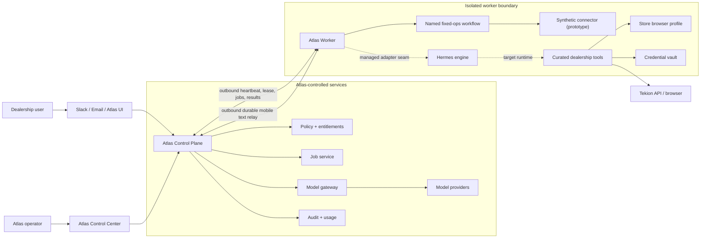
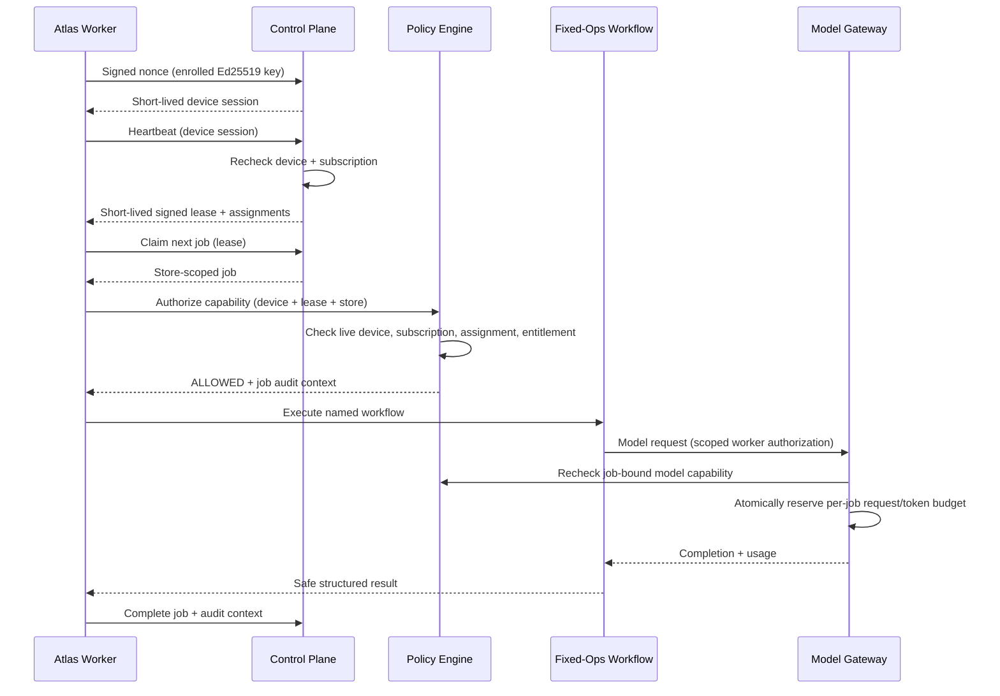
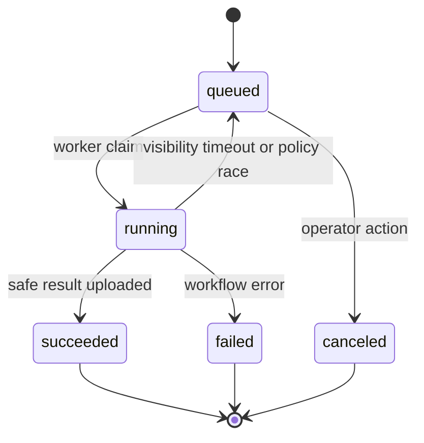

# Atlas Architecture

## Status

- Stage: prototype
- Architecture owner: Atlas platform team
- Upstream engine baseline: Hermes Agent
  `a7f65e3bcd937cd095ba599ab5927af2093a0d95`
- Primary deployment: one local worker per store/credential boundary
- Prototype persistence: SQLite
- Production persistence target: PostgreSQL

## System context



## Trust boundaries

1. **Control Plane boundary.** Authoritative identity, subscription,
   entitlement, policy, job, usage, and audit state lives here.
2. **Worker boundary.** The local machine may be inspected or modified by its
   administrator. Its credential is scoped and revocable.
3. **Engine boundary.** Hermes is a single-tenant execution engine. It is not
   used as a multi-tenant isolation mechanism.
4. **Connector boundary.** Raw dealer credentials and browser sessions are
   available only to trusted connector code.
5. **Provider boundary.** Model-provider master credentials remain behind the
   Atlas Model Gateway.

## Runtime sequence

The lease/job path below is the current worker runtime. The Ed25519 proof and
device-session prelude is an implemented Control Plane/client contract exercised
end to end by WS-05 tests; the existing Desktop supervisor still uses the
compatibility bearer until its follow-up integration.



## Component responsibilities

### Control Plane API

- Verifies provider-neutral browser identity assertions through an injected
  adapter, then reloads live user, membership, role, and store grants.
- Creates short-lived, one-time enrollment transactions without accepting a
  tenant from the client.
- Registers Ed25519 public keys for phone or worker devices, rejects proof
  replay, rotates keys, and revokes devices with a live credential-version
  check.
- Authenticates worker devices.
- Issues and validates short-lived leases.
- Derives tenant identity from the authenticated device.
- Persists and serves stores, assignments, subscriptions, and entitlements.
- Evaluates deterministic policy.
- Dispatches and tracks jobs.
- Exposes the OpenAI-compatible model-gateway contract.
- Enforces one running claim per device, recovers stale claims after a bounded
  visibility timeout, and invalidates every superseded claim token.
- Atomically reserves per-job model-request and requested-output-token budgets
  before a provider call.
- Persists safe usage and audit records.
- Pairs one enrolled phone with one exact worker/store/agent boundary and
  persists encrypted, idempotent text commands plus ordered replay events.
- Serves the localhost Control Center in the prototype.

### Atlas Worker supervisor

- The current compatibility worker reads the prototype bearer from
  `ATLAS_DEVICE_TOKEN`. Newly enrolled workers instead generate an Ed25519 key,
  retain the private key in the OS vault, sign a fresh session challenge, and
  keep only the returned short-lived device session in process memory. Wiring
  that client flow into Desktop is the integration step after WS-05.
- Sends heartbeats and maintains the current lease.
- Claims only jobs assigned by the control plane.
- Builds immutable `ManagedContext` values.
- Calls policy before connector or model use.
- Dispatches named workflow implementations.
- Converts a finalized-session Cortex job into an idempotent
  `cortex.memory_maintenance` control-plane job carrying a strict provenance
  envelope, binds its lease/claim to an exact static profile identity, matches
  the claimed envelope to the exact next locally admitted job, and
  transactionally leases only that memory job.
- Reports job transitions and safe diagnostics.
- Runs the fixture-backed fixed-ops workflow and native Cortex maintenance
  directly in this walking skeleton.
- The M02 relay connector proves its enrolled Ed25519 key, opens an outbound
  WebSocket, durably stores commands before acknowledgement, and translates
  only three command types through a loopback-only gateway adapter. It does not
  expose the Desktop JSON-RPC registry to a phone.

### Cortex memory lifecycle

Cortex separates durability from interpretation. Each completed user,
assistant, or tool turn is synchronously appended to the profile store, but no
memory model runs and no semantic job is enqueued from the turn path.
Compression adds only a durability barrier and deterministic preservation note;
every physical session produced by repeated compression retains the same
logical-conversation lineage.

Only an explicit logical finalization/reset creates the initial model-backed
job. Cortex hashes the complete lineage and idempotently enqueues one
`session_distill` chain, then wakes a dedicated asynchronous worker. That worker
uses the cheap `atlas-cortex-memory` route, never the conversational model. It
processes at most 100 due observations per job in bounded batches and emits a
lineage-scoped continuation when overflow remains. Scheduled wakeups and the
legacy-named 04:00 `dream_cycle` marker perform recovery, retention, and
integrity work only; they may repair a missing canonical finalization job but
do not create an independent nightly semantic pass. On a self-managed profile,
a wake may resume the dedicated memory model for that exact previously admitted
session-end chain after a crash or unavailable route; this is retry execution,
not new semantic authority.

### Managed Hermes adapter

The current adapter surface contains:

- An Atlas model-provider plugin for the server-side model gateway.
- A mandatory managed policy guard before upstream tool dispatch.
- Immutable request-local managed authorization; rotating job values never
  enter process-global environment or the profile `.env`.
- Focused tests proving managed mode cannot bypass that guard through skip
  flags or alternate dispatch paths.

The native Cortex runtime starts one profile-local managed maintenance
supervisor whenever a complete device/store/agent binding is present. It keeps
only the device credential needed to request work and obtains a fresh control-
plane lease and exact `cortex.memory_maintenance` claim for every semantic
unit. Gateway startup reattaches this supervisor for every served managed
profile, so already-admitted session-end work resumes after a reboot without a
foreground chat turn. Customers do not launch `atlas-control worker --watch`
separately.

The Cortex dispatch envelope contains only local job/admission/root IDs, a
canonical input hash, attempt, due time, schema version, and dispatch-key
commitment. The control plane persists it in the dedicated job payload;
generic admin queue/requeue paths reject the Cortex capability. Claim and model
paths require a matching dedicated admission ledger row and valid payload. The
provider sends the exact envelope and key in request-local headers, and the
model endpoint compares them with the persisted payload before and again
during atomic usage reservation. Invalid legacy/tampered active jobs are
quarantined rather than returned to the queue.

This binds the shipped runtime path; it is not remote attestation. The server
trusts an authenticated assigned device's statement that the opaque local IDs
refer to its owner-controlled Cortex database. Hardware-backed attestation is
required to prove that local database state to the server against a malicious
or compromised device.
Independent engine-process supervision for the broader curated tool runtime
remains a later deployment milestone.

Only the minimum fail-closed hook belongs in upstream execution code. Billing,
Tekion behavior, customer UI, and product policy remain in Atlas modules.

### Fixed-ops workflow pack

The prototype contains one named capability:

```text
fixed_ops.daily_report
```

It accepts an authenticated store context, reads fixture-backed data through a
connector interface, computes deterministic metrics, optionally requests a
manager summary through the model gateway, and returns a structured report.
The connector interface is the future seam for Tekion API and browser
automation.

## Data model

All store-scoped records include a tenant relationship. Repository methods
must scope by the authenticated tenant before store, device, agent, job, or
usage identifiers.

Core records:

- `tenants`
- `stores`
- `subscriptions`
- `devices`
- `agents`
- `entitlements`
- `jobs`
- `usage_events`
- `audit_logs`

Prototype schema and migrations live with `altas/control_plane`. SQLite is
selected for zero-friction testing, not as a statement about production
concurrency.

## API contract

### Worker surface

```text
POST /api/v1/worker/heartbeat
POST /api/v1/worker/policy/evaluate
GET  /api/v1/worker/jobs/next
POST /api/v1/worker/jobs/{job_id}/complete
```

Worker calls use `Authorization: Bearer <device-secret>`. Lease-protected
calls also supply the signed lease returned by heartbeat in `X-Atlas-Lease`.
The job claim response contains a one-time `claim_token`; the completion body
must return it, preventing another attempt from completing the job. Policy and
model calls also carry it as `X-Atlas-Claim-Token`, binding all paid execution
to the exact active attempt. Scoped calls carry tenant, store, agent, and job
headers derived from `ManagedContext`.

### Model gateway

```text
GET  /v1/models
POST /v1/chat/completions
```

The contract is intentionally OpenAI-compatible so the Hermes engine can use a
small provider profile. The server rechecks live device state and never returns
its upstream provider credential. Chat completion requests must include the
claimed running job in `X-Atlas-Job-ID`; idle or foreign jobs are denied. The
job must explicitly declare `model.chat` as a static workflow dependency. The
prototype defaults to eight requests and 4,096 requested output tokens per
ordinary job. The dedicated `cortex.memory_maintenance` job instead receives a
separate, bounded 20-request/80,000-token allowance sized for the session-end
batch and repair path; it cannot spend that allowance through the
conversational model. Each request is limited to one completion, 128 messages,
64 KiB per message, and 256 KiB total; unknown provider extensions are
rejected. Quota configuration is documented in `.env.atlas.example`.

### Development admin surface

```text
GET  /api/v1/admin/overview
GET  /api/v1/admin/{tenants|stores|devices|agents|jobs|usage_events|audit_logs}
POST /api/v1/admin/jobs
POST /api/v1/admin/devices/{device_id}/toggle
```

This surface is localhost-only and protected by a shared development bearer in
the prototype. That token is not production identity. Production requires real
operator authentication, tenant-aware RBAC, CSRF protection, rate limiting,
and separate customer/operator applications.

In demo mode only, the same localhost/admin boundary exposes
`POST /api/v1/dev/identity/token`. It mints a short-lived deterministic identity
assertion for an already seeded subject. The route is absent outside demo mode;
production supplies an OIDC verifier through the provider-neutral identity
boundary.

## Job state machine



Transitions are server validated and idempotent where possible. A job contains
one tenant, one store, one assigned worker/agent, one named workflow, and one
job identifier that serves as the prototype correlation key. Each claim creates
a one-time attempt token required for success or failure completion. A device
holds at most one running claim.
When the visibility timeout expires, the old token is invalidated before the
job can be reclaimed. Disabling a device atomically cancels its queued and
running work.

## Production evolution

The prototype contract should survive these replacements:

| Prototype | Production target |
|---|---|
| SQLite | PostgreSQL with migrations and backups |
| Database polling | Queue/Temporal after workflow requirements stabilize |
| Ed25519 enrollment and proof-bound sessions; legacy bearer-token compatibility | Hardware/OS-bound key plus platform attestation where justified |
| Localhost admin | Authenticated, RBAC-protected operator console |
| Deterministic model | Server-side OpenAI-compatible provider adapters |
| Fixture connector | Authorized Tekion API/browser connectors |
| Manual start | Signed desktop installer and managed service |
| Single process | Horizontally scaled stateless APIs |

## Architecture rules

1. No control-plane credential enters the worker.
2. No raw dealer credential enters a prompt, audit event, or report.
3. No request body selects its own tenant.
4. No policy decision is delegated to a model.
5. No managed tool executes when policy is unreachable.
6. No generic engine updater runs on a customer deployment.
7. No customer-facing Atlas capability depends on a mutable upstream name.
