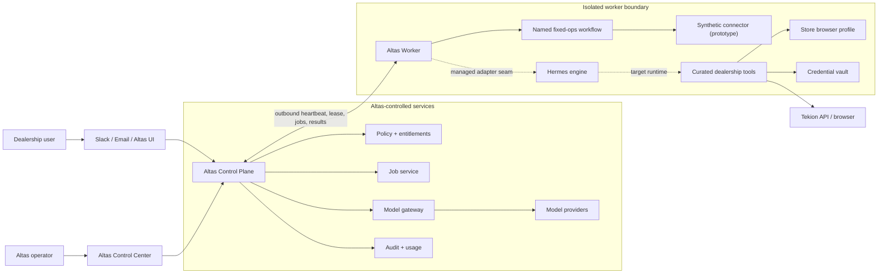
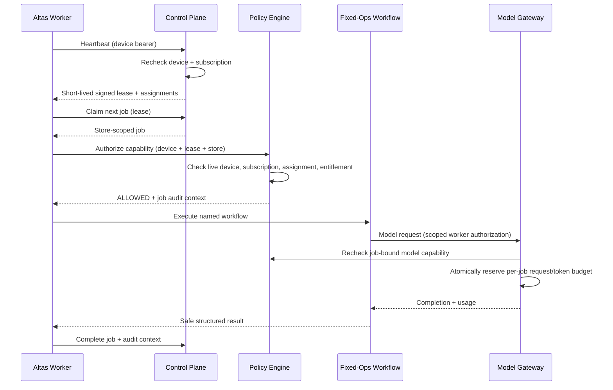
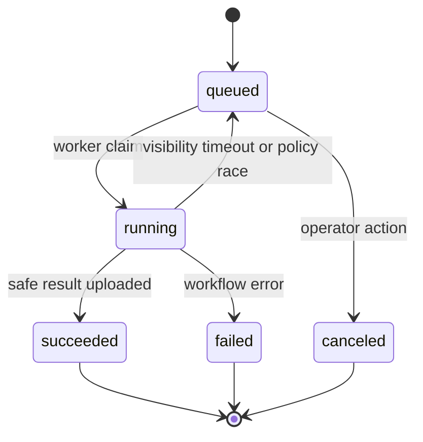

# Altas Architecture

## Status

- Stage: prototype
- Architecture owner: Altas platform team
- Upstream engine baseline: Hermes Agent
  `a7f65e3bcd937cd095ba599ab5927af2093a0d95`
- Primary deployment: one local worker per store/credential boundary
- Prototype persistence: SQLite
- Production persistence target: PostgreSQL

## System context



## Trust boundaries

1. **Control Plane boundary.** Authoritative identity, subscription,
   entitlement, policy, job, usage, and audit state lives here.
2. **Worker boundary.** The local machine may be inspected or modified by its
   administrator. Its credential is scoped and revocable.
3. **Engine boundary.** Hermes is a single-tenant execution engine. It is not
   used as a multi-tenant isolation mechanism.
4. **Connector boundary.** Raw dealer credentials and browser sessions are
   available only to trusted connector code.
5. **Provider boundary.** Model-provider master credentials remain behind the
   Altas Model Gateway.

## Runtime sequence



## Component responsibilities

### Control Plane API

- Authenticates worker devices.
- Issues and validates short-lived leases.
- Derives tenant identity from the authenticated device.
- Persists and serves stores, assignments, subscriptions, and entitlements.
- Evaluates deterministic policy.
- Dispatches and tracks jobs.
- Exposes the OpenAI-compatible model-gateway contract.
- Enforces one running claim per device, recovers stale claims after a bounded
  visibility timeout, and invalidates every superseded claim token.
- Atomically reserves per-job model-request and requested-output-token budgets
  before a provider call.
- Persists safe usage and audit records.
- Serves the localhost Control Center in the prototype.

### Altas Worker supervisor

- Reads the prototype device bearer from `ALTAS_DEVICE_TOKEN`; moving device
  identity into the OS vault is a production milestone.
- Sends heartbeats and maintains the current lease.
- Claims only jobs assigned by the control plane.
- Builds immutable `ManagedContext` values.
- Calls policy before connector or model use.
- Dispatches named workflow implementations.
- Reports job transitions and safe diagnostics.
- Runs the fixture-backed fixed-ops workflow directly in this walking skeleton.

### Managed Hermes adapter

The current adapter surface contains:

- An Altas model-provider plugin for the server-side model gateway.
- A mandatory managed policy guard before upstream tool dispatch.
- Focused tests proving managed mode cannot bypass that guard through skip
  flags or alternate dispatch paths.

The next runtime milestone is an Altas supervisor that starts one engine
process per store/credential boundary with an isolated internal data directory,
the Altas provider profile, and a curated toolset. That process launch is not
part of the current fixture-backed worker.

Only the minimum fail-closed hook belongs in upstream execution code. Billing,
Tekion behavior, customer UI, and product policy remain in Altas modules.

### Fixed-ops workflow pack

The prototype contains one named capability:

```text
fixed_ops.daily_report
```

It accepts an authenticated store context, reads fixture-backed data through a
connector interface, computes deterministic metrics, optionally requests a
manager summary through the model gateway, and returns a structured report.
The connector interface is the future seam for Tekion API and browser
automation.

## Data model

All store-scoped records include a tenant relationship. Repository methods
must scope by the authenticated tenant before store, device, agent, job, or
usage identifiers.

Core records:

- `tenants`
- `stores`
- `subscriptions`
- `devices`
- `agents`
- `entitlements`
- `jobs`
- `usage_events`
- `audit_logs`

Prototype schema and migrations live with `altas/control_plane`. SQLite is
selected for zero-friction testing, not as a statement about production
concurrency.

## API contract

### Worker surface

```text
POST /api/v1/worker/heartbeat
POST /api/v1/worker/policy/evaluate
GET  /api/v1/worker/jobs/next
POST /api/v1/worker/jobs/{job_id}/complete
```

Worker calls use `Authorization: Bearer <device-secret>`. Lease-protected
calls also supply the signed lease returned by heartbeat in `X-Altas-Lease`.
The job claim response contains a one-time `claim_token`; the completion body
must return it, preventing another attempt from completing the job. Policy and
model calls also carry it as `X-Altas-Claim-Token`, binding all paid execution
to the exact active attempt. Scoped calls carry tenant, store, agent, and job
headers derived from `ManagedContext`.

### Model gateway

```text
GET  /v1/models
POST /v1/chat/completions
```

The contract is intentionally OpenAI-compatible so the Hermes engine can use a
small provider profile. The server rechecks live device state and never returns
its upstream provider credential. Chat completion requests must include the
claimed running job in `X-Altas-Job-ID`; idle or foreign jobs are denied. The
job must explicitly declare `model.chat` as a static workflow dependency. The
prototype defaults to eight requests and 4,096 requested output tokens per
job. Each request is limited to one completion, 128 messages, 64 KiB per
message, and 256 KiB total; unknown provider extensions are rejected. Quota
configuration is documented in `.env.altas.example`.

### Development admin surface

```text
GET  /api/v1/admin/overview
GET  /api/v1/admin/{tenants|stores|devices|agents|jobs|usage_events|audit_logs}
POST /api/v1/admin/jobs
POST /api/v1/admin/devices/{device_id}/toggle
```

This surface is localhost-only and protected by a shared development bearer in
the prototype. That token is not production identity. Production requires real
operator authentication, tenant-aware RBAC, CSRF protection, rate limiting,
and separate customer/operator applications.

## Job state machine



Transitions are server validated and idempotent where possible. A job contains
one tenant, one store, one assigned worker/agent, one named workflow, and one
job identifier that serves as the prototype correlation key. Each claim creates
a one-time attempt token required for success or failure completion. A device
holds at most one running claim.
When the visibility timeout expires, the old token is invalidated before the
job can be reclaimed. Disabling a device atomically cancels its queued and
running work.

## Production evolution

The prototype contract should survive these replacements:

| Prototype | Production target |
|---|---|
| SQLite | PostgreSQL with migrations and backups |
| Database polling | Queue/Temporal after workflow requirements stabilize |
| Hashed bearer device secret | Hardware/OS-bound asymmetric device identity |
| Localhost admin | Authenticated, RBAC-protected operator console |
| Deterministic model | Server-side OpenAI-compatible provider adapters |
| Fixture connector | Authorized Tekion API/browser connectors |
| Manual start | Signed desktop installer and managed service |
| Single process | Horizontally scaled stateless APIs |

## Architecture rules

1. No control-plane credential enters the worker.
2. No raw dealer credential enters a prompt, audit event, or report.
3. No request body selects its own tenant.
4. No policy decision is delegated to a model.
5. No managed tool executes when policy is unreachable.
6. No generic engine updater runs on a customer deployment.
7. No customer-facing Altas capability depends on a mutable upstream name.
