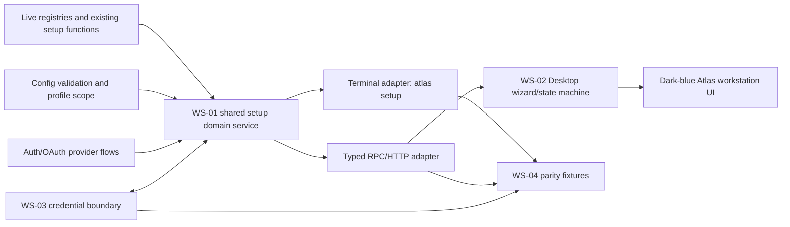

# Atlas Desktop setup parity contract

## Status and authority

- Workstream: WS-00
- Audited: 2026-07-18
- Code baseline: `origin/main` on `codex/ws-00-setup-parity-contract`
- Scope: discovery and specification only; no setup implementation is changed here
- Product direction: complete terminal-to-Desktop functional parity before any managed commercial simplification

This is the authoritative contract for WS-01 through WS-04. It records both:

1. **Current behavior**: what the checked-in terminal and Desktop code actually does.
2. **Required parity behavior**: the common behavior that terminal and Desktop must obtain from one shared setup implementation.

When those differ, the difference is called out as a **parity blocker**. Future
managed dealership defaults in [SETUP_DEFAULTS.md](SETUP_DEFAULTS.md) are
proposals, not permission to remove, hide, or preselect a current choice.

The word **choice** below means a reachable decision, including advanced,
plugin-provided, platform-gated, and current-value/keep-existing decisions. A
catalog may recommend or group choices, but it must not freeze a changing
provider, model, platform, tool, skill, plugin, MCP, or memory count.

## Audited source map

| Concern | Current source of truth |
| --- | --- |
| Setup parser, flags, Atlas `--portal` gate | [`hermes_cli/subcommands/setup.py`](../../hermes_cli/subcommands/setup.py) |
| Setup modes, section order, defaults, summaries, migration | [`hermes_cli/setup.py`](../../hermes_cli/setup.py) |
| Provider picker and auxiliary model routing | [`hermes_cli/main.py`](../../hermes_cli/main.py) |
| Provider-specific authentication and model flows | [`hermes_cli/model_setup_flows.py`](../../hermes_cli/model_setup_flows.py) |
| Canonical/dynamic model providers | [`hermes_cli/models.py`](../../hermes_cli/models.py), [`hermes_cli/provider_catalog.py`](../../hermes_cli/provider_catalog.py), [`hermes_cli/auth.py`](../../hermes_cli/auth.py) |
| Toolsets, tool providers, model catalogs, post-setup hooks | [`hermes_cli/tools_config.py`](../../hermes_cli/tools_config.py), [`toolsets.py`](../../toolsets.py) |
| Gateway platform discovery, prompts, service lifecycle | [`hermes_cli/gateway.py`](../../hermes_cli/gateway.py), [`gateway/platform_registry.py`](../../gateway/platform_registry.py), [`plugins/platforms/`](../../plugins/platforms/) |
| Skills, plugins, MCP, and memory companion flows | [`hermes_cli/skills_config.py`](../../hermes_cli/skills_config.py), [`hermes_cli/plugins_cmd.py`](../../hermes_cli/plugins_cmd.py), [`hermes_cli/mcp_config.py`](../../hermes_cli/mcp_config.py), [`hermes_cli/memory_setup.py`](../../hermes_cli/memory_setup.py) |
| Config, environment, validation, profile scope | [`hermes_cli/config.py`](../../hermes_cli/config.py), [`hermes_constants.py`](../../hermes_constants.py) |
| OAuth/auth storage | [`hermes_cli/auth.py`](../../hermes_cli/auth.py) and provider flow modules |
| Existing TUI gateway setup checks | [`tui_gateway/server.py`](../../tui_gateway/server.py) |
| Existing reusable Desktop REST seams | [`hermes_cli/web_server.py`](../../hermes_cli/web_server.py), [`apps/desktop/src/hermes.ts`](../../apps/desktop/src/hermes.ts) |
| Current Desktop onboarding state/UI | [`apps/desktop/src/store/onboarding.ts`](../../apps/desktop/src/store/onboarding.ts), [`apps/desktop/src/components/onboarding/`](../../apps/desktop/src/components/onboarding/) |

## Non-negotiable invariants

1. Terminal and Desktop render one backend-owned graph. React may own layout,
   focus, accessibility, and copy, but not provider lists, defaults, platform
   gates, validation rules, or persistence rules.
2. Every operation is scoped to the captured Atlas home/profile for its entire
   lifetime. A profile switch cannot retarget a running setup or OAuth flow.
3. Ordinary configuration, secrets, and OAuth/device credentials are three
   distinct data classes and three distinct write paths.
4. No raw existing secret is returned by catalog, snapshot, validation,
   summary, error, log, event, or cancellation responses.
5. The system prompt and current conversation tool schema are not rebuilt as a
   side effect of browsing setup. Changes take effect on the next session or an
   explicit reload/restart path already required by the feature.
6. Catalogs are generated at session start from the live registries and
   capability gates. A catalog revision mismatch invalidates a stale apply.
7. Current-value behavior is explicit: unchanged fields are omitted from the
   patch; blank secret inputs mean keep existing unless the user invokes a
   separate remove action.
8. Cancellation stops future work and cancels owned long-running operations.
   It never claims to undo an external effect it cannot reverse.
9. Backup and recovery state are created before destructive config changes.
10. Managed mode remains fail-closed: setup cannot mutate administrator-owned
    config or credentials.

## Current terminal setup graph

```mermaid
flowchart TD
    A[atlas setup parser] --> B[run_setup_wizard]
    B --> C{managed install?}
    C -- yes --> C1[deny mutation]
    C -- no --> D[ensure profile home]
    D --> E[current code: reset if requested]
    E --> F[current code: back up config.yaml]
    F --> G{interactive TTY?}
    G -- no --> G1[print guidance and return]
    G -- yes --> H{section supplied?}
    H -- yes --> H1[run one of six sections]
    H -- no --> I{existing provider detected?}
    I -- yes + --quick --> I1[missing-items-only]
    I -- yes --> J[full reconfigure]
    I -- no --> K[optional OpenClaw migration]
    K --> L{Atlas brand?}
    L -- yes --> L1[Full or Blank Slate]
    L -- no --> L2[Nous Quick, Full, or Blank Slate]
    J --> M[model]
    L1 -- Full --> M
    L2 -- Full --> M
    M --> N[terminal]
    N --> O[fresh only: silent agent defaults]
    O --> P[gateway]
    P --> Q[tools]
    Q --> R[save + backup hint + summary]
    L1 -- Blank --> S[minimal or walkthrough]
    L2 -- Blank --> S
    L2 -- Quick --> T[Nous OAuth/model]
    T --> N
```

The graph exposes two important facts:

- `SETUP_SECTIONS` contains model, TTS, terminal, gateway, tools, and agent,
  but the current Full path calls model, terminal, gateway, and tools only.
- The implemented first-run Quick path is Nous-specific and is hidden when the
  process is Atlas-branded.

## Common lifecycle contract

| Decision or phase | Current terminal behavior | Required shared behavior |
| --- | --- | --- |
| Brand/profile | `atlas` selects `~/.atlas`; profile-aware helpers select the active home. Some setup copy remains hard-coded to Hermes. | Session creation captures `brand`, `profile`, and absolute home. All later operations reject a different scope. All user-visible copy is backend-neutral or Atlas-branded. |
| Managed mode | `run_setup_wizard` exits through `managed_error`. Config/env writers also reject managed keys. | Catalog marks the session read-only and explains the administrator-owned fields. Apply and secret/OAuth mutations fail with structured `managed_scope` errors. |
| Reset | `--reset` saves `DEFAULT_CONFIG` before the backup is made. It can mutate even when the command later discovers no TTY. | Confirm reset, make the pre-reset backup first, validate the default document, then apply. Reset must not occur merely by opening a noninteractive session. This is a parity blocker in current terminal code. |
| Backup | Best-effort timestamped copy of `config.yaml` only. The path is printed only after the normal Full path. | Snapshot records a pre-apply config backup for every mutating mode/section. Summary always reports its path and scope. Secret/auth stores are not falsely described as covered. |
| Noninteractive | `--non-interactive` or no TTY prints guidance and returns, after current reset/backup processing. | Desktop never routes through terminal TTY detection. A headless API session returns `interactive_required` without mutation. Terminal keeps a guidance-only adapter. |
| Existing install | Current detection is limited to `OPENROUTER_API_KEY`, `OPENAI_BASE_URL`, or an active auth provider. | One shared dynamic installation-state function uses the provider/auth registries and valid model config. Both surfaces use its result. The current narrow test is a parity blocker. |
| OpenClaw migration | Fresh-only offer when `~/.openclaw` exists; preview, high-impact warnings, default-no confirmation, non-overwriting migration including secrets, report, then optional per-section skip. | Expose migration as a catalog-gated operation with preview, explicit confirmation, progress, report, and the same non-overwrite rules. Never return migrated secret values. |
| Section-only | `atlas setup model|tts|terminal|gateway|tools|agent`; saves afterward and prints a short completion message. | All six section sessions remain directly launchable from Desktop settings and terminal. They receive the same snapshot, validation, backup, apply, cancel, and summary semantics. |
| Existing reconfigure | Bare setup and `--reconfigure` run Full. Existing values are defaults; provider/platform subflows often ask whether to reconfigure. | Snapshot supplies current ordinary values and secret status. An unchanged field produces no write. `--reconfigure` stays an alias, not a separate graph. |
| Missing-only | Existing `--quick` prompts missing required vars, selected optional tool keys, Telegram/Discord/Slack vars, and missing config defaults/version. | Preserve the mode, but generate requirements from live section descriptors and registries rather than the current hard-coded messaging grouping. Apply only selected missing items. |
| Apply granularity | Many subflows write config/env/auth immediately; later cancellation leaves earlier writes in place. | Ordinary form state is draft until a node/section apply. Completed external installs, OAuth grants, and already-applied sections are recorded as committed effects. Default cancel is `keep_applied`, matching terminal outcomes; optional config restore is explicit and cannot imply secret/OAuth rollback. |
| Back | Only some nested pickers have an explicit Back. Curses checklist escape normally returns the preselection. Prompt interruption can exit the process. | Back discards un-applied draft state for the current node. It does not remove a saved credential, revoke OAuth, uninstall a dependency, or roll back an earlier section unless a dedicated action is selected. |
| Validation | Distributed across prompt parsing, live provider probes, registry checks, model restrictions, config validation, and post-save runtime checks. | `validate` returns field and graph issues without mutation. Apply revalidates server-side against the same catalog revision. Network checks are explicit operations with timeout/retry/cancel states. |
| Summary | Dynamic tool/provider-ish summary plus file locations and recovery commands. Early returns differ. | Every terminal and Desktop completion/cancel/failure has a redacted summary: changed/kept/skipped/failed items, committed side effects, restart/reload needs, backup, and honest recovery steps. |

## Modes

### First-run Quick Setup

Current unbranded behavior is `_run_first_time_quick_setup`:

1. Nous Portal device OAuth or existing login.
2. Curated Nous model selection, including free/paid availability.
3. Terminal backend selection.
4. Silent agent defaults: `agent.max_turns=150`,
   `display.tool_progress=all`, compression enabled at `0.50`, and
   `session_reset.mode=none`.
5. Optional messaging setup.
6. Save and final summary.

Current Atlas behavior does **not** expose this mode: the Atlas branch offers
only Full and Blank Slate, and `--portal` is absent. The product directive says
Atlas Desktop must offer Quick Setup, while the only implemented first-run
Quick path selects a Nous commercial dependency that Atlas documents as
unavailable. WS-00 does not invent a replacement provider/default.

**Required resolution before WS-01/WS-02 can call Quick complete:** product
owners must choose either (a) permit the existing Nous Quick path in Atlas, or
(b) approve a provider-neutral Atlas Quick graph and its default-selection
rule. Until then the catalog may expose Quick as `blocked` with this reason; it
must not silently map Quick to Full, missing-only, or a hard-coded provider.

### Full Setup

Fresh and existing installs share the Full graph. Current order is:

1. Show config, secrets, data, and install locations.
2. Model & Provider.
3. Terminal Backend.
4. Fresh only: silently apply agent defaults; existing installs retain their
   current agent settings.
5. Messaging Platforms.
6. Tools (`first_install=true` only for fresh installs).
7. Save, optionally print backup recovery, and show summary.

The Full label says “every provider, tool & option,” but current Full does not
invoke standalone TTS or interactive Agent Settings. Required parity makes all
six declared sections reachable within Full; changing the terminal Full order
must happen in the shared implementation, not only in React.

### Blank Slate

Current `_run_blank_slate_setup` requires a model/provider, then:

- configures a terminal backend;
- enables only `file` and `terminal` for CLI and hard-disables every other
  known leaf/configurable/plugin toolset;
- sets `agent.max_turns=90`, progress `all`, no session reset;
- disables compression, memory, user profile, checkpoints, and smart routing;
- offers **finish minimal** or **walk through configurations**.

Minimal finish writes the bundled-skill opt-out marker. Walkthrough then asks:

1. Seed the full bundled skill catalog or preserve zero skills.
2. Open the real tool selector or keep the minimal toolset.
3. “Review and enable built-in plugins?” Current Yes only prints plugin CLI
   instructions; it does not open a plugin selector.
4. “Add an MCP server?” Current Yes only prints an `mcp add` instruction; it
   does not add a server.
5. Optionally run messaging setup.

Desktop must preserve both forks. Plugin and MCP affirmative choices must not
be represented as successful configuration when current code merely prints
recovery instructions; the shared implementation should either invoke the
real companion flow on both surfaces or label the action as “open manager.”

### Existing-install Full and missing-only

- Bare `atlas setup` and `--reconfigure` mean Full reconfigure.
- `--quick` means missing-items-only, not first-run Quick.
- Fresh use of `--quick` or `--reconfigure` falls back to first-run mode
  selection with an informational message.
- Section flags always take precedence over existing/fresh mode selection.

## Section contracts

### Model & Provider

Sources: `setup_model_provider`, `select_provider_and_model`, provider catalog,
and provider-specific flows. The picker is generated from canonical provider
order plus configured custom providers and model-provider plugins. Display
groups (for example Kimi, MiniMax, xAI, OpenAI, OpenCode, and Copilot) are
presentation metadata; a one-member group degrades to its provider row.

#### Provider and nested-flow inventory

| Flow family | Current reachable decisions | Ordinary config | Secret/auth state | Validation and side effects |
| --- | --- | --- | --- | --- |
| Generic API-key providers | Registry-backed providers such as OpenAI API, OpenRouter-compatible long tail, Gemini, DeepSeek, NVIDIA, Alibaba, Xiaomi, Tencent TokenHub, Z.AI, Arcee, GMI, Hugging Face, KiloCode, OpenCode, Ollama Cloud, Novita, LM Studio, and plugin additions. Keep/replace/cancel key, live/curated model, custom model. | `model.provider`, `model.default`, optional `model.base_url`, `model.api_mode`, `model.context_length` | First declared provider env key in profile `.env`; LM Studio may use a no-key sentinel. | Optional credential/model probes, Gemini free-tier check, expensive-model confirmation, Cortex-route collision guard. |
| OpenRouter | Keep/replace/cancel key, live catalog with price metadata, model/custom model. | Main model fields. | `OPENROUTER_API_KEY` | Live catalog is best-effort with fallback; expensive model confirmation. |
| Nous Portal | Login or reuse session, tier-aware model catalog, Tool Gateway opt-in. | Main model fields and managed tool-routing config. | OAuth/device tokens in `auth.json`; legacy/key compatibility may exist. | Browser/device flow, subscription lookup, model availability, managed tool side effects. Atlas brand currently gates first-run Quick/Portal. |
| MoA | Choose configured preset/reference/aggregator path; no provider credential prompt in this row. | MoA preset/config owned by its existing manager. | Uses credentials of referenced providers. | Preset must exist and referenced routes must resolve. |
| OpenAI Codex OAuth | Reuse, reauthenticate, cancel; choose allowed Codex model. | Main model fields. | OAuth in `auth.json`. | External/browser flow and model catalog. |
| Anthropic | Reuse/reauth/cancel; API key or subscription/setup-token OAuth; choose model. | Main model fields. | `ANTHROPIC_API_KEY` or token slots in `.env`/auth compatibility store. | Mutually correct key/token slot, auth exchange, model selection. |
| xAI | API-key provider row plus xAI OAuth row; reuse/reauth/cancel; model. | Main model fields. | `XAI_API_KEY` or xAI OAuth tokens in `auth.json`. | Browser OAuth or key validation; same credentials can later power TTS/X search/image/video choices. |
| Qwen OAuth | Reuse the local Qwen CLI login when present; choose live/fallback model. | Main model fields. | External Qwen login/token state. | No in-process login UI; absence produces recovery instructions. |
| MiniMax | API-key global/China rows and OAuth global row; login/region/model. | Main model fields and selected region endpoint. | `MINIMAX_API_KEY`, `MINIMAX_CN_API_KEY`, or OAuth auth state. | OAuth device flow or key/model validation. |
| GitHub Copilot | Copilot API: device OAuth/manual token/cancel, model, optional reasoning effort. Copilot ACP: external command and model. | Main model fields, optional command/reasoning config. | `COPILOT_GITHUB_TOKEN`/`GH_TOKEN`/`GITHUB_TOKEN` or external ACP state. | Token validation, command availability, live/fallback models. |
| Kimi / StepFun | Kimi key prefix selects global/China endpoint; StepFun explicitly selects international/China; model. | Main model fields/base URL. | Kimi or StepFun registry env keys. | Key shape/endpoint choice and model availability. |
| AWS Bedrock | IAM/default SDK chain or bearer API key; region and model. | `model.provider`, `model.default`, Bedrock region/auth fields. | AWS credential chain or `AWS_BEARER_TOKEN_BEDROCK`. Current bearer flow also copies the value to `OPENAI_API_KEY`. | SDK dependency/discovery/filter; save-anyway recovery if discovery fails. |
| Vertex AI | ADC or service-account path, project, region, model. | Vertex auth/project/region plus main model fields. | ADC/service-account file outside config; no raw credential response. | Credential/package availability and model discovery. |
| Azure AI Foundry | Endpoint, API key or Entra, transport/API mode, discovered/manual model, context length. | `model.base_url`, `model.auth_mode`, `model.entra.scope`, `model.api_mode`, `model.context_length`, main model fields. | `AZURE_FOUNDRY_API_KEY` or Entra credential chain. | URL/key or Entra probe; user may save after a failed optional probe. |
| Z.AI explicit endpoint | Global, China, Coding global, Coding China, or custom endpoint; model. | Main provider/model/base URL fields. | Z.AI/GLM registry key. | Endpoint and model validation. |
| Custom endpoint | URL, optional key, automatic/manual API mode, probe or continue, discovered/manual model, display name, context length. Saved custom endpoints can be selected/removed later. | `custom_providers[]` plus active `model.{provider,default,base_url,api_mode,context_length}` | Current code can put an `api_key` inside a custom-provider config entry. | URL normalization, `/models` probe, API-mode detection, model requirement. Inline key storage is a security drift item. |

Additional picker actions remain reachable: add custom endpoint, select a saved
custom endpoint, remove one, configure auxiliary models, or leave the current
model unchanged. Selecting a named provider clears stale `OPENAI_BASE_URL`.

#### Model catalogs and model validation

- Model rows can come from live `/models`, models.dev metadata, provider
  curated fallbacks, account entitlements, user custom providers, and plugins.
- Current model appears first. Unavailable paid rows remain visible but cannot
  be applied.
- A user-entered model name remains available where the terminal offers it.
- An expensive model requires an explicit default-no confirmation.
- The main chat route cannot equal either dedicated Cortex memory route.
- Provider/model/base URL/API mode/context length are one assignment; apply
  must not accidentally erase the endpoint when a model changes.

#### Auxiliary models

The auxiliary menu is also part of Model & Provider. Built-in tasks currently
include vision, compression, web extraction, approvals, MCP, title generation,
TTS audio tags, Skills Hub, triage/specification, kanban decomposition, profile
description, curator, and the two Cortex memory routes; plugins may append more.

For a generic task the choices are auto/follow main, a connected provider and
model, a task-local custom endpoint, or Back. The current store is
`auxiliary.<task>.{provider,model,base_url,api_key}`. The `api_key` member is a
current security drift: new setup service contracts must route it through the
secret boundary while retaining read compatibility.

Cortex triage and reasoning are a special invariant: both use one explicit,
authenticated, structured-output-capable route, never auto, never an arbitrary
task-local endpoint, and never the main chat provider/model pair.

### Text-to-Speech

Standalone `atlas setup tts` and the TTS provider category inside Tools are
different current surfaces and both must be represented until they are unified.

| Surface | Current choices | Config | Secrets/auth | Side effects/gates |
| --- | --- | --- | --- | --- |
| Standalone TTS | Nous managed when entitled, Edge, ElevenLabs, OpenAI, xAI, MiniMax, Mistral, Gemini, NeuTTS, KittenTTS, keep current | `tts.provider`; xAI may set `tts.xai.voice_id`; managed rows set gateway routing | `ELEVENLABS_API_KEY`, `VOICE_TOOLS_OPENAI_KEY` or `OPENAI_API_KEY`, xAI OAuth/`XAI_API_KEY`, `MINIMAX_API_KEY`, `MISTRAL_API_KEY`, `GEMINI_API_KEY`/`GOOGLE_API_KEY` | xAI chooses OAuth/key/Edge fallback; NeuTTS may install `espeak-ng` and Python packages; KittenTTS installs packages; failures fall back to Edge. |
| Tools TTS category | Edge, managed Nous, OpenAI, xAI, ElevenLabs, Mistral, Gemini, KittenTTS, Piper, plus plugin TTS rows | `tts.{provider,use_gateway}` | Provider-declared env keys or OAuth | Provider post-setup hooks; Piper appears here while MiniMax/NeuTTS currently appear only standalone. |

Keep-current does no write. Existing credentials are shown as configured, not
returned. The provider catalog must carry its own availability and install
operation descriptors rather than duplicating these lists in React.

### Terminal Backend

| Choice | Platform gate and nested decisions | Config | Environment compatibility | Validation/side effects |
| --- | --- | --- | --- | --- |
| Local | All hosts; default. | `terminal.backend=local`; `terminal.cwd` defaults to the user home only if absent. | `TERMINAL_ENV=local` | No dependency install. |
| Docker | All hosts. | `terminal.backend=docker`; default `terminal.docker_image`. | `TERMINAL_ENV=docker` | Warn when Docker executable is missing. A resource helper exists for persistence/CPU/memory/disk but is not called by the production setup graph. |
| Modal | All hosts; choose managed Nous when entitled or direct Modal. | `terminal.backend=modal`, `terminal.modal_mode` | `TERMINAL_ENV`, `TERMINAL_MODAL_MODE`; direct mode uses `MODAL_TOKEN_ID` and `MODAL_TOKEN_SECRET`. | May install `modal`; managed entitlement check. |
| SSH | All hosts; host, user, port, private-key path; optional connection test. | `terminal.backend=ssh` | `TERMINAL_SSH_HOST`, `TERMINAL_SSH_USER`, `TERMINAL_SSH_PORT`, `TERMINAL_SSH_KEY`, `TERMINAL_ENV` | Runs a bounded `ssh ... echo ok` test when selected. Host/user/port/key path are connection config, not credential values, even though current compatibility storage is `.env`. |
| Daytona | All hosts. | `terminal.backend=daytona`, default `terminal.daytona_image` | `DAYTONA_API_KEY`, `TERMINAL_ENV` | May install SDK; prompts key. |
| Singularity / Apptainer | Linux only. | `terminal.backend=singularity`, default `terminal.singularity_image` | `TERMINAL_ENV` | Warn when neither binary is present. |
| Keep current | Existing value only. | No write. | No write. | Returns immediately. |

### Agent Settings

| Decision | Values and validation | Config/side effects |
| --- | --- | --- |
| Maximum turns | Positive integer; invalid text keeps current. | `agent.max_turns`; removes legacy `HERMES_MAX_ITERATIONS`. |
| Tool progress | `off`, `new`, `all`, `verbose`, `log`; unknown value keeps current. | `display.tool_progress`; `log` is gateway-oriented. |
| Compression | Always enabled by this section; threshold accepted only from `0.50` through `0.95`. | `compression.enabled=true`, `compression.threshold`. |
| Session reset | Both idle+daily, idle, daily, never, or keep current. Idle must be positive; daily hour is `0..23`. | `session_reset.mode`, optional `idle_minutes`, `at_hour`. |

Fresh Full/Quick currently applies `150/all/0.50/none` silently. Blank Slate
uses `90/all/compression off/none`. Existing Full currently does not enter this
section. The shared graph must make the difference between silent mode defaults
and the interactive section explicit.

### Messaging Platforms and gateway service

The setup checklist is generated by `_all_platforms`: legacy built-ins plus all
bundled/enabled user platform registry entries. Current built-ins retained in
the local table are Mattermost, Signal, Weixin, BlueBubbles, QQBot, and
Yuanbao. Current bundled registry examples include Telegram, Discord, Slack,
WhatsApp, Matrix, Email, SMS, DingTalk, Feishu, Google Chat, Home Assistant,
IRC, Line, Mattermost, Ntfy, Photon, Raft, SimpleX, Teams, WeCom group bot,
WeCom callback app, and plugin additions. This list is descriptive, not a
fixed allowlist.

Matrix is hidden on native Windows. Other entries advertise dependency checks,
install hints, required env fields, setup callbacks, connection checks,
allowlist fields, and home-channel support through the registry.

#### Common platform decision contract

1. Show live `configured`, `partially configured`, dependency-missing, or
   platform-specific status; preselect configured rows.
2. Checklist escape/cancel preserves the prior selection. An empty confirmed
   selection exits without change.
3. A registry `setup_fn` owns the platform flow. Legacy built-ins use bespoke
   Signal/Weixin/QQBot/BlueBubbles flows or the standard schema prompt.
4. Existing credentials cause a default-no reconfigure decision where the
   platform implements it.
5. Required secret and non-secret fields are saved through their typed stores.
6. Allowlist paths preserve deny-by-default behavior. Empty allowlists lead to
   open access, DM pairing, or deny/skip decisions as offered by that platform.
   Unauthorized-DM policy is stored under
   `platforms.<platform>.unauthorized_dm_behavior` where used.
7. QR/device flows (Telegram managed bot, WhatsApp pairing, Weixin, QQBot,
   DingTalk where available) are cancellable long-running operations.
8. Connection tests are explicit and can fail without leaking the submitted
   secret. Platform-specific config remains as declared by the platform
   adapter; secrets remain in the credential store.
9. After any platform is configured, warn about missing supported home channels
   for cron/cross-platform delivery.
10. If a service is running, offer restart; if installed, offer start; if a
    supported manager exists, offer install then start. Current managers are
    systemd, launchd, and Windows Scheduled Task. Containers receive foreground
    and restart-policy guidance. Root/system-scope conflicts and legacy units
    are warnings, not reasons to terminate the whole wizard.

Current legacy field examples include:

- Mattermost: URL, bot token, allowed users, home channel, reply mode.
- BlueBubbles: server URL, password, allowed users/pairing, home channel, and
  local webhook port behavior.
- QQBot: app ID, client secret, allowed OpenIDs, home channel; QR/manual paths.
- Yuanbao: app ID and app secret.
- Signal: bridge URL, account, allowlist, and optional live bridge test.
- Weixin: QR authorization/account/token plus DM/group policy.

All plugin field sets must come from the live `PlatformEntry`/setup descriptor;
adding a platform must not require a Desktop source edit.

### Tools

`atlas setup tools` delegates to the same `tools_command` used by `atlas tools`.

#### Toolset selection

The current built-in configurable keys are web, browser, terminal, file, code
execution, vision, video analysis, image generation, video generation, X
search, TTS, skills, todo, memory, context engine, session search, clarify,
delegation, cron jobs, Home Assistant, Spotify, Discord, Discord admin,
Yuanbao, and computer use. Plugin toolsets are appended dynamically.

- Home Assistant, Spotify, Discord, Discord admin, video analysis, video
  generation, and X search are default-off; credentials can auto-enable X
  search or Home Assistant where the resolver defines that behavior.
- Discord and Discord admin appear only for the Discord platform.
- Computer use is gated to macOS, Windows, and Linux and has host-specific
  permission/doctor behavior.
- First install walks every enabled platform, preselects the permitted defaults,
  and configures selected provider-backed toolsets.
- Returning use selects a platform (and global where applicable), then enables,
  disables, or reconfigures toolsets. `platform_toolsets.<platform>` is the
  persisted selection; `known_plugin_toolsets` preserves plugin opt-out intent.

#### Provider-backed tool categories

| Category | Current static choices and dynamic sources | Config and secrets | Side effects |
| --- | --- | --- | --- |
| Web | Managed Nous Firecrawl, Firecrawl self-hosted, and live web-provider plugins (currently including free/local and paid providers). | `web.{backend,use_gateway}` plus provider-declared key/URL env fields. | Plugin post-setup where declared. |
| Browser | Local Chromium, managed Browser Use, Camofox, and browser-provider plugins such as Browserbase/Browser Use/Firecrawl. | `browser.{cloud_provider,use_gateway}` and provider env fields. | `agent-browser`/Chromium install, Camofox npm setup, provider checks. |
| Image generation | Managed FAL plus image-provider plugins such as FAL, OpenAI, OpenAI Codex, OpenRouter, Krea, and xAI. | `image_gen.{provider,model,use_gateway}` plus declared secret/auth state. | Dynamic provider model picker and install/auth hooks. |
| Video generation | Managed FAL plus video-provider plugins such as FAL and xAI. | `video_gen.{provider,model,use_gateway}` plus declared secret/auth state. | Dynamic model picker and hooks. |
| X search | xAI OAuth or `XAI_API_KEY`. | Credential state; no separate vendor list in React. | Browser OAuth/key setup; auto-enable when credentials exist. |
| TTS | The Tools TTS catalog described above plus plugin TTS providers. | `tts.{provider,use_gateway}` and provider credential state. | Local package installs and OAuth/key flows. |
| Home Assistant | Home Assistant URL/token. | `HASS_URL`, `HASS_TOKEN`. | Runtime registration remains credential-gated. |
| Spotify | Spotify Web API. | OAuth state owned by the Spotify plugin. | PKCE setup. |
| Computer use | `cua-driver`. | Driver/config status; no provider key. | Binary install, doctor, and macOS permission grant flow. |
| Vision | Auto/follow routing, authenticated provider+model, custom endpoint, or skip. | `auxiliary.vision.{provider,model,base_url}` and secret boundary for any endpoint key. | Model capability validation. |

Provider selection, credential submission, model selection, and post-setup are
separate operations. This matches the reusable Desktop endpoints already in
`web_server.py` and prevents a key prompt or package install from being hidden
inside an ordinary config patch.

#### Existing MCP filtering inside Tools

When configured MCP servers exist, returning users can connect/probe each
enabled server and select its exposed tools. The filter is saved under
`mcp_servers.<name>.tools.include`; selecting all clears a redundant filter.
This path configures an existing server and does not add one.

### Skills, plugins, MCP servers, and memory

These are setup-adjacent managers rather than six top-level `atlas setup`
sections today. They are included because Blank Slate and Tools expose or
reference them and the confirmed Desktop milestone requires their choices to
remain reachable.

#### Skills

- Discover installed skills at runtime, including user and bundled skills.
- Select global or a platform, then toggle individual skills or categories.
- Persist global `skills.disabled` and per-platform
  `skills.platform_disabled.<platform>`.
- Blank Slate additionally owns the bundled-skill seed/opt-out marker choice.
- Canceling a checklist preserves its preselection. Sync/install/edit actions
  are separate manager operations, not ordinary setup patches.

#### Plugins

- Discover bundled, user-directory, and entry-point plugins dynamically.
- Preserve list/info/install/update/remove/enable/disable and permission-grant
  paths already available in the plugin manager.
- Persist enable/disable and entry permissions under `plugins.*`; plugin
  toolsets flow into the dynamic tool catalog.
- Enabling untrusted code or a built-in tool override is an explicit security
  decision. Package install/remove is a long-running/external operation.
- Blank Slate currently only links to this manager; it does not perform the
  enable operation itself.

#### MCP

- Preserve add/remove/list/test/configure/login/reauth and enabled state.
- Add supports URL or stdio command/args/env, optional known preset, connect
  timeout, OAuth or bearer/API-key auth, and enabled state.
- Config lives under `mcp_servers.<name>`; bearer values are saved separately
  and referenced with `${MCP_<NAME>_API_KEY}`.
- `validate_mcp_server_entry` must reject suspicious shell-plus-egress shapes
  before any save. Probing discovers tools/prompts/resources with bounded
  timeouts. OAuth and probes are cancellable operations.
- Setup browsing must not reload the active session's MCP schema; an explicit
  reload remains a separately confirmed, prompt-cache-invalidating action.

#### Memory

- Always offer built-in MEMORY.md/USER.md only.
- Discover memory provider plugins at runtime. Current bundled examples are
  ByteRover, Hindsight, Holographic, Honcho, Mem0, OpenViking, RetainDB, and
  Supermemory; user plugins may add more.
- Generic provider schemas support text, choice, boolean, conditional fields,
  dynamic defaults, secret env fields, dependency install declarations, native
  provider config files, and provider-owned post-setup/OAuth.
- Persist the active provider at `memory.provider`; provider config may live at
  `memory.<provider>`, a provider JSON file, or a provider-owned compatibility
  location. The provider descriptor must declare the store. Secrets remain in
  the credential store.
- Current examples include Hindsight cloud/local embedded/local external and
  its LLM/recall/retain settings; local Holographic; Honcho API/self-hosted;
  Mem0 cloud/self-hosted and identity/rerank fields; OpenViking endpoint and
  recall controls; and API-key providers such as RetainDB/Supermemory/ByteRover.
- Dependency installation and provider `post_setup` are operations. Selecting
  built-in only is an ordinary config apply. A new session is required to
  activate a changed provider.

## Persistence, validation, cancellation, and recovery

### Data-class boundary

| Class | Examples | Current store | Desktop response rule |
| --- | --- | --- | --- |
| Ordinary config | provider/model IDs, URLs, regions, terminal backend, allowlists, toolsets, policies | Profile `config.yaml`, provider JSON, or declared non-secret compatibility field | May return current values unless the descriptor marks sensitive/PII. |
| Secret | API keys, bot tokens, passwords, app secrets, bearer tokens | Current compatibility store is profile `.env`; future OS-vault adapter may back the same interface | Return only `missing/configured/invalid/replacement_required` plus optional non-sensitive last-updated metadata. |
| OAuth/device/external auth | Nous, Codex, Anthropic, xAI, MiniMax, Spotify, provider/plugin flows | Profile `auth.json`, provider token files, external CLI/SDK credential stores | Return provider, flow type, operation state, expiry/scopes where safe; never access/refresh tokens or authorization codes after submission. |

Config writes use the existing fail-closed readable-file guard and atomic YAML
replacement. `validate_config_structure`, toolset validation, MCP validation,
and section validators run before final apply. Current `.env` writes are atomic
and permission-aware, but memory's legacy `_write_env_vars` path is a separate
non-atomic implementation that WS-01/WS-03 must route through the shared secret
writer.

### Cancel/back truth table

| State | Back | Cancel |
| --- | --- | --- |
| Unapplied ordinary draft | Discard current-node edits and return to parent. | Discard all unapplied drafts. |
| Secret input not submitted | Clear input and return. | Clear input; no backend mutation. |
| Secret validation in progress | Cancel operation; retain previous valid secret. | Same, then end session. |
| Secret successfully replaced | Return with configured status only; no value rehydration. | Keep the committed replacement unless the user separately removes/replaces it. |
| OAuth/device flow pending | Cancel owned operation/session and return. | Cancel it, then end setup. |
| OAuth completed | Back shows connected status. | Keep grant; revocation is a separate explicit action. |
| Package/service/external command pending | Cancel only if the operation declares cancellation safe. | Attempt safe cancel and report outcome. |
| Earlier section applied | Return to navigation; show it as applied. | Default `keep_applied`; optional config-only restore is explicit. |

### Recovery contract

Every summary includes:

- terminal state: `completed`, `cancelled`, `failed`, or `partially_applied`;
- config backup path and the exact profile it belongs to;
- applied, unchanged, skipped, and failed decisions by stable ID;
- redacted secret/auth status changes;
- irreversible or separately reversible side effects;
- required new-session, environment reload, MCP reload, gateway restart, or
  service action;
- config restore command/action and an explicit warning that config restore
  does not revoke OAuth, restore prior `.env` values, uninstall packages, or
  undo remote account changes.

## Proposed typed setup-session contract

The wire transport may be JSON-RPC in `tui_gateway` with an HTTP bridge for the
Desktop, but the domain service and types are transport-independent. Method
names below are normative; adapters may expose equivalent route names while
preserving the payloads.

### Operations

| Method | Purpose | Mutation |
| --- | --- | --- |
| `setup.catalog` | Return live modes, sections, decision descriptors, registry provenance, gates, and revision. | None |
| `setup.session.create` | Capture brand/profile/home, mode/section, install state, catalog revision, and pre-change snapshot. | May create session metadata; no product config mutation. |
| `setup.session.snapshot` | Return current ordinary values, secret/auth statuses, completed decisions, and recovery state. | None |
| `setup.session.validate` | Validate a proposed ordinary patch or operation input against a node and catalog revision. | None; external probe only when explicitly requested. |
| `setup.session.apply` | Apply validated ordinary config decisions or invoke a named non-secret action. | Yes; atomic per declared apply unit. |
| `setup.secret.apply` | Submit/replace/remove one declared secret without returning its value. | Yes, through WS-03 boundary. |
| `setup.operation.start` | Start OAuth/device, QR, probe, dependency install, migration, or service action. | Operation-specific. |
| `setup.operation.status` | Poll or subscribe to redacted progress. | None |
| `setup.operation.input` | Submit a one-time code/confirmation to an owned operation. | Operation-specific; input is never echoed. |
| `setup.operation.cancel` | Cancel an owned operation when supported. | Cancellation/compensation only. |
| `setup.session.cancel` | End the graph with `keep_applied` or explicit config restore strategy. | Optional config restore. |
| `setup.session.summary` | Return the redacted final/current summary and recovery plan. | None |

### Core types

```ts
type SetupModeId = 'quick' | 'full' | 'blank' | 'missing_only' | 'section' | 'reset'
type SetupSectionId = 'model' | 'tts' | 'terminal' | 'gateway' | 'tools' | 'agent'
type SetupSessionState =
  | 'draft' | 'validating' | 'applying' | 'waiting_operation'
  | 'completed' | 'cancelled' | 'failed' | 'partially_applied'
type SecretState = 'missing' | 'configured' | 'invalid' | 'replacement_required'
type AuthState = 'disconnected' | 'pending' | 'connected' | 'expired' | 'error'

interface ValidationRule {
  kind: string
  params?: Record<string, unknown>
}

interface AuthStatus {
  state: AuthState
  flow?: 'oauth' | 'device_code' | 'external' | 'sdk_chain'
  expiresAt?: string
  scopes?: string[]
}

interface OperationDescriptor {
  id: string
  kind: 'oauth' | 'device_code' | 'qr' | 'probe' | 'install' | 'migration' | 'service'
  cancellable: boolean
  inputFieldIds?: string[]
}

interface EffectDescriptor {
  id: string
  kind: 'config_write' | 'secret_write' | 'auth_write' | 'install' | 'service' | 'remote'
  reversible: boolean
  confirmationCode?: string
}

interface EffectResult {
  id: string
  status: 'applied' | 'unchanged' | 'skipped' | 'failed' | 'cancelled'
  reversible: boolean
  message?: string
}

interface RecoveryArtifact {
  kind: 'config_backup' | 'report' | 'instruction'
  label: string
  path?: string
  coverage: string[]
}

interface SummaryItem {
  id: string
  label: string
  message?: string
}

interface SetupScope {
  brand: 'atlas' | 'hermes'
  profile: string
  home: string             // absolute, captured by backend
}

interface CatalogGate {
  available: boolean
  reasonCode?: string
  message?: string
  platforms?: Array<'darwin' | 'linux' | 'win32'>
  requires?: string[]      // dependency/entitlement/registry capabilities
}

interface SetupChoiceDescriptor {
  id: string               // stable semantic ID, never display text/index
  label: string
  description?: string
  source: { module: string; registry?: string; plugin?: string }
  gate: CatalogGate
  children?: string[]
  configFields?: ConfigFieldDescriptor[]
  secretFields?: SecretFieldDescriptor[]
  operations?: OperationDescriptor[]
  effects?: EffectDescriptor[]
}

interface ConfigFieldDescriptor {
  path: string
  kind: 'string' | 'integer' | 'number' | 'boolean' | 'enum' | 'list' | 'object'
  default?: unknown
  currentPolicy: 'show' | 'status_only' | 'hidden'
  required?: boolean
  choices?: Array<{ id: string; label: string; gate?: CatalogGate }>
  validation: ValidationRule[]
  store: 'config_yaml' | 'provider_config' | 'compat_env_nonsecret'
}

interface SecretFieldDescriptor {
  id: string
  label: string
  storeKey: string          // backend-owned key/alias, not a raw value
  required: boolean
  status: SecretState
  allowRemove: boolean
  validationOperation?: string
}

interface SetupSnapshot {
  sessionId: string
  scope: SetupScope
  mode: SetupModeId
  section?: SetupSectionId
  catalogRevision: string
  installState: 'fresh' | 'existing' | 'partial' | 'managed'
  ordinary: Record<string, unknown>
  secrets: Record<string, SecretFieldDescriptor['status']>
  auth: Record<string, AuthStatus>
  backup?: RecoveryArtifact
  appliedDecisionIds: string[]
  pendingOperationIds: string[]
}

interface ValidationResult {
  ok: boolean
  catalogRevision: string
  normalizedPatch?: Record<string, unknown>
  issues: Array<{
    severity: 'error' | 'warning' | 'confirmation'
    code: string
    fieldId?: string
    message: string
  }>
  plannedEffects: EffectDescriptor[]
}

interface ApplyRequest {
  sessionId: string
  catalogRevision: string
  decisionId: string
  patch: Record<string, unknown>
  acceptedConfirmationCodes?: string[]
  idempotencyKey: string
}

interface ApplyResult {
  ok: boolean
  state: SetupSessionState
  applied: string[]
  unchanged: string[]
  effects: EffectResult[]
  nextDecisionIds: string[]
  restart: Array<'new_session' | 'reload_env' | 'reload_mcp' | 'gateway_restart'>
  recovery: RecoveryArtifact[]
}

interface SecretApplyRequest {
  sessionId: string
  catalogRevision: string
  fieldId: string
  action: 'set' | 'remove'
  value?: string             // write-only; never echoed or retained by renderer state
  idempotencyKey: string
}

interface SecretApplyResult {
  ok: boolean
  fieldId: string
  status: SecretState
  validation: 'not_supported' | 'not_run' | 'valid' | 'invalid'
  restart: ApplyResult['restart']
}

interface SetupOperation {
  operationId: string
  sessionId: string
  kind: 'oauth' | 'device_code' | 'qr' | 'probe' | 'install' | 'migration' | 'service'
  state: 'pending' | 'waiting_user' | 'running' | 'succeeded' | 'failed' | 'cancelled' | 'expired'
  cancellable: boolean
  verificationUrl?: string
  userCode?: string         // device display code only; never a token
  progress?: { current?: number; total?: number; message?: string }
  error?: { code: string; message: string; retryable: boolean }
  committedEffects: EffectResult[]
}

interface SetupSummary {
  sessionId: string
  state: SetupSessionState
  scope: SetupScope
  applied: SummaryItem[]
  unchanged: SummaryItem[]
  skipped: SummaryItem[]
  failed: SummaryItem[]
  secretChanges: Array<{ id: string; before: SecretState; after: SecretState }>
  authChanges: Array<{ provider: string; before: AuthState; after: AuthState }>
  effects: EffectResult[]
  restart: ApplyResult['restart']
  recovery: RecoveryArtifact[]
}
```

### Contract rules

- IDs are semantic and stable; array indices and display labels are never apply
  identifiers.
- The catalog revision covers registry membership and gates, not volatile
  secrets. A stale revision produces `catalog_changed` and a refreshed catalog.
- `snapshot` never returns raw `.env`, `auth.json`, provider token files, or a
  config field declared secret by a legacy schema.
- `validate` is pure unless the request names a probe operation. Probe results
  contain reachability/status only.
- `apply` is idempotent. A repeated idempotency key returns the prior result.
- Secret replacement validates the candidate before replacing the prior value
  whenever the provider supports validation. Failure/cancel retains the prior
  valid value.
- OAuth operations own their provider session and profile. Completion commits
  auth exactly once; cancellation cannot cross-cancel another setup session.
- Package/service operations stream bounded redacted output and declare
  whether cancellation/compensation is supported.
- Summary objects are safe to persist in renderer state and support bundles.
  Raw secret inputs, OAuth codes submitted by the user, and command output that
  may contain secrets are not.

## Terminal-to-Desktop coverage matrix

Legend: **Yes** = reusable current Desktop/backend capability; **Partial** =
some dependency exists but not the setup behavior; **No** = absent as a setup
session. “Target” is required for WS-04 sign-off.

| Capability | Terminal current | Desktop current | Target |
| --- | --- | --- | --- |
| Live setup catalog/session | Procedural Python graph | No | One shared typed catalog/session |
| First-run Quick | Implemented only for unbranded Nous flow; hidden in Atlas | No | Reachable after Quick policy blocker is resolved |
| Full Setup | Yes, but omits TTS and interactive agent section | Provider-only onboarding | All six sections from shared graph |
| Blank Slate minimal/walkthrough | Yes | No | Full parity, including honest plugin/MCP manager handoff |
| Existing Full reconfigure | Yes, narrow existing detection | Provider settings only | Shared dynamic install state/current values |
| Missing-items-only | Yes, partly hard-coded | No | Dynamic descriptor-driven missing list |
| Section-only six-way entry | Yes | Scattered settings, not a setup session | Direct launch for every section |
| Reset/backup/recovery | Present with unsafe reset-before-backup order | No setup recovery | Backup-before-reset and redacted summary |
| OpenClaw migration | Yes | No | Same preview/confirm/report operation |
| Model/provider catalogs | Dynamic | **Yes/Partial**: model options and OAuth/provider APIs exist | Reuse under setup session |
| Provider API-key entry | Yes | **Partial**: env/key endpoints and onboarding form | WS-03 secret boundary; no raw value recovery |
| OAuth/device/external auth | Yes | **Yes/Partial**: provider start/poll/submit/cancel state machine | Operation contract and setup ownership |
| Auxiliary/Cortex routing | Yes | **Partial**: main and Cortex APIs/UI exist | All auxiliary tasks dynamic; preserve Cortex invariant |
| TTS standalone and tool variants | Yes | Tool settings only | Both current choice sets until backend unifies them |
| Terminal backends | Yes | No setup UI | Full backend/platform/validation parity |
| Messaging platforms | Dynamic terminal registry | **Partial**: dynamic REST cards, tests, QR flows | Setup-session orchestration plus service lifecycle |
| Toolsets/providers/models/hooks | Dynamic terminal flow | **Partial/strong**: reusable REST toolset APIs | Integrate descriptors and long-running hooks |
| Skills | Companion CLI | **Partial**: skill APIs/settings exist | Reachable from Blank/manager without cloned catalog |
| Plugins | Companion CLI | **Partial**: list/manage RPC/settings | Full current management choices and permissions |
| MCP | Companion CLI + Tools filter | **Partial/strong**: server/catalog APIs exist | Setup manager plus explicit cache reload boundary |
| Memory providers | Dynamic companion CLI | **Partial/strong**: provider schema/setup/config APIs exist | Dynamic setup-session descriptors and operation ownership |
| Agent settings | Yes section; silent fresh defaults | General config settings only | Exact values/validation/current-value behavior |
| Cancel/back/partial apply | Procedural, inconsistent | OAuth cancel only | Shared truth table and redacted partial summary |
| Final summary | Full/Quick/Blank; section paths differ | No setup summary | Every terminal/Desktop terminal state |

## Dependency diagram



WS-02 may build against fixtures that implement this contract, but its
fixtures cannot become a provider/tool/default catalog. WS-01 owns descriptors
and state transitions. WS-03 owns secret persistence/IPC and redaction. WS-04
owns cross-surface proofs.

## Behavior that must remain dynamic

The following are runtime inputs, never TypeScript enumerations or count-based
tests:

1. Model providers, display groups, auth types, env aliases, custom providers,
   provider plugins, and canonical order.
2. Provider model catalogs, entitlement availability, pricing, capabilities,
   expensive-model confirmation metadata, and unavailable rows.
3. Auxiliary tasks contributed by plugins and the reviewed Cortex-capability
   catalog.
4. Gateway platforms, setup callbacks, required fields, install hints,
   connection checks, home-channel support, and OS gates.
5. Configurable and plugin toolsets, platform restrictions, default-off rules,
   check functions, tool membership, and context token estimates.
6. Web/browser/image/video/TTS provider schemas, provider model catalogs, and
   post-setup allowlists.
7. Installed skills, categories, origins, platform scope, and bundled-skill
   sync result.
8. Bundled/user/entry-point plugins, enablement, permissions, contributed
   toolsets/platforms/providers/tasks, and install metadata.
9. MCP server entries, enabled state, transport, advertised capabilities,
   discovered tools, OAuth support, and include filters.
10. Memory provider plugins, field schemas, conditions/defaults, dependencies,
    native stores, OAuth/post-setup hooks, and availability.
11. Host platform, dependency/service-manager availability, managed scope,
    profile, existing-install state, and migration source presence.
12. Config schema/version defaults and validation rules.

Tests must assert relationships—for example, “every catalog provider can be
addressed by stable ID and an added fake provider appears on both surfaces”—not
exact provider counts or full catalog snapshots.

## Verified documentation and implementation drift

| ID | Drift | Consequence / required owner |
| --- | --- | --- |
| D-01 | Product docs require Atlas first-run Quick; Atlas-branded code hides the only implemented, Nous-specific Quick path and `--portal`. | Product decision required; WS-01 must not choose a commercial default. |
| D-02 | Full Setup is labeled as configuring every option but does not call standalone TTS or interactive Agent Settings. | WS-01 shared graph and terminal adapter must align before WS-04 parity. |
| D-03 | `--reset` writes defaults before backup and before no-TTY return. | WS-01 must make backup-before-reset and no-mutation-on-headless invariants; add regression tests. |
| D-04 | Backup covers only `config.yaml` and is reported only on the normal Full completion path. | All summaries must state exact coverage; do not imply `.env`/auth rollback. |
| D-05 | Existing-install detection in `run_setup_wizard` ignores many direct-key/configured providers that the broader inventory recognizes. | Extract one registry-backed install-state helper for both surfaces. |
| D-06 | Missing-only messaging groups only Telegram, Discord, and Slack and derives requirements from a static env registry. | Generate missing nodes from live descriptors. |
| D-07 | Blank Slate Yes for plugin review and MCP add only prints commands. | Label as manager handoff or invoke the real shared manager on both surfaces. |
| D-08 | TTS choices differ between standalone setup and Tools: standalone has MiniMax/NeuTTS; Tools has Piper. | Catalog both surfaces explicitly until they are intentionally unified. |
| D-09 | Docker resource prompt code exists, and setup documentation describes resource choices, but the production terminal setup does not call it. | Do not claim it as current reachable parity; decide separately before enabling it. |
| D-10 | Custom provider and auxiliary flows can persist raw API keys inside `config.yaml`; Bedrock bearer setup also copies its secret into `OPENAI_API_KEY`. | WS-03 compatibility/migration design; stop new inline writes without breaking existing reads. |
| D-11 | Memory setup writes `.env` through its own direct file writer rather than the shared atomic/managed-scope secret writer. | WS-01/WS-03 route it through the credential boundary. |
| D-12 | Several setup strings and recovery commands remain hard-coded as Hermes/`~/.hermes` rather than using brand helpers. | WS-01 terminal adapter and WS-02 copy must be Atlas-correct. |
| D-13 | The current Desktop onboarding is provider plus main/Cortex model setup, with completion/skip bits in browser localStorage; it has no setup modes, backup, or setup summary. | Preserve its reusable APIs, replace its role as the full setup gate in WS-02. |
| D-14 | Desktop has an `/api/env/reveal` endpoint used by general settings. That capability violates the setup renderer rule if reused by setup. | WS-02 setup must never call it; WS-03 tests must prove no reveal path enters setup. |
| D-15 | The legacy built-in Mattermost row wins key deduplication over the plugin registry entry, so the plugin's setup callback is not used by `_all_platforms`. | WS-01 catalog tests should surface duplicate ownership and preserve current behavior until the gateway owner resolves it. |
| D-16 | Some legacy standard-platform code prints existing non-token fields; secondary secrets can be misclassified if only the primary token is treated as secret. | Registry descriptors must classify each field; summaries/errors must never interpolate existing values. |
| D-17 | Tools first-install platform detection recognizes only CLI plus a small hard-coded credential set (Telegram, Discord, Slack, WhatsApp, and QQBot), while the platform registry is much broader. | WS-01 must derive setup targets from the live platform/configured-state descriptors. |
| D-18 | `SETUP_DEFAULTS.md` labels the “current implementation” as full terminal-to-Desktop parity, but the same document calls parity an active directive and current Desktop code implements provider/Cortex onboarding only. | Treat that status line as target intent until WS-04 signs off, then update it. |

## Phased implementation plan and ownership

### WS-01 — shared setup backend service

Owns Python setup-domain modules, extraction/adaptation of current setup
functions, terminal adapter, typed RPC/HTTP handlers, dynamic descriptors,
profile-scoped session storage, config backup/validation/apply/cancel/summary,
operation orchestration, and focused Python tests.

Must not own React wizard files or Electron credential-vault internals. It
depends on the WS-03 interface for secret mutations and can use a narrow
compatibility adapter until WS-03 lands. It must keep `atlas setup` supported
and move terminal behavior onto the shared graph rather than creating a second
Desktop engine.

### WS-02 — full Desktop setup UI

Owns Desktop setup components, nanostore/state machine, typed client adapter,
i18n, accessibility, responsive dark-blue Atlas presentation, and component
tests/visual evidence. It renders backend descriptors and operation states.

Must not edit Python registries/defaults or persist secrets. Presentation-only
metadata is allowed; provider/tool/platform choices and defaults are not. It
may use deterministic fixtures conforming to this contract while WS-01 is in
flight.

### WS-03 — Desktop setup secret boundary

Owns the credential submission/replacement/removal interface, Electron
main/preload IPC where required, OS-vault-ready adapter, compatibility `.env`
and auth writers, redaction, and security tests. It defines status-only reads
and clears one-time inputs after use.

Must not build the wizard or select provider defaults. It preserves terminal
compatibility and documents any migration from legacy inline config secrets;
failed validation/cancel retains the previous valid credential.

### WS-04 — end-to-end parity verification

Runs after WS-01/02/03 integrate. Owns hermetic cross-surface fixtures, fake
OAuth/providers/installers/service managers, Desktop harness coverage, the
manual runbook, and the signed-off matrix. It compares meaningful resulting
config/auth **relationships**, never live credentials or catalog counts.

It may fix narrow parity defects but routes contract/architecture changes to
the owning workstream. It must cover every mode, six sections, companion
managers, fresh/existing/profile isolation, cancellation, partial failure,
backup/recovery, restart requirements, and sentinel-secret absence.

## Release gate

Desktop setup parity is complete only when WS-04 can demonstrate that, for the
same captured scope, catalog revision, user decisions, and fake external
results, terminal and Desktop produce equivalent ordinary config, equivalent
secret/auth status, equivalent committed side-effect records, and equivalent
recovery summaries. Visual polish alone and provider-only onboarding do not
satisfy this gate.
