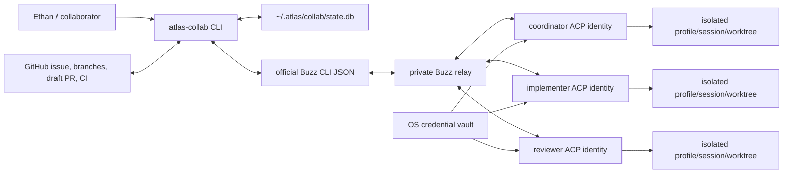

# Atlas Development Collaboration Plane

Status: development-only implementation in WS-22. It is not an Atlas product
runtime, customer dependency, or authorization source.

Protocol version: `atlas.collab.protocol.v1`.

## Decision

Atlas development collaboration uses a hybrid plane:

- GitHub and Git remain authoritative for requested scope, acceptance criteria,
  files, commits, CI, review, and human merge decisions.
- Buzz is the private, live before/during/after discussion record.
- `atlas-collab` is a local deterministic orchestrator and recovery ledger.
- Separate ACP harnesses provide role-specific agent processes only when the
  corresponding runtime and credentials are proven healthy.

This does not reuse renderer-local Atlas Teams channel state. Atlas Teams
continues to route local per-profile sessions and deliberately makes worker
output terminal. Buzz is not added to Hermes/Atlas core, the Control Plane, the
mobile sequence, or product dispatch.

## Architecture



The implementation lives under `tools/atlas_collab/`; schemas and role prompts
ship as package data. `scripts/atlas-collab` is the stable repository entry
point and the `atlas-collab` console script is installed with the project.

### Trusted boundaries

1. The authenticated task contract defines allowed product work.
2. Issue comments, channel messages, repository text, and model responses are
   untrusted data until the coordinator policy accepts a contract event.
3. Buzz membership proves neither task authorization nor tool permission.
4. Runtime profiles and worktrees are isolated by role.
5. Private keys cross only the credential-vault-to-process-environment
   boundary. They do not enter arguments, YAML, SQLite, launch definitions,
   logs, screenshots, Buzz, GitHub, or handoffs.
6. GitHub review/CI and an explicit human are the merge gate. Buzz workflows,
   reactions, canvases, and model claims are not.

## Contracts

### Task

`tools/atlas_collab/schemas/task-v1.json` defines
`atlas.collab.task.v1`. Semantic validation also requires:

- a safe task ID and resolved base SHA;
- at least one observable acceptance criterion;
- stable, unique `AC-NN` identifiers;
- required evidence for every criterion;
- only supported roles; and
- no secret-like fields or values.

Invalid intake persists as `needs-clarification` and publishes the missing
decision without authorizing edits.

### Event

`tools/atlas_collab/schemas/event-v1.json` defines the human-readable,
structured `atlas.collab.event.v1` envelope. A Buzz message includes a concise
Markdown summary, a stable idempotency marker, and canonical JSON. Events carry
actor/role, task/workstream, state, base/branch/worktree, claims, dependencies,
acceptance IDs, evidence, decisions, assumptions, questions, blockers,
causation, recipients, hop count, and next action.

Acknowledgement, evidence, handoff, completion, cancellation, self-authored,
unaddressed, and hop-exhausted events cannot wake another agent.

## State and recovery

The state machine is:

```text
needs-clarification -> intake
intake -> context_sync -> planning -> plan_review -> ready -> executing
executing -> blocked | replanning | review_requested
review_requested -> reviewing
reviewing -> changes_requested | integration_ready
integration_ready -> integrating -> human_approval_required
human_approval_required -> completed | changes_requested | canceled
```

Any active state may pause or cancel. Resume restores the recorded pre-pause
state. Only the coordinator role may transition task state.

SQLite persists tasks, hashes, external references, agents/public keys,
acknowledgements, events/causation, claims, turns, evidence, services, failures,
budgets, and cleanup state. Writes to Buzz and GitHub reserve a stable key
before the external call and record the external ID afterward. A retry either
finishes the pending step or returns the existing ID.

`bootstrap --dry-run` and `doctor` do not create machine state when none exists.
Bootstrap, enrollment, channels, task intake, comments, canvases, events,
services, worktrees, and replay are designed to be idempotent.

## Routing and collaboration

Before edits, every role must explicitly acknowledge the same base SHA,
contract hash, and context-manifest hash. The coordinator publishes:

- dependency graph and integration order;
- exact path/interface ownership;
- test and review plan;
- risk and security boundaries; and
- explicit human gates.

The reviewer challenges the plan and each implementer accepts a bounded work
package. Claims have owners and bounded lease expiry. Parent/child paths and
identical interfaces conflict even if the strings differ.

A worker-to-worker request follows one visible bounded route:

1. Worker sends a structured request to the coordinator naming the peer.
2. Coordinator verifies membership, state, scope, causation, hop count, claim
   boundaries, failure circuit, and turn/cost budget.
3. Coordinator emits a linked event mentioning the peer.
4. Peer answers in the same thread or through the coordinator.
5. The answer retains attribution and causation.

There is one active turn per `(task, agent)` and at most one routed task turn.
Default `max_hops` is 3, repeated clarification is bounded at two cycles,
retries are bounded, and three repeated failures open the circuit. Periodic LLM
heartbeat is disabled (`0`) by default.

## Adapter behavior

### Buzz

The adapter shells only to the installed official `buzz` JSON CLI. It
feature-detects commands, searches exact channel names, reuses existing
channels, sends message bodies through stdin, and keeps credentials in
the Buzz CLI/harness environment only. A no-shell runtime shim removes Buzz
identity variables before the ACP model runtime starts. It supports channels,
membership, canvases, profiles,
structured messages/threads, deep links, and honest network/auth errors.

Buzz 0.4.26 exposes owner-reviewed agent drafts but not direct agent creation.
Distinct locally generated identities therefore remain relay-pending until a
Buzz owner authorizes them. The operator must not work around that gate by
copying desktop-managed private keys out of Buzz state.

### GitHub

The adapter uses `git` and `gh`, needs no repository-admin permission for its
basic path, and rejects dirty worktrees, wrong bases, non-unique branch
assignment, path overlap, and actual merge conflicts. Milestone comments and
draft pull requests have stable markers; a retry creates or updates exactly one
open draft PR for the branch. If a human has already marked that PR ready, the
adapter refuses to change its review state. It has no merge, ready, deploy,
publish, force-push, branch-delete, or settings mutation method.

The current private repository does not expose branch protection/rulesets on
its plan: the branch-protection API returned 404 and rulesets returned the
GitHub plan restriction. This is an explicit manual/admin limitation, not a
configured protection claim.

### Runtimes

One narrow runtime contract starts/cancels persistent role sessions bound to a
worktree. The deterministic fake is the credential-free test reference.
Feature detection reports:

- Hermes/Atlas ACP separately from provider readiness;
- Codex CLI authentication separately from Buzz ACP API-key readiness; and
- Claude installation separately from Claude authentication.

`buzz-acp --agents N` may scale a single role only after distinct identities
work. Service wrappers configure mention subscriptions, an owner allowlist,
one process, queue deduplication, role-specific permission mode, bounded turn
duration, and no periodic heartbeat.

Each service is fail-closed until `agents bind` records one durable task,
expected branch, clean unique worktree, and persistent session for that role.
Binding also applies a distinct worktree-local Git name/email and `doctor`
refuses a mismatch.
The service rechecks the branch, limits subscriptions to the task plus the
role's stable operational channels, and selects the role's isolated Hermes
profile. Worker author gates are asymmetric: workers may wake the coordinator,
while only the coordinator or an authorized human may wake an implementer or
reviewer. A direct worker-to-worker mention therefore cannot bypass
coordination.

## Git and GitHub protocol

- one WS integration worktree/branch;
- optional separate role branches/worktrees when work is independent;
- one writer per worktree and active path/interface claim;
- no direct commit to `main`;
- intentional work-package commits;
- independent review against original acceptance IDs;
- ancestry/overlap/order verification and union tests before handoff; and
- a draft PR that remains under a human merge gate.

Material scope, architecture, acceptance, security, or integration decisions
are summarized in GitHub and the unique workstream handoff with exact Buzz
links. Routine chat is not mirrored.

## Documentation drift found in WS-22

- `docs/altas/MULTI_AGENT_CHANNELS.md` references an
  `atlas-coding-agent-team` skill, but no such repository/local skill was
  present. WS-22 adds one canonical `atlas-collaboration` skill instead of
  recreating an unverified name.
- Atlas Teams remains workstation-local renderer state; it is not cross-host
  development coordination.
- Buzz Desktop managed-agent metadata contains desktop-managed credential
  fields. WS-22 does not reuse or expose those values; its role keys use the OS
  credential vault.
- The installed Claude binary is not authenticated. A ChatGPT Codex session is
  healthy for the Codex CLI, but does not prove the specified Buzz Codex ACP
  API-key path.
