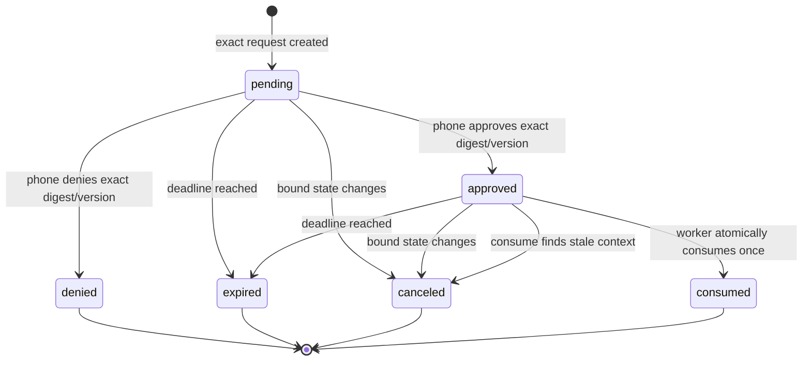

# Atlas Managed Actions and Approvals

## Status and scope

This document defines the WS-09 server/worker contract for consequential
managed actions. It is implemented for one deterministic synthetic export and
for the mandatory Hermes tool-dispatch guard. It does not add a final React or
iOS approval surface, enable a live connector write, or turn an approval into
a general capability.

The approval service is an additional condition on execution. It never
replaces account authorization, device authentication, a live lease, an exact
job claim, store policy, or entitlement checks.

## Action vocabulary

Every managed action has schema version `atlas.managed-action.v1` and exactly
these fields:

```json
{
  "schema_version": "atlas.managed-action.v1",
  "kind": "download_export",
  "operation": "export",
  "summary": "Export the synthetic fixed-operations report",
  "target_type": "synthetic_report",
  "target_id": "report-demo-1",
  "target_label": "Synthetic report report-demo-1"
}
```

Identifiers use a bounded identifier alphabet. Display strings are
whitespace-normalized and length-bounded. Unknown fields fail validation. The
canonical JSON object is domain-separated and SHA-256 hashed; the digest binds
the decision to the exact displayed action and target.

| Action kind | Approval required | Meaning |
|---|---:|---|
| `read` | no | Read already-authorized data without exporting it. |
| `navigate` | no | Move within an already-authorized surface. |
| `analyze` | no | Compute or summarize without an external side effect. |
| `draft` | no | Create an unsent, unsubmitted draft. |
| `download_export` | yes | Export or download data from its current boundary. |
| `send_message` | yes | Deliver a message to a bounded recipient or channel. |
| `submit` | yes | Submit a form or workflow transition. |
| `mutate` | yes | Change customer, dealer, or system state. |
| `credential` | yes | Create, rotate, reveal, or use a sensitive credential action. |
| `administrative` | yes | Change administrative or security-relevant state. |

The classifier in `altas/managed/actions.py` maps known tools to this
vocabulary. An unknown managed tool is denied as `ACTION_UNCLASSIFIED`; it
cannot fall through to a low-risk or generic administrative class. Raw model
arguments are never copied into the human display object. Each supported
consequential tool must instead project its arguments through an explicit
allowlist.

## Bound authority

One approval row is bound to all of the following server-owned context:

- tenant and store;
- approving user and enrolled phone;
- enrolled worker and its exact agent assignment;
- job ID, running attempt number, and hashed claim token checked at use;
- relay session and the phone/worker pairing behind it;
- workflow and capability;
- action kind, operation, target type, canonical action digest, and policy
  version;
- lease nonce and lease expiry;
- approval expiry and one optimistic-concurrency version;
- audit correlation ID.

The user binding comes from the live account membership and phone-to-worker
pairing. System work remains bound to its server-created job and exact worker
claim. A prompt, skill, previous decision, locally supplied tenant, or model
argument cannot change any of those identities.

## State machine



The request expiry is the earlier of the configured approval TTL and the
lease expiry. State transitions run under an immediate database transaction
and compare the expected row version. Two racing phone decisions can produce
only one winner. Retrying the identical decision with the same idempotency key
returns the existing result; a different decision, key, digest, or version is
rejected. Consumption is never idempotently replayed: it is a single-use
authorization boundary.

Expiry and cancellation are durable states. Device revocation, job completion
or requeue, and disabling the bound agent, store, entitlement, or subscription
cancel every pending or approved decision in scope. The consume transaction
also rechecks the original lease identity, current job attempt and claim,
active phone/worker/agent/pairing/session, live membership and store grant, and
capability. Any mismatch cancels the decision and no action runs.

## API contract

### Worker endpoints

```text
POST /api/v1/worker/approvals
GET  /api/v1/worker/approvals/{approval_id}
POST /api/v1/worker/approvals/{approval_id}/consume
```

All calls require the exact worker authentication accepted by the Control
Plane plus:

```text
X-Atlas-Store-ID
X-Atlas-Agent-ID
X-Atlas-Job-ID
X-Atlas-Lease
X-Atlas-Claim-Token
```

Creation also requires `Idempotency-Key` and the relay session that owns the
phone decision path. The server derives tenant and capability from the
authenticated worker and claimed job. It does not accept either as request
authority.

Consumption sends the exact action again, its digest, and the approved row
version. A successful response contains a narrow receipt with approval ID,
action digest, job ID and attempt, policy version, and consumption time. The
receipt is not reusable and is not a bearer token; the synthetic workflow and
managed guard compare it with their locally recomputed action before dispatch.

### Phone endpoints

```text
GET  /api/v1/mobile/relay/approvals
GET  /api/v1/mobile/relay/approvals/{approval_id}
POST /api/v1/mobile/relay/approvals/{approval_id}/responses
```

Phone calls require both the account assertion and
`X-Atlas-Device-Session` for the exact enrolled phone owned by that account.
The list and object routes return only approvals bound to that phone and a
currently active owner/operator membership plus store grant. The response
route accepts only `approve` or `deny`, a fixed reason code, the exact current
version and digest, and an `Idempotency-Key`. There is no approve-all,
wildcard, free-form target, or client-selected scope operation.

### Relay events

The approval lifecycle is delivered through the M02 durable event stream:

```text
approval.requested
approval.resolved
approval.expired
approval.canceled
approval.consumed
```

These events inherit M02 monotonic sequence, encrypted persistence, signed
cursor, replay, and phone scope. They allow the future iOS client to render a
pending request and reconcile a response without opening the Desktop gateway.

## Synthetic end-to-end workflow

The seeded demo capability `fixed_ops.synthetic_export` accepts only this
strict payload:

```json
{
  "workflow": "fixed_ops.synthetic_export.v1",
  "report_id": "report-demo-1",
  "relay_session_id": "relay_session_..."
}
```

The worker:

1. claims the job and receives the normal policy allow;
2. deterministically builds the `download_export` action;
3. creates or resumes its exact idempotent approval request;
4. polls the exact approval until it is approved or terminal;
5. atomically consumes the approved version under the original job/lease/action
   context;
6. verifies the returned receipt and executes a deterministic fixture.

The fixture returns `artifact_created: false` and `external_write: false`. It
proves the policy and lifecycle contract without writing a file, calling a
dealer system, or using customer data.

## Mandatory Hermes guard

All existing managed tool dispatch paths continue through
`altas/managed/policy_guard.py`. The guard first obtains the normal server
policy decision. For a consequential classified action it then requires an
exact approval ID and version in the request-local managed authorization
context and consumes that approval before allowing dispatch. Missing,
malformed, rejected, unavailable, or mismatched approval state fails closed.

Unmanaged developer sessions retain their existing behavior. The workstream
does not make approval environment variables a global process setting and
does not create a bypass around the managed guard.

## Persistence, privacy, and audit

The `managed_approvals` table stores exact scope identifiers, classifications,
digests, expiry, versions, and state. The human-readable action object is
AES-GCM encrypted with an approval-specific context before SQLite persistence.
Request and decision idempotency keys and the job claim token are stored only
as hashes. Raw credentials and arbitrary customer/job payloads are not copied
into the approval row, relay audit, or Control Plane audit.

Audit events record the approval ID, correlation, bounded classification,
digest, policy version, decision reason, and outcome. The encrypted M02 event
payload contains the display object required by the phone UI. Production still
needs a KMS-managed encryption key, retention policy, PostgreSQL concurrency,
operator identity/RBAC, and multi-instance delivery.

## Stable failure outcomes

Representative API codes include:

- `managed_action_does_not_require_approval`
- `approval_job_claim_invalid`
- `approval_relay_scope_invalid`
- `approval_idempotency_conflict`
- `managed_approval_not_found`
- `managed_approval_action_modified`
- `managed_approval_version_stale`
- `managed_approval_already_resolved`
- `managed_approval_already_consumed`
- `managed_approval_expired`
- `managed_approval_context_changed`
- the normal policy codes such as `lease_expired`, `lease_context_mismatch`,
  `entitlement_inactive`, and `device_inactive`.

The local guard reports `ACTION_UNCLASSIFIED`, `APPROVAL_REQUIRED`,
`APPROVAL_INVALID`, or `POLICY_UNAVAILABLE` without embedding response content
in model-visible tool output.

## Deferred product work

- Final iOS and React approval presentation, accessibility, notification, and
  reauthentication UX.
- APNs wake-up and multi-device decision routing.
- Real dealership connector/file/message actions and their individually
  reviewed argument-to-action projections.
- Production OIDC, operator RBAC, distributed transactions, PostgreSQL, KMS
  envelope keys, retention, alerting, and rate limiting.
- General supervisor wiring that obtains and injects exact approval references
  for every future consequential Hermes tool. The mandatory consume boundary
  and alternate dispatch tests exist; only the synthetic export is orchestrated
  end to end in this workstream.
