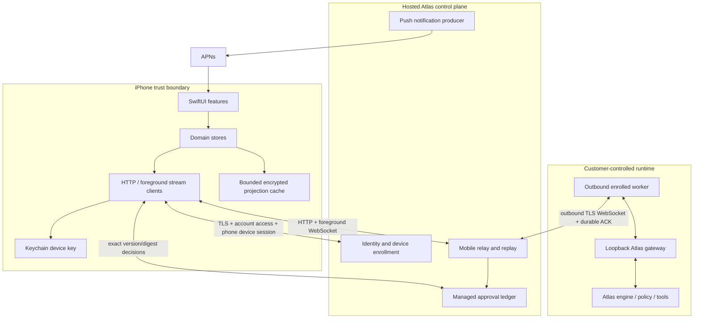
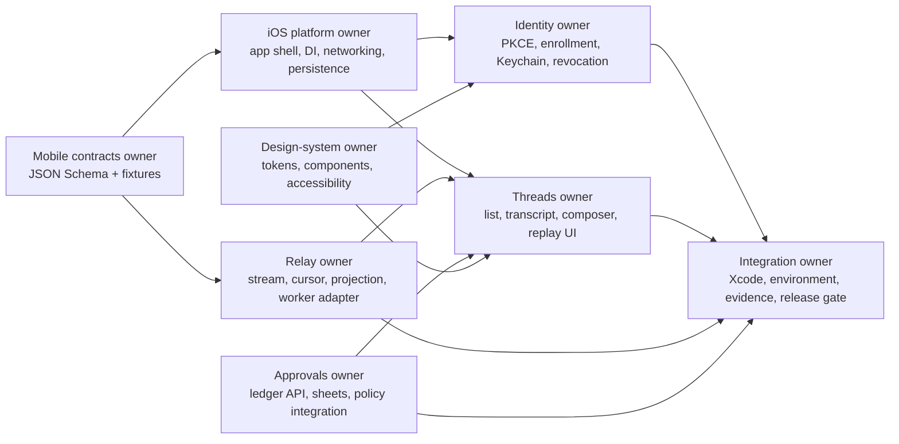
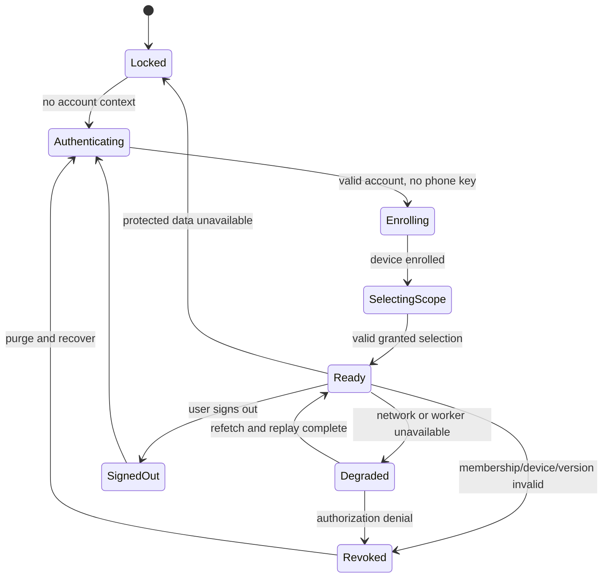
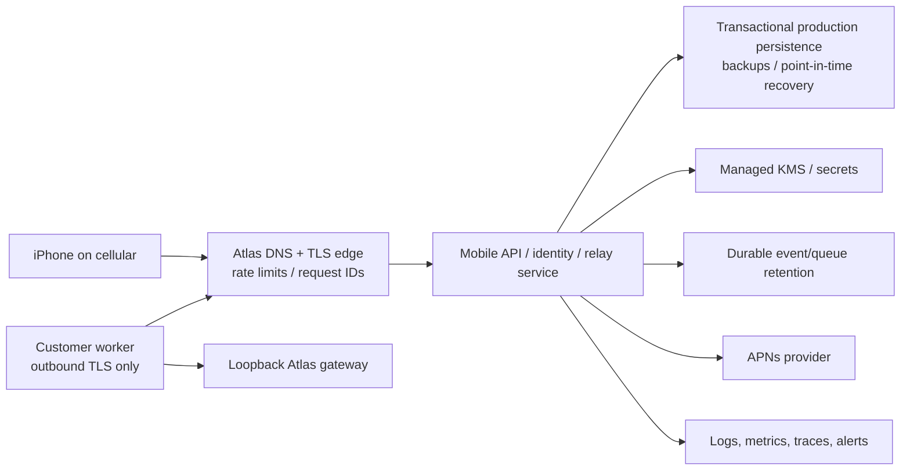

# Atlas for iPhone — Native Architecture

**Architecture:** A SwiftUI thin client with generated mobile contracts, actor-isolated services, a bounded encrypted projection cache, and no local Atlas runtime. All authority remains in the control plane, outbound worker, gateway, policy engine, and managed-approval ledger.

## 1. Chosen platform

- Swift 6 language mode and strict concurrency.
- SwiftUI for screens and navigation; UIKit wrappers only for capabilities without a reliable SwiftUI surface.
- Observation for screen state; structured concurrency and actors for mutable service state.
- `URLSession` for HTTP, WebSocket, and uploads; no third-party networking framework in M03.
- `AuthenticationServices` for OAuth/OIDC browser flow; `LocalAuthentication` for fresh user presence.
- CryptoKit for Ed25519/Curve25519 signing required by the current backend; Security framework for Keychain persistence.
- SQLite behind a narrow local-store protocol. Select the concrete library in M03 after checking licensing and Swift concurrency behavior; the schema and repository boundary must not depend on it.
- APNs/UserNotifications for opaque notification hints; no background WebSocket.
- Minimum iOS 18.0; conditional iOS 26 material enhancements.

This choice maximizes native lifecycle, security, accessibility, and rendering quality and avoids a web runtime carrying sensitive state.

## 2. System context



## 3. Repository and target structure

Recommended M03 layout:

```text
apps/ios/
  Atlas.xcodeproj
  App/
    AtlasApp.swift
    AppEnvironment.swift
    AppRouter.swift
  Features/
    Authentication/
    Enrollment/
    Today/
    Threads/
    Approvals/
    Activity/
    Settings/
    Voice/
  Core/
    Contracts/          # generated, never hand-edited
    Networking/
    Identity/
    Relay/
    Persistence/
    Security/
    DesignSystem/
    Diagnostics/
  Resources/
  Tests/
  UITests/
contracts/mobile/       # language-neutral source of truth
```

One app target plus focused local Swift packages or target groups is preferred for M03. Do not create a framework for every screen. Boundaries become packages only when they reduce ownership conflicts or enable isolated tests.

## 4. Component ownership



The contracts owner controls `contracts/mobile/**`; generated Swift is mechanical output. Backend relay owners control server projection and replay. Feature owners may not add unreviewed wire fields or interpret raw gateway payloads.

## 5. Layering and dependency rule

`View → FeatureModel → UseCase/DomainStore → Client/Repository → Transport/Database`.

- Views have no token, URL, cursor-signing, JSON-decoding, or SQL logic.
- Feature models are `@MainActor`, expose render-ready immutable state, and hold cancellable tasks.
- Domain stores are actors that serialize auth, thread, approval, and connection transitions.
- Transport DTOs are generated from the versioned contracts and mapped into small domain types.
- Repositories own cache reconciliation and never manufacture server truth.
- Environment/config is injected at the composition root; production builds contain no runtime environment selector.

## 6. State ownership

| State | Owner | Lifetime | Persistence |
|---|---|---|---|
| Account/auth transaction | `IdentityCoordinator` actor | sign-in attempt | memory only except opaque state verifier until callback |
| Account access credential | `SessionBroker` actor | ten minutes in current dev implementation | memory only |
| Proof-bound renewal handle | `SessionBroker` / `IdentityRepository` | rotates once per account renewal | `ThisDeviceOnly` Keychain; specified gap |
| Device private key | `DeviceKeyStore` | enrollment until sign-out/revocation | `ThisDeviceOnly` Keychain item |
| Device access session | `SessionBroker` actor | max five minutes currently | memory only |
| Granted scope | `AccountStore` actor | account session | opaque selected IDs in protected preferences; grants refetched |
| Foreground stream | `RelayConnection` actor | active scene | memory; durable cursor in cache |
| Transcript projection | `ThreadRepository` actor | bounded pages | encrypted/protected local DB |
| Composer draft | `DraftStore` | user-controlled | protected local DB, never auto-submitted |
| Approval state | server ledger, projected by `ApprovalStore` | until terminal | bounded cache; refetch before decision |
| Diagnostics | `DiagnosticsRecorder` actor | bounded ring | content-free protected records |

No access token is written to disk. The device private key is the renewable proof root; membership and credential version are checked server-side for every session mint.

## 7. App state machine



`Degraded` preserves timestamped cached read state but disables server actions. `Revoked` purges decrypted feature state immediately and is not recoverable through retries alone.

## 8. Networking architecture

### HTTP

- One `APIClient` sends schema-version headers, correlation ID, app/build/device metadata, short-lived human account access, exact phone device session, and idempotency key where required.
- Requests are typed and cancelable. Automatic retries are allowed only for idempotent reads and explicitly idempotent writes.
- On timeout after a prompt/approval write, resolve by idempotency key or live resource fetch before offering Retry.
- Server time from response metadata feeds clock-skew diagnostics; the app never adjusts security timestamps silently.

### Foreground streaming

- `RelayConnection` owns one foreground WebSocket per selected organization/environment. It authenticates in the HTTP upgrade header; tokens never enter query strings or logs. Changing organization closes and recreates the connection after clearing projected scope.
- The app subscribes to explicit thread/resource scopes returned by HTTP. Server authorization applies again at subscribe time.
- Incoming envelopes pass size limit → JSON decode → schema/version validation → scope check → sequence/gap check → payload mapping → UI/cache.
- Unknown versions close or quarantine the affected subscription and trigger a supported-version fetch; unknown events do not reach feature code.
- Heartbeat/liveness is not worker truth. Worker presence comes from timestamped relay events/HTTP projection.

### Replay

- The local cache commits an event and its cursor in one transaction.
- A reconnect sends the last committed cursor. The server returns strictly ordered events after it, or an explicit `cursor_expired` response requiring snapshot refresh.
- Live events are buffered behind replay and released only when contiguity is proven.
- Sequence gaps never auto-fill with guessed state.

## 9. Local data architecture

Suggested tables: `account_projection`, `scope_selection`, `thread_summary`, `thread_event`, `thread_snapshot`, `approval_projection`, `draft`, `cursor`, and `diagnostic_transition`.

Requirements:

- Data Protection class `NSFileProtectionComplete`; no sensitive background mutation while the device is locked. APNs remains a hint until unlock/fetch.
- Application-layer encryption for message/approval payload columns with a random local cache key wrapped by a `ThisDeviceOnly` Keychain item. This is defense in depth, not a substitute for server encryption.
- No SQL/log/analytics value contains auth tokens, device private key, raw enrollment token, provider secret, or arbitrary tool arguments.
- Bounded per-thread pages and LRU eviction. Production retention is not chosen here; the server advertises replay availability and the app exposes Clear Local Data.
- On sign-out/revocation/environment change, delete the cache key first, then the database and protected preferences. Key deletion makes residual pages unreadable if file deletion is delayed.
- Schema migrations are forward-only and tested from every shipped local schema. Incompatible contract changes use snapshot refetch, not unsafe field coercion.

## 10. Identity and key architecture

The current server verifies Ed25519 device proof. CryptoKit provides compatible Curve25519 signing, but Secure Enclave supports P-256 rather than Ed25519. M03 therefore:

1. generates Ed25519 on-device;
2. stores the private representation in a `kSecAttrAccessibleWhenUnlockedThisDeviceOnly` Keychain item with no synchronizable/iCloud flag;
3. uses the key only inside `DeviceKeyStore` to sign the canonical proof string;
4. keeps short-lived account/device access sessions in memory and a one-time rotating, device-proof-bound account renewal handle in Keychain once that specified server gap exists;
5. optionally records App Attest assertions through a separate server seam when specified.

Before production, security owners must choose either server support for Secure-Enclave P-256 device proof or accept/document the Keychain-protected Ed25519 tradeoff. M02 does not claim hardware-backed Ed25519.

## 11. Background and lifecycle

- Open foreground stream only while an active scene needs it. On background, flush the committed cursor, close gracefully, and rely on APNs plus authoritative fetch.
- Background URL sessions may upload an explicitly submitted voice clip later, but M03 text slice has no background upload.
- APNs payload contains category, opaque resource ID, environment discriminator, and collapse/thread identifiers—no transcript, tool arguments, store name, approval arguments, or bearer material.
- Silent push is opportunistic and never required for correctness. Background execution expiration leaves durable server state untouched.
- A notification tap enters through `DeepLinkRouter`, authenticates, validates environment, refetches the resource, then navigates.
- Memory pressure evicts rendered pages before security/auth state. Protected-data-unavailable locks content.

## 12. Dependency injection and fixtures

Define protocols at the use boundary: `IdentityProviding`, `DeviceKeyStoring`, `AccountFetching`, `RelayStreaming`, `ThreadServicing`, `ApprovalServicing`, `NotificationRegistering`, `LocalProjecting`, `Clock`, and `Randomness`.

Shipping builds compose real implementations. Deterministic providers, clocks, streams, and synthetic approval fixtures compile only into test/internal configurations and are visibly marked. A failed real service never silently falls back to a fixture.

## 13. Error model

Generated API errors map into domain categories:

- `unauthenticated`: session absent/expired; mint once or sign in.
- `revoked`: device/membership/grant/version invalid; purge protected state.
- `forbidden`: authenticated but operation/scope denied; no retry loop.
- `conflict`: stale version/digest or context changed; refetch.
- `rateLimited(retryAfter)`: disable submission until server time.
- `cursorExpired`: refetch snapshot and re-anchor.
- `workerUnavailable(lastSeen)`: preserve accepted state; no local queue.
- `uncertainOutcome(correlationID)`: block blind retry.
- `unsupportedContract`: stop affected feature and require upgrade.
- `transport`: offline/TLS/timeout; retain truthful state.

All feature errors include a safe user explanation, recovery action, and correlation ID where available.

## 14. Build and environment strategy

- Xcode configurations: Debug-Local, Internal-Isolated, and Release. Release has exactly one immutable production base URL and no deterministic identity provider.
- Secrets are provisioned server-side or through Apple signing infrastructure; `.xcconfig` files contain public endpoints/identifiers only.
- App bundle, keychain access group, push environment, URL scheme/universal link, and local database namespace differ per environment.
- CI validates generated contracts are current, runs Swift format/lint/tests, builds with warnings as errors for owned code, and archives an unsigned simulator build plus a signed internal build when signing is configured.
- Every evidence bundle records the mobile SHA, backend stack SHAs, contract manifest version, Xcode/SDK version, device OS, and environment.

## 15. Minimum real deployment away from the Mac



The minimum real environment includes:

- a verified Atlas-owned DNS name and automatically renewed certificate on a hosted TLS endpoint; no temporary tunnel as architecture;
- production OIDC/MFA/recovery and short-lived account/device credentials;
- mobile API, identity, relay routing/presence, managed approvals, and APNs producer deployed with health/drain/rollback support;
- transactional Postgres-class persistence (vendor unresolved), durable relay/event queue or equivalent, owner-approved replay/retention, migrations, encrypted backups and restore tests;
- managed KMS/secrets, separated service identities and key rotation;
- outbound worker connectivity over 443/WSS with exact enrolled-device auth and loopback-only gateway access;
- APNs key custody, environment/topic isolation, token rotation/deletion and delivery observability;
- WAF/abuse and per-account/device/worker rate limits, structured logs/metrics/traces, alerts, dashboards and correlation across phone/control plane/worker/gateway;
- staging/internal/production account/project, database, keys, bundle IDs, keychain groups, APNs topics, domains and data separated—never a runtime flag over one shared dataset;
- on-call ownership, incident/revocation/support/backup/restore/key-rotation/server-drain/runbooks and a tested rollback.

M03 needs a restricted hosted **isolated** instance of this shape to prove cellular operation, but may use one relay instance and synthetic data while visibly documenting its prototype persistence/identity/key limitations. It cannot be called production or pilot-ready.

## 16. Architecture acceptance gates

- No feature imports worker/gateway secrets or direct gateway transports.
- No wire DTO is hand-authored outside generated contracts.
- No protected action is enabled from cached authorization alone.
- Replay, revocation, and uncertain-outcome state machines have deterministic tests.
- App survives kill/relaunch, network switching, cursor expiry, worker disconnect, clock skew, protected-data lock, and contract-version rejection without fabricating success.
- Instruments checks show bounded memory during long streams, no runaway task/socket, and no sensitive values in logs.
