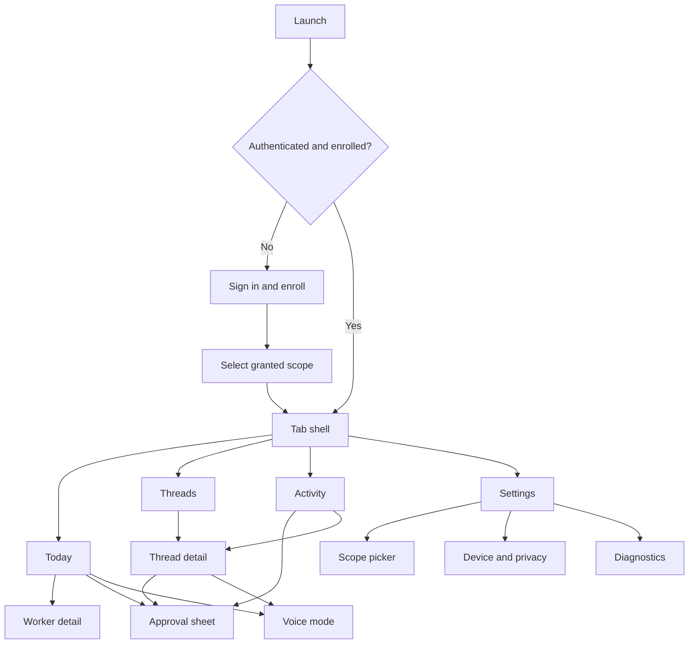
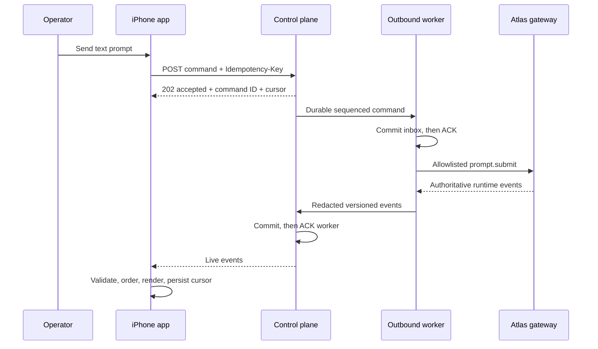
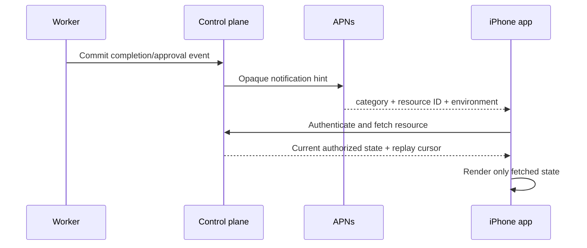

# Atlas for iPhone — Information Architecture

**Recommendation:** Four tabs—Today, Threads, Activity, Settings—with Voice as a mode and approvals as contextual sheets. The hierarchy optimizes for checking, continuing, and deciding, not configuring Atlas.

## 1. Structural map



## 2. Navigation rules

- Today is the default after enrollment and the destination of a normal notification tap.
- Threads preserves per-tab navigation and returns to the most recent thread.
- Activity is an operator-readable feed, not the raw audit ledger.
- Settings owns scope selection, device security, notifications, privacy, and diagnostics.
- An approval always opens as a sheet over the originating tab. It can deep-link from a notification but must refetch before showing action buttons.
- Voice is a full-screen modal mode launched from a microphone control. In the text-first build the control is absent, not disabled or labeled “coming soon.”
- No screen exposes a raw gateway URL, bearer token, provider/model secret, policy editor, connector credential, shell, or worker enrollment action.

## 3. Global presentation model

Every primary screen has these layers:

1. **Scope:** selected organization/store and worker/profile when relevant.
2. **Freshness:** live, reconnecting, stale since a timestamp, offline, worker unavailable, or access revoked.
3. **Content:** last authoritative projection plus explicit loading/empty/error states.
4. **Action:** one dominant next action and bounded secondary actions.

Global state does not use a spinner forever. After two seconds, skeleton/loading copy states what is being fetched. After the request budget, the app shows the last-known timestamp and Retry. Revocation replaces protected content immediately; it is never presented as ordinary offline state.

## 4. Screen specifications

### 4.1 Sign in

- **Purpose:** establish the human account context through an external user agent.
- **Primary action:** Continue to sign in.
- **Data:** environment label for internal builds, privacy note, no organization text field.
- **States:** launching browser; browser canceled; provider error; invalid callback; account has no Atlas membership.
- **Accessibility:** concise VoiceOver order; authentication status announced; no color-only errors.
- **Deep link:** only the exact registered callback with matching state/nonce is accepted.

### 4.2 Enroll this iPhone

- **Purpose:** bind a device-generated key to the authenticated account using a one-time enrollment.
- **Primary action:** Enroll this iPhone.
- **Data:** device name suggestion, issuer, token expiry, granted organization summary.
- **States:** creating key; redeeming; expired token; already used; clock skew; unsupported device; revoked membership.
- **Recovery:** request a new one-time enrollment from an authorized Atlas surface. Never reuse or display the token after redemption.
- **Accessibility:** explain that Face ID protects sensitive decisions but does not replace account sign-in.

### 4.3 Scope selection

- **Purpose:** choose only among server-returned organization/store/worker/profile grants.
- **Primary action:** Continue with selection.
- **Data:** store label, worker name and last-seen state, profile/capability summary.
- **States:** no stores; no enrolled worker; worker offline; grant removed during selection.
- **Rule:** the app sends opaque IDs returned by the server but cannot create or broaden them. A scope change clears thread navigation and refetches every projection.

### 4.4 Today

- **Purpose:** answer “Can Atlas work, and what needs me?” in under five seconds.
- **Primary action:** Continue most relevant thread, or Review approval when one is pending.
- **Data source/data:** control-plane Today projection plus relay presence: connectivity/freshness; selected scope; current jobs; active threads; approval count; reports ready; recent completed/failed work; next scheduled workflows; role-authorized model/usage state; last contact.
- **Loading:** skeleton for summary cards; scope header remains visible.
- **Empty:** “No active work” plus Open Threads.
- **Offline:** last-known summary is visibly timestamped; prompt actions are unavailable.
- **Worker unavailable:** explain last seen and offer Diagnostics/Retry, not “system failed.”
- **Revoked:** protected summary disappears and the reauthentication/recovery route replaces it.
- **Accessibility:** headings and rotor landmarks; status icons pair with text; card order follows urgency.
- **Deep links:** approval, thread, completion, and failure notification routes.

### 4.5 Threads

- **Purpose:** find an authorized thread without reproducing a desktop sidebar.
- **Primary action:** open a thread; secondary actions create, rename, archive, resume, or fork only when the server advertises them for the selected profile.
- **Data source/data:** session-list/thread-projection API: title, worker/profile, last safe message summary, running/waiting/approval/failed/completed/archived state, server unread position, timestamp, lineage and attention marker.
- **Loading:** paged skeleton; pull to refresh restarts from the first authoritative cursor.
- **Empty:** “No threads in this scope.”
- **Offline:** show bounded cached rows, timestamped; search is local over cached titles only and labeled accordingly.
- **Errors:** cursor invalidated resets safely; unsupported item renders a noninteractive placeholder.
- **Accessibility:** Dynamic Type allows two-line titles; state precedes timestamp in VoiceOver.

### 4.6 Thread detail

- **Purpose:** read one authoritative transcript projection and send/interrupt bounded input.
- **Primary action:** send a text prompt. Secondary: interrupt when the server says an interruptible turn is active.
- **Data source/data:** transcript snapshot + cursor replay + foreground subscription: title; live status; ordered messages; clarification requests; typed tool/progress rows; typed citations/artifacts; pending approval; composer; server freshness.
- **Initial load:** fetch the latest durable page, then subscribe from its cursor; do not combine live deltas with unanchored cache.
- **Empty:** new thread explains the active worker/profile before input.
- **Offline:** cached transcript remains readable; drafts can be saved locally, but Send is disabled and nothing is called queued.
- **Reconnect:** banner moves through reconnecting → replaying → live; event gaps remain visible until repaired.
- **Worker unavailable:** composer locks; accepted work remains visible with its last state.
- **Uncertain outcome:** persistent high-attention row instructs the operator to verify before retrying.
- **Revoked:** immediately dismiss detail and purge its decrypted view state.
- **Accessibility:** message sender/role headings; tool rows are single focus groups with expandable detail; streaming deltas are coalesced and not announced character-by-character.
- **Deep link:** thread ID plus optional event ID; the server authorizes before content appears.

### 4.7 Voice mode

- **Purpose:** capture one intentional push-to-talk utterance and turn it into a reviewable text prompt.
- **Primary action:** hold to record; release to stop; review/edit and Send. Swipe/cancel discards.
- **Data source/data:** local AVAudioSession capture plus the selected transcription seam: elapsed time, input/route, selected thread/scope, partial/final transcription, editable transcript, optional final-text TTS state.
- **Permission:** request microphone only on the first user tap, with a preceding reason. Denial links to Settings.
- **Offline:** recording may be canceled or kept ephemerally while the view is active; it is not silently uploaded later. The user explicitly retries.
- **Interruption:** phone call, route change, app background, or audio-session loss stops capture and presents Review/Discard.
- **Privacy:** no ambient listening, hot mic, wake word, or background capture.
- **Accessibility:** equivalent tap-to-start/tap-to-stop mode for motor accessibility; haptic and spoken cues; visible waveform is not the only state signal.

### 4.8 Activity

- **Purpose:** review recent outcomes and decisions across permitted threads.
- **Primary action:** open the related thread or approval.
- **Data source/data:** server activity projection: completion, failure, interruption, policy denial, approval lifecycle, worker connection changes, scheduled report history and report availability.
- **Loading/empty/offline:** paged skeleton; “No recent activity”; timestamped cached feed.
- **Rule:** the feed contains human summaries and correlation IDs. Raw audit fields live in the control plane.
- **Accessibility:** filter controls use native menus; outcome and timestamp are spoken.

### 4.9 Approval sheet

- **Purpose:** make one informed, explicit managed-action decision.
- **Primary action:** Approve; equally visible Deny. Dismiss makes no decision.
- **Data source/data:** live managed-approval resource: safe action label, effect, bounded arguments, target, store/profile, thread, workflow, worker/requester, material consequence (send/submit/export/change/delete/spend), expiry, risk tier, policy summary, safe preview and correlation ID.
- **Loading:** action controls remain absent until a live fetch validates version and scope.
- **Expired/canceled/consumed:** immutable resolved sheet with explanation.
- **Offline:** no action controls; never queue an approval.
- **Biometric failure:** allow retry or deny; never fall back to silent approval. Device passcode fallback follows the chosen LocalAuthentication policy for the risk tier.
- **Accessibility:** decision consequence precedes buttons; countdown announces only meaningful thresholds; buttons remain distinct at large text sizes.

### 4.10 Settings

- **Purpose:** inspect account/scope, device security, notifications, privacy, and app diagnostics.
- **Primary actions:** change granted scope, manage this phone, notification settings, sign out.
- **Data source/data:** account/device context plus local settings: account; membership; current scope; device enrollment; voice; category/store notification preferences; last proof; app/build/environment; privacy choices; cache usage.
- **Revocation:** if already revoked, show only recovery, diagnostics, and purge/sign-out actions.
- **Accessibility:** destructive actions use explicit labels and confirmation dialogs.

### 4.11 Diagnostics

- **Purpose:** make failure observable without exposing private content.
- **Data:** app/build/schema versions, environment, enrollment ID suffix, last successful auth time, last cursor suffix, worker last seen, connection state transitions, correlation IDs, push registration state.
- **Primary action:** Copy safe diagnostics or share with support.
- **Prohibited:** tokens, key bytes, complete IDs, message content, tool arguments, raw headers, local paths, provider names when private, or connector data.

### 4.12 Worker detail

- **Purpose:** explain one selected worker's actionable health without becoming a fleet-admin dashboard.
- **Primary action:** Retry connection check or choose another granted worker.
- **Data source/data:** relay/control-plane worker projection: connected/degraded/unavailable/revoked, last successful contact, active/queued jobs, next scheduled workflows, profile/capabilities appropriate to the role, recent failures, and safe recovery guidance.
- **Loading/empty/offline:** bounded skeleton; “No current work”; timestamped last-known state with mutations disabled.
- **Permission/revoked:** removed grant returns to scope selection; revoked worker is read-only with an owner/operator recovery route outside the phone v1.
- **Error/unavailable:** stable safe code/correlation ID; do not offer direct gateway URL or worker enrollment.
- **Accessibility/deep link:** grouped health/jobs/schedule headings; Today/worker notification deep-link refetches before render.

### 4.13 Report detail

- **Purpose:** read a safe server-authorized manager summary and artifact metadata.
- **Primary action:** Open an authorized report/artifact when its typed policy permits; otherwise return to its thread.
- **Data source/data:** report API: store/profile, scheduled/requesting workflow, created/freshness, safe summary, citations/artifact metadata and authorization expiry.
- **Loading/empty/offline:** refetch with skeleton; no-body state; cached metadata only offline—no implicit file availability.
- **Permission/revoked/worker unavailable:** access denial clears content; completed report remains server-authorized even if worker is offline; revoked phone locks it.
- **Error/accessibility/deep link:** safe code/correlation ID; summary before metadata; report-ready notification refetches by opaque resource ID.

## 5. Primary-screen state coverage

This matrix closes states that are “not applicable” as intentionally as those that render UI.

| Screen | Permission denied | Revoked | Worker unavailable | Error / deep-link rule |
|---|---|---|---|---|
| Sign in | browser/provider denial with Retry | account-disabled recovery | Not applicable | accept only validated auth callback |
| Enrollment | new enrollment required | membership/device denial; discard provisional key | worker pairing deferred or alternative granted worker | enrollment link is environment/token bound |
| Scope picker | remove inaccessible row/refetch | protected list clears | show last seen; cannot select for send | links cannot preselect ungranted scope |
| Today | hide unauthorized module, explain role where safe | privacy shield/recovery | persistent banner/recovery | resource links refetch before navigation |
| Threads | mutation controls follow server capabilities | dismiss/purge | cached read-only list; send/create disabled | thread link authorizes before title/content |
| Thread detail | no unpermitted artifact/tool detail | dismiss/purge | read-only with accepted-state truth | event link replays/refetches exact thread |
| Voice | microphone denial → Settings; command auth still separate | stop/delete audio and lock | transcript may be reviewed but not sent | voice link only selects already authorized thread |
| Activity | server filters role/scope | purge feed | historical feed remains timestamped | event link refetches target |
| Approval | no buttons for unauthorized role | dismiss/purge | decision may remain possible only if server returns live valid action; otherwise no controls | notification always refetches exact version |
| Worker detail | only granted worker projection | read-only revoked explanation | primary state with last contact | worker link cannot enroll/configure |
| Report detail | clear body/metadata on denial | dismiss/purge | completed server report may remain available | opaque report link refetches |
| Settings/Diagnostics | unavailable setting explains controlling policy | recovery/purge only | diagnostics shows last contact | settings links never carry credentials |

## 6. Foreground conversation flow



## 7. Background completion and push



Push is a wake/attention hint, never truth. Notification text defaults to privacy-preserving copy until product owners choose a policy.

## 8. Content and copy rules

- Say **Worker unavailable**, not “Atlas is broken,” when the outbound worker is absent.
- Say **Reconnecting** only while retrying, **Replaying** while repairing a gap, and **Offline** when no network path exists.
- Say **Access revoked** when authorization changed; never disguise it as expiry/offline.
- Say **Outcome uncertain—verify before retrying** when the relay cannot prove whether a local gateway call ran.
- Never use success color or haptics before the authoritative terminal event.
- Every error supplies a correlation ID and one safe next action.

## 9. Low-fidelity thread wireframe

```text
┌──────────────────────────────────────┐
│ ‹ Threads     Inventory review   •Live│
│ Sunrise Store · Mac Studio Worker    │
├──────────────────────────────────────┤
│ You                                  │
│ Check the latest inventory variance. │
│                                      │
│ Atlas                                │
│ I’m checking the approved source…    │
│ ┌ Tool · Inventory read ───────────┐ │
│ │ Running · 4s                     │ │
│ └──────────────────────────────────┘ │
│                                      │
│ ┌ Approval required ───────────────┐ │
│ │ Export summary · expires in 4:12 │ │
│ │              Review             ›│ │
│ └──────────────────────────────────┘ │
├──────────────────────────────────────┤
│ [ + ]  Message Atlas…      [mic][↑] │
└──────────────────────────────────────┘
```
