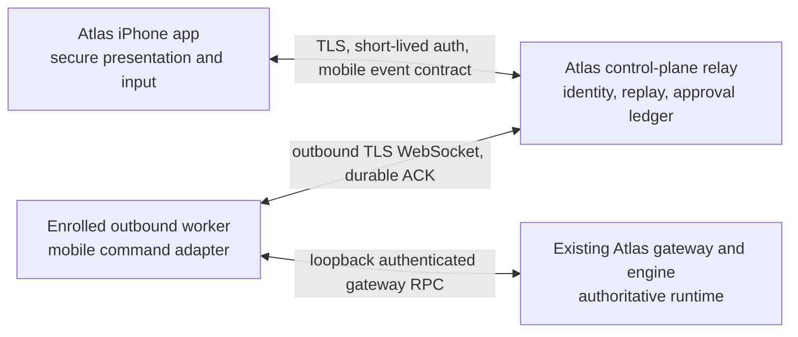

# Atlas for iPhone — Product Specification

**Status:** M02 authoritative product boundary
**Decision:** Build a native, secure Atlas interface for iPhone. The phone is not an agent runtime.
**M03 disposition:** Gated GO for an isolated engineering vertical slice; NO-GO for a production pilot.

## 1. Product promise

Atlas for iPhone lets an enrolled operator see what their Atlas workers are doing, continue a thread, and make an explicit approval decision when away from a workstation. It preserves the authority of the existing Atlas gateway, worker, policy engine, and managed-approval ledger.

The first useful promise is deliberately narrow:

> From an enrolled iPhone, an authorized operator can open one existing Atlas thread, send one text prompt through an outbound-connected worker, observe durable streamed progress, reconnect without duplicating the prompt, and approve or deny one harmless synthetic consequential action.

That is the M03 vertical slice. It is not a mobile copy of the desktop app and it is not a production launch.

## 2. Evidence baseline and confidence

This plan distinguishes what exists from what must be built.

| Evidence inspected | Head / status | What it establishes |
|---|---|---|
| M01 discovery checkout | `ed85a5cc810bf1f5ed51d1ab473b28d011eb30b8` | Existing gateway, worker, desktop/control-center surfaces, gaps, and local Apple toolchain evidence |
| `codex/ws-05-device-enrollment` | `20997113cf87657b607a306bc38b0cfb23f2db29` (draft PR 7) | Provider-neutral identity boundary, one-time enrollment, Ed25519 device proof, short-lived device sessions, revocation and rotation |
| `codex/mobile-m02-text-relay` | `cf7bec22bf231c3629d2ab7890ed60e6477e38b7` (draft PR 8; stacked on WS-05) | Durable outbound worker relay, pairings, text commands, ACK/replay, encrypted SQLite stores, idempotency and uncertain-outcome handling |
| `codex/ws-09-managed-approvals` | `85443deadf9574106e15035bf605c693eedcf3d6` (draft PR 9; stacked on relay) | Strict managed-action classification, contextual approval lifecycle, single-use consumption and synthetic guarded execution |

These heads are reviewed implementation evidence, not a merged baseline. Their storage, presence, identity-provider, key-management, notification, and deployment choices remain prototypes.

## 3. Product boundary

The iPhone:

- presents server-authorized organizations, stores, workers, profiles, threads, progress, reports, and approvals;
- captures text and, after the text slice is proven, push-to-talk audio;
- keeps a bounded encrypted local projection for continuity;
- authenticates a human and proves possession of an enrolled device key;
- never stores worker bearer tokens, model-provider secrets, connector credentials, shell access, or policy authority;
- never becomes a second transcript, job scheduler, approval ledger, or source of tenant/store scope.

## 4. Target users and jobs

### Primary user

An Atlas owner or operator who already has an account, one or more granted stores, and at least one enrolled worker. A member can enroll a phone and read permitted data but cannot enroll workers, revoke devices, or perform managed approvals unless policy explicitly grants that role in a later version.

### Core jobs

1. **Check:** “Is Atlas connected, and what is active or blocked?”
2. **Continue:** “Send a short instruction to the right thread without opening a laptop.”
3. **Supervise:** “See tool progress and know whether a result is current, stale, uncertain, or failed.”
4. **Decide:** “Understand a consequential action and approve or deny it with context.”
5. **Recover:** “Reconnect, replay, revoke a lost phone, or understand why the worker is unavailable.”

## 5. Version-one scope

### Included in the first releasable product shape

- Browser-based account sign-in using OAuth/OIDC authorization-code flow with PKCE once a production identity provider is selected.
- One-time phone enrollment, local device key generation, short-lived device-session proof, rotation, sign-out, and remote revocation.
- Server-derived organization, store, worker, and profile selection.
- Today summary with connectivity, active work, pending approvals, and recent completion.
- Thread list and thread detail with durable text prompt submission, history, tool/progress rows, interruption, reconnect, and replay.
- Managed approval inbox and contextual approve/deny sheet.
- APNs notification hints for completion, failure, and approval; opening the app always refetches authoritative state.
- Diagnostics sufficient to report version, environment, device enrollment state, last cursor, and correlation ID without leaking content or secrets.
- Accessibility, Dynamic Type, Reduce Motion, Reduce Transparency, light and dark appearance, and VoiceOver from the first slice.

### Sequenced immediately after the text slice

- Push-to-talk: press, record, release/cancel, upload, transcribe through a server-owned seam, display/edit the transcript, then submit through the same prompt contract.
- Background completion continuity and richer Activity/report summaries.
- Multiple worker and store navigation once single-worker semantics are proven.

### Explicit non-goals

- Running a model, agent loop, shell, connector, or Atlas gateway on iPhone.
- Direct phone-to-worker LAN access or public exposure of a local gateway.
- Worker enrollment, provider credential entry, capability authoring, policy editing, admin fleet configuration, raw audit logs, or cron management.
- A second mobile transcript, optimistic fake agent output, silent offline queueing, autonomous approvals, or notification-carried secrets.
- General production write actions. M03 uses only the existing synthetic export fixture, which creates no artifact and performs no external write.
- Deciding the production identity vendor, cloud/region, retention policy, notification defaults, speech vendor, pricing, App Store identity, or real connector write permissions in M02.

## 6. Navigation recommendation

Ship four tabs: **Today**, **Threads**, **Activity**, and **Settings**. Voice is a prominent mode launched from Today and the thread composer after push-to-talk is implemented; it must not occupy an empty tab in the text-first slice. If user research proves persistent voice supervision is a top-level job, the router supports adding a Voice tab later without changing relay contracts.

Approvals appear in Today and Activity and deep-link to a modal decision sheet. Enrollment, store/worker selection, and recovery are setup or Settings flows, not tabs.

## 7. Functional requirements

### 7.1 Authentication and enrollment

- The app uses an external user agent for account sign-in and validates state, nonce, PKCE verifier, issuer, audience, and redirect.
- The control plane derives membership and grants; the app cannot assert tenant, store, role, or worker authority.
- Enrollment tokens are single-use, random, hashed at rest, expire after ten minutes by the current implementation default, and are redeemed atomically.
- The iPhone generates an Ed25519 key for the current WS-05 contract. Because Secure Enclave does not provide an Ed25519 signing key, M03 stores the private bytes as a `ThisDeviceOnly` Keychain item and records this as a pre-production limitation. App Attest is complementary, not a substitute.
- Current account assertions last ten minutes and device sessions five minutes. Device sessions renew through fresh nonce/timestamp proof. Production account continuity uses a one-time rotating renewal handle bound to the enrolled phone proof; it is not implemented in WS-05 and is an M03 identity gap. Access credentials stay in memory and a reused refresh handle revokes its family.
- Revocation, membership loss, store-grant loss, credential-version change, and session expiry must fail closed and force a visible state transition.

### 7.2 Today

- Summarize the selected scope, worker connectivity, current jobs, active threads, pending approvals, ready reports, recent completions, next scheduled workflows, and blocking conditions.
- Show last successful contact and distinguish connected, degraded, unavailable, and revoked. “Connected” means a fresh relay-owned worker observation, not merely that the phone socket is open.
- Model/usage state is shown only when the server returns a role-authorized, customer-meaningful budget or availability projection; raw provider/model routing and operator cost internals stay off mobile.
- Every status includes freshness and a plain-language recovery action.
- Counts are server projections. Tapping a count opens a filtered authoritative list.

### 7.3 Threads and text

- Show thread title, worker/profile, last activity, state, and unread/attention marker.
- Support server-authorized create, resume, rename, archive, fork, and search. Each mutation is idempotent, version checked, and reflected across devices through thread events. Fork creates a server-side child with explicit source lineage; it never copies a local cached transcript into a new authority.
- Thread states include running, waiting for user/clarification, approval required, failed, interrupted, archived, and completed in background. Unread position is a per-user server projection so cross-device reads converge.
- Thread history renders stable message blocks and typed tool/progress rows. Raw provider frames and unclassified payloads are never rendered.
- A prompt requires a client-generated idempotency key and explicit target thread/session. Maximum text is 16,000 UTF-8 characters to match the current relay.
- Sending is disabled when the selected worker is unavailable or authorization is stale. The app never implies a queued submission unless the control plane has durably accepted it.
- Server acceptance changes the composer state from `submitting` to `accepted`. Runtime progress is distinct. A local timeout does not mean failure; the app resolves by idempotency lookup and replay.
- Interrupt is explicit, scoped, and idempotent. It is not a guarantee that an external side effect can be undone.
- Markdown is parsed through an allowlisted renderer: headings, emphasis, lists, code spans/blocks, quotes, safe HTTPS links, and bounded tables. HTML, scripts, data URLs, remote images, and automatic link opening are prohibited. Tables get a labeled horizontal scroller plus an accessible row/column representation.
- Citations and artifacts are typed server resources with title, safe origin label, authorization/expiry, and explicit Open/Download policy. M03 renders synthetic citation/report metadata but does not download arbitrary files.
- A clarification request is a typed waiting state with bounded answer choices or text; its reply uses a normal idempotent prompt, not a hidden permission grant.
- Attachments are absent from M03. A future attachment contract must define allowed types/size, malware scanning, encryption, retention, and server-owned authorization before the picker appears.
- Retry is offered only after resolving prior idempotency state. Edit-and-resend creates a new message/turn linked to the original; it never mutates the canonical submitted message.

### 7.4 Voice workspace

- Immediate second slice is push-to-talk: press/accessible start, partial transcript, final transcript, review/edit, then explicit Send through the text command path.
- The future Voice Workspace supervises persistent threads with server-authorized intents: list running/waiting work, select a thread, refocus it, fork it, explicitly interrupt the selected thread, summarize what awaits the user, and open an approval.
- Voice input is translated into typed intents or ordinary text. It never grants a capability, chooses a new tenant/store, approves without the approval sheet, spawns an unbounded loop, or silently changes scope.
- States are explicit and mutually legible: listening, transcribing, ready to review, submitting, thinking, executing, speaking, waiting, and failed.
- Partial transcription is ephemeral UI; final text is editable. Nothing is sent until the user confirms, unless an owner later approves a clearly indicated hands-free mode under a separate threat review.
- TTS is optional response presentation. Speaking over Atlas may stop TTS playback; stopping audio never interrupts a worker. Worker interruption always requires a separate explicit scoped command.
- The first TTS implementation prefers generated response audio after final text so text remains authoritative. Streaming audio is deferred until barge-in, ordering, replay, and privacy semantics are independently specified.
- Audio-session behavior covers receiver/speaker, Bluetooth, headphones, route changes, calls/Siri interruptions, mute, and noisy environments. A route/interruption stops capture safely and offers Review/Discard/Retry.
- No lock-screen microphone, wake word, indefinite background audio, or ambient listening. Background playback is allowed only for user-initiated TTS under standard media controls and must not keep relay execution alive.
- VoiceOver and motor accessibility receive tap-to-start/tap-to-stop controls, spoken/haptic state cues, and the same editable transcript.

### 7.5 Tool and progress presentation

- Present `tool.requested`, `tool.started`, `tool.progress`, `tool.completed`, and `tool.failed` as typed rows with a human label, status, duration when known, and redacted summary.
- Private model reasoning/chain-of-thought is never sent or displayed. User-visible status is a typed, concise projection distinct from the final response and from tool activity.
- Never show a shell command, credential field, private URL, raw tool arguments, or arbitrary HTML/Markdown supplied by a worker.
- Unknown event versions or types are retained only as an unsupported-event marker with correlation ID; they are not interpreted.
- “Uncertain outcome” is a first-class blocking state. The current relay deliberately does not replay a local gateway call after an executing-process crash.
- Browser, code, and command activity use safe product labels and redacted summaries only when the user's role/policy permits visibility. Mobile never shows raw DOM, cookies, shell strings, filesystem paths, environment data, or unrestricted output.
- Report generation and background jobs show queued/running/waiting/completed/failed with timestamps and thread links. Policy denial is a terminal typed row explaining that the operation was not permitted, without exposing policy internals.
- An expandable detail sheet exposes only allowlisted fields such as duration, safe target label, retry number, correlation ID, and safe error code.

### 7.6 Approvals

- The inbox shows only live, server-authorized managed actions.
- The sheet shows action kind, human description, worker, thread, store, requested effect, expiry, risk tier, and bounded safe arguments. It never approves an opaque digest alone.
- Approval requires a fresh server fetch, exact version/digest, explicit confirmation, and biometric reauthentication for consequential actions.
- Approve and deny are idempotent. Expired, canceled, consumed, scope-changed, or already-resolved actions become read-only immediately.
- The worker may consume one approval once and only for the exact bound job, attempt, claim, lease, pairing, workflow, capability, policy version, and action digest.

### 7.7 Activity, reports, and notifications

- Activity is a human-scale feed of thread completion, failure, interruption, approval lifecycle, revocation, and worker connectivity changes.
- Reports are summaries or links to server-authorized artifacts. M03 does not download arbitrary files or create local copies.
- Report-ready cards show title/type, store/profile, requesting or scheduled workflow, completion/freshness, safe manager summary, and Open action. Scheduled history is server-paged and never reconstructed from push history.
- Notification categories are approval needed, worker offline, job failed, report ready, and background thread completed. Users control category and store scope after permission; authorization still filters every notification and deep link.
- APNs registrations are device/environment/topic scoped, rotated when iOS changes the token, and deleted on sign-out/revocation. Push contains no report body, transcript, credential, action argument, or unnecessary dealership data.
- Audit truth remains server-side. The app exposes correlation IDs and a support share sheet containing only allowlisted diagnostics.

### 7.8 Settings and recovery

- Show account, selected organization/store/worker/profile, phone name, enrollment time, last proof, voice and notification preferences, store-level notification scope, privacy controls, app/build/environment, local-cache reset, and consented support diagnostics.
- Sign out idempotently revokes this phone/renewal family, unregisters its push token, and deletes sessions, sensitive caches, cursors, drafts, cache key, and device key. Other devices are unaffected. If offline, local purge still completes and the app explicitly tells the user to revoke the phone from another surface for immediate server assurance.
- “Revoke this phone” is a separately confirmed server action. Lost-phone recovery is performed from another authenticated surface by an owner/operator.
- Environment switching is unavailable in production builds and visibly labeled in internal builds.

## 8. State and truth model

| Concept | Authority | Permitted iPhone behavior |
|---|---|---|
| Membership, role, store grant | Control plane | Cache display projection; refetch before privileged action |
| Worker connectivity | Relay/control plane | Display timestamp and stale threshold; never infer from socket alone |
| Thread transcript and sequence | Gateway projected through relay | Cache bounded encrypted pages and reconcile by cursor |
| Prompt acceptance | Relay durable command record | Resolve by idempotency key after timeout |
| Runtime outcome | Worker/gateway event stream | Render ordered projection; gaps trigger replay |
| Approval state | Managed-approval ledger | Refetch and submit exact version/digest |
| Local UI drafts | iPhone | Local only; never presented as sent |

Product copy uses these distinct terms: **Draft**, **Submitting**, **Accepted**, **Running**, **Waiting for approval**, **Completed**, **Failed**, **Interrupted**, **Uncertain**, **Offline**, **Worker unavailable**, and **Access revoked**.

## 9. M03 vertical slice

M03 is complete only when this exact physical-device story passes:

1. Launch an internal build on an iPhone using a scoped Xcode developer directory.
2. Sign in through the production-shaped PKCE seam using an isolated non-production account provider.
3. Redeem a one-time enrollment and generate/store the phone key.
4. Select one server-granted store, worker, and profile.
5. Load real relay-backed sessions and open or create one session.
6. Submit a deterministic text prompt with a fresh idempotency key.
7. Observe acceptance, message start/delta/complete, and one safe tool lifecycle through the real worker/gateway.
8. Explicitly interrupt the selected active turn and observe its authoritative terminal state.
9. Background/terminate the app, sever and restore connectivity, reopen, and replay from the last durable cursor with no duplicate prompt or event; reconnect the worker as part of the same continuity test.
10. Trigger one synthetic consequential action.
11. Receive an approval event, inspect context, use biometric confirmation, and approve or deny it.
12. Confirm single-use consumption when approved and no external write/artifact creation.
13. Background the app, commit a thread completion server-side, receive a content-minimal APNs notification, and deep-link/refetch the correct authorized thread.
14. Repeat the send/stream/replay path on a physical iPhone over cellular rather than the Mac's Wi-Fi.
15. Revoke the phone from another authorized surface and confirm the live socket closes, cached content locks, and future API calls fail closed.
16. Capture screen recording, server/worker correlation logs, contract-test output, and the exact backend/mobile SHAs.

The slice runs on synthetic data in a restricted environment. It is prohibited from production data, real credentials, or live connector writes.

## 10. Success and release gates

### M03 success measures

- No cross-tenant/store data is returned under adversarial tests.
- Zero duplicate command execution across deterministic disconnect/replay tests.
- Every displayed event validates against `atlas.mobile.event.v1`; unsafe fields fail closed.
- Revocation reaches API and stream denial on the next request/heartbeat, with no silent stale continuation.
- VoiceOver, Dynamic Type at accessibility sizes, Reduce Motion, and Reduce Transparency pass the core path.
- Physical-device evidence proves app → control plane → outbound worker → gateway → relay → app.

### GO / NO-GO

**GO for M03 engineering only**, after PRs 7 → 8 → 9 are reviewed and integrated into one clean base and the mobile schemas in `contracts/mobile/` are frozen for that slice. The current code demonstrates enough of the hard identity, durable relay, and approval semantics to avoid inventing an architecture from scratch.

**NO-GO for any production or external pilot.** Production identity, TLS ingress, multi-instance routing/presence, Postgres-class transactions, managed KMS keys, APNs, operational alerting, mobile-safe event projection, general worker integration, retention decisions, privacy review, and recovery/support operations are not complete.

## 11. Related authoritative documents

- `IOS_INFORMATION_ARCHITECTURE.md`
- `IOS_DESIGN_SYSTEM.md`
- `IOS_ARCHITECTURE.md`
- `MOBILE_RELAY_PROTOCOL.md`
- `MOBILE_IDENTITY_AND_ENROLLMENT.md`
- `MOBILE_SECURITY.md`
- `MOBILE_TEST_STRATEGY.md`
- `MOBILE_IMPLEMENTATION_ROADMAP.md`
- `MOBILE_DECISION_LOG.md`
