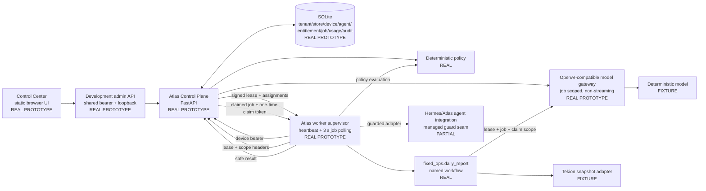
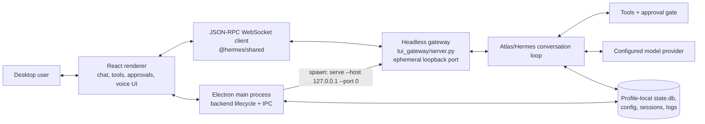
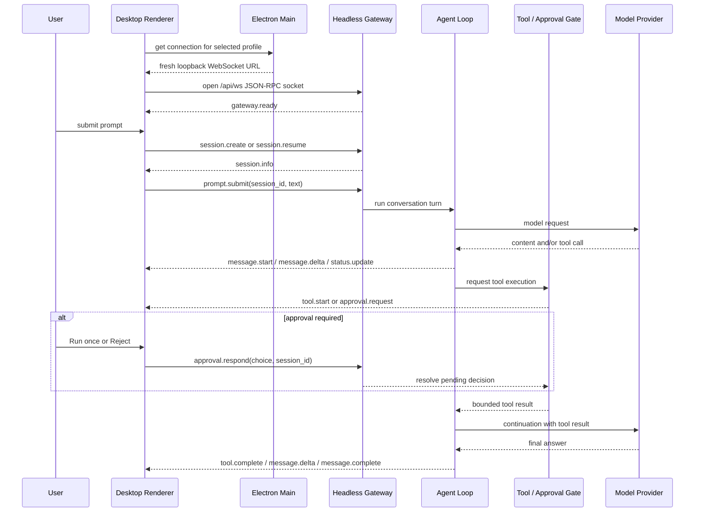
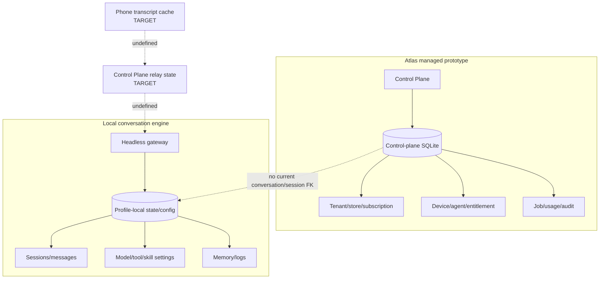
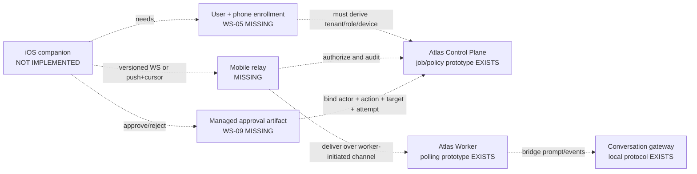

# M01 Runtime Map

## Purpose and baseline

This document maps the Atlas runtimes that actually exist, the paths exercised
during M01, and the seam a future phone companion would need. It deliberately
separates the Atlas managed-worker Control Plane from the upstream-derived
desktop conversation gateway: both are real, but they are not currently one
end-to-end hosted system.

| Field | Value |
|---|---|
| Audited repository | `Seomzo/atlas-platform-experiments` |
| Branch | `codex/mobile-m01-discovery` |
| Commit | `4934f94eae2d02e039a8bb430f0cfb27075cc40e` |
| Baseline state | Clean, created from the then-live `origin/main` |
| Runtime labels | **real** = actual code/transport; **fixture** = synthetic identity/data/model; **prototype** = implemented but not production contract; **target** = not implemented |

## 1. There are three version planes, not one

| Plane | Observed version | Source/provenance status | Role |
|---|---|---|---|
| Agent/CLI runtime | 0.18.2, friend-bundle `2026.7.7.2` | Installed source has no Git metadata; package version matches `pyproject.toml` | Conversation engine, tools, local session state, gateway server |
| Atlas managed control plane | 0.1.0 | Defined by `altas/__init__.py` at the audited commit | Tenant/store/device policy, jobs, model gateway, usage, audit, Control Center |
| Installed Desktop bundle | 0.17.0, build stamp `90be699` | Stamp does not resolve in current repository history | Electron shell and bundled renderer; not used as current-source proof |

The M01 desktop proof used a fourth identifiable source state: dirty
`<VOICE_PROTOTYPE_WORKTREE>` at
`e91602ae4b1a8fec3b813af2f3ad785b37262a09`. Every conclusion based on that run
is labelled **dirty prototype**.

## 2. Current Atlas-managed runtime

This is the current Atlas-owned walking skeleton implemented under `altas/`.
It is job-oriented and HTTP/polling-oriented; it is not a conversational
mobile relay.



### Managed runtime component map

| Runtime node | Process/module | State owned | Transport and authority |
|---|---|---|---|
| CLI entry | `altas/cli.py` | None beyond command configuration | `serve`, `worker`, and `doctor`; rejects non-loopback prototype server binds |
| Control Plane app | `altas/control_plane/app.py` | API wiring and dependency graph | FastAPI HTTP; authoritative for prototype device auth, leases, policy, jobs, usage, and audit |
| Configuration | `altas/control_plane/config.py` | Database path, signing/admin secrets, TTLs, quotas, provider route | Process environment; secrets omitted from representations and database |
| Persistence | `altas/control_plane/database.py`, `altas/control_plane/repository.py` | SQLite schema and scoped rows | Local SQLite; prototype only |
| Device/lease security | `altas/control_plane/security.py` | Secret hashing and signed lease primitives | Device bearer -> bounded signed lease |
| Policy | `altas/control_plane/policy.py` | Deterministic allow/deny result | Rechecks live state; no model authority |
| Model gateway | `altas/control_plane/model_gateway.py`, `plugins/model-providers/altas/plugin.yaml` | Job-bound model request and safe usage | `GET /v1/models`, `POST /v1/chat/completions`; current schema rejects streaming |
| Worker client | `altas/managed/client.py` | Redacted device credential in memory, latest lease/job authorization | HTTP to Control Plane; explicit Atlas headers |
| Immutable execution scope | `altas/managed/context.py`, `altas/managed/request_scope.py` | Tenant/store/device/agent/job identity | Request-local; must match the claimed job |
| Dispatch guard | `altas/managed/policy_guard.py` | No policy state | Fail closed before managed tool dispatch |
| Worker supervisor | `altas/managed/worker.py` | Current polling cycle and job execution | Heartbeat, claim, evaluate, execute named workflow, complete |
| Fixed-ops workflow | `altas/fixed_ops/workflow.py` | Deterministic report result | Fixture connector plus job-scoped summary call |
| Control Center | `altas/control_plane/static/index.html`, `altas/control_plane/static/app.js`, `altas/control_plane/static/styles.css` | Browser-session development bearer and current view | Loopback-only admin API; not production customer/operator auth |

### Managed job sequence

```mermaid
sequenceDiagram
    participant W as Atlas Worker
    participant CP as Control Plane
    participant DB as SQLite Repository
    participant P as Policy Engine
    participant F as Fixed-Ops Workflow
    participant M as Model Gateway

    W->>CP: POST worker/heartbeat + device bearer
    CP->>DB: authenticate device; recheck assignment/subscription
    CP-->>W: signed short-lived lease + capabilities
    W->>CP: GET worker/jobs/next + lease + tenant/store/agent
    CP->>DB: atomically claim eligible job
    CP-->>W: job + claim_token + authorization lease
    W->>CP: POST worker/policy/evaluate + immutable job scope
    CP->>P: recheck device/store/agent/subscription/entitlement/job
    P-->>W: allow or bounded denial code
    W->>F: execute registered named capability
    F->>M: POST chat/completions + lease/job/claim headers
    M->>P: recheck model.chat for the active attempt
    M->>DB: atomically reserve request/token budget
    M-->>F: non-streaming completion + usage
    F-->>W: structured safe result
    W->>CP: POST job complete + fresh lease + claim_token
    CP->>DB: validate active attempt; persist result/audit
```

### Current worker timing and direction

- `WorkerSettings.poll_interval_seconds` defaults to 3.0 in
  `altas/managed/worker.py`.
- The worker initiates heartbeat and job-poll HTTP calls. The Control Plane does
  not hold a persistent connection to push a phone prompt down to the worker.
- The job lease and claim token bind paid/privileged execution to one active
  attempt. They identify worker execution, not a human phone user.
- The current Control Plane model gateway requires a claimed running job and
  rejects streaming requests through `altas/control_plane/schemas.py`.

## 3. Current desktop conversation runtime

Desktop is a separate local conversation plane. Electron starts a headless
Atlas/Hermes backend on loopback, obtains its connection information, and the
renderer communicates directly with the engine gateway over JSON-RPC/WebSocket.
REST is used for configuration and stored-session reads.



Relevant source seams:

- `apps/desktop/electron/backend-command.ts` constructs
  `serve --host 127.0.0.1 --port 0` and supports a legacy dashboard fallback.
- `apps/desktop/electron/backend-env.ts` builds the isolated runtime environment.
- `apps/desktop/electron/main.ts` owns process startup, connection discovery,
  local/remote connection modes, Electron IPC, WebSocket URL minting, and
  REST routing.
- `apps/shared/src/json-rpc-gateway.ts` is the transport-independent WebSocket
  request/event client.
- `apps/shared/src/websocket-url.ts` builds local token or remote ticket URLs.
- `tui_gateway/server.py` is the authoritative method/session dispatcher.
- `apps/desktop/src/hermes.ts` wraps the shared client with typed Atlas calls.
- `apps/desktop/src/store/gateway.ts` maintains primary and per-profile sockets,
  reconnect state, and active-profile routing.

### Desktop conversation sequence



### Reusable desktop RPC and event vocabulary

The method names below are implemented in `tui_gateway/server.py`; desktop call
sites are in `apps/desktop/src/app/session/hooks/use-session-actions/index.ts`
and `apps/desktop/src/app/session/hooks/use-prompt-actions/submit.ts`.

| Category | Current methods/events | Mobile relevance |
|---|---|---|
| Session | `session.create`, `session.resume`, `session.info` | Strong starting nouns; needs tenant/user/worker addressing and versioned cursors |
| Prompt | `prompt.submit`, `session.interrupt` | Useful behavior; needs idempotency key, accepted offset, offline retry, and server authorization |
| Messages | `message.start`, `message.delta`, `message.complete` | Reusable render vocabulary; needs sequence numbers and resumable replay contract |
| Progress | `thinking.delta`, `reasoning.delta`, `reasoning.available`, `status.update` | Optional capability-negotiated events; sensitive content policy required |
| Tools | `tool.start`, `tool.progress`, `tool.generating`, `tool.complete` | Useful UI model; must not become permission |
| Human input | `clarify.request`, `approval.request`, `secret.request`, `approval.respond` | Only clarify/approval shape is reusable; mobile must never relay raw secrets and needs the WS-09 authorization artifact |
| Completion/error | `background.complete`, `error` | Needs stable error taxonomy, retryability, freshness, and final cursor |

`apps/desktop/src/app/session/hooks/use-message-stream/gateway-event.ts`
projects those events into the transcript. The current client rejects pending
requests when a socket closes and reconnects with bounded backoff, but event
names alone do not guarantee lossless resume. A mobile protocol requires
monotonic sequence/cursor behavior and duplicate/out-of-order handling as a
server contract.

## 4. M01 runtime proof

### 4.1 Listener and data isolation

| Listener / store | Binding or location | Data used | Cleanup result |
|---|---|---|---|
| Atlas Control Plane | `127.0.0.1:8787` | Temporary SQLite + demo seed | Listener absent after run |
| Control Center | Served by 8787 | Synthetic tenant/store/device/job/audit | Browser showed explicit disconnected state after shutdown |
| Desktop renderer | `127.0.0.1:5174` | Dirty prototype renderer only | Listener absent after deliberate Ctrl-C |
| Desktop gateway | Ephemeral loopback port | Isolated Atlas home/profile/session | Process/listener absent after run |
| Deterministic model | `127.0.0.1:19081` | Generated local responses only | Listener absent after run |
| Installed Atlas home | `<ATLAS_HOME>` | Filename-level inventory only | No content or credentials copied |
| M01 desktop home | Temporary `HOME`, `HERMES_HOME`, and Electron userData | Synthetic prompt, tool output, settings | Isolated from the installed profile |

No M01 service bound to a LAN/WAN interface. No inbound firewall exception was
created. No mobile or external relay port was opened.

### 4.2 Control-plane proof

From `<M01_WORKTREE>`:

```bash
make PYTHON="<ATLAS_HOME>/hermes-agent/venv/bin/python" atlas-smoke
```

`scripts/altas-smoke.py` used a temporary SQLite database and in-process
FastAPI `TestClient`. It passed the demo job, verified `8084.0` total sales,
denied an unentitled store, and proved that disabling the device denied the
next heartbeat.

A separate loopback server used the source CLI form defined in
`altas/cli.py` and `Makefile`:

```bash
<ATLAS_PYTHON> -m altas serve --host 127.0.0.1 --port 8787
atlas-control doctor
atlas-control worker --once
```

Environment values were isolated and secret values are intentionally omitted.
The doctor reported Control Plane configured, database parent ready, fixture
ready, and worker configured. The single worker cycle succeeded
`job_demo_daily_report` for `fixed_ops.daily_report`.

### 4.3 Desktop proof

The dirty prototype was launched with isolated `HOME`, `HERMES_HOME`, Electron
userData, project path, and explicit source root:

```bash
npm --workspace apps/desktop run dev
```

A local no-key OpenAI-compatible fixture returned one terminal tool call and a
streamed final response. The live UI -> JSON-RPC WebSocket -> gateway -> agent
-> tool -> provider -> streamed renderer path completed. The safe tool printed:

```text
M01_DETERMINISTIC_TOOL_OK
```

An earlier synthetic `git push` did not produce an approval request; it ran in
the empty isolated temporary workspace and exited 128 (`not a git repository`),
with no local repository or remote mutation. A later harmless
`python3 -c print(...)` command did produce an `approval.request`; M01 chose
Reject and the blocked command returned exit `-1`. The current desktop approval
gate is therefore pattern-sensitive and must not be confused with the missing
WS-09 managed-action policy. The first-launch memory-model gate and
settings/voice/provider/gateway surfaces were also rendered. The local visual
evidence is stored under `artifacts/mobile-readiness/current-surfaces/` and is
catalogued in `docs/altas/mobile/M01_DISCOVERY_AUDIT.md`.

This proof is not evidence of a hosted Control Plane, phone authentication,
lossless network resume, production provider behavior, or current-main desktop
readiness.

## 5. Persistence and ownership map



The Control Plane database does not own the desktop's durable conversation
sessions, and the local conversation store does not derive a human Atlas
account, tenant membership, or phone enrollment from the Control Plane. A
future relay must specify correlation keys and retention without merging audit
records and transcript payloads into one accidental data model.

## 6. Authentication and authorization map

| Boundary | Current credential/artifact | What it proves | Why it is not a mobile credential |
|---|---|---|---|
| Worker -> Control Plane | Hashed device bearer | Knowledge of the seeded/configured worker secret | Reusable symmetric worker credential; no human, org role, phone binding, or enrollment transaction |
| Worker scoped calls | Signed short-lived lease | Recently authenticated device with current assignment/capabilities | Issued to worker execution, not a phone user |
| Job attempt | One-time claim token | Active attempt for an exact claimed job | Not a conversation-session or approval token |
| Control Center -> admin API | Shared development admin bearer + loopback | Development access from local browser | No customer/operator identity, RBAC, CSRF model, or safe remote exposure |
| Desktop renderer -> local gateway | Local session token / fresh WebSocket URL | Access to locally managed engine gateway | Local process trust; no Atlas account/device enrollment |
| Desktop -> remote upstream gateway | Static token or OAuth cookie + one-time WS ticket | Upstream gateway session | Provider-specific desktop feature, not adopted Atlas identity architecture |
| Experimental messaging relay | Gateway/connector HMAC material | Authenticated connector WebSocket; inbound frames rely on that channel rather than separate per-delivery signatures | Different actor, tenant, and platform trust model; no Atlas phone/user/worker binding |

The mobile relay must start with WS-05 user/device enrollment and issue its own
short-lived, audience-limited access. It must never forward the worker bearer,
Control Center admin bearer, model-provider secret, dealership credential, or
raw gateway token to a phone.

## 7. Current mobile path: absent



`docs/altas/MOBILE_COMPANION.md` describes this rough target and correctly
blocks it on WS-05. Nothing in the current repository completes the dotted
edges.

### Minimum runtime contract required next

1. **Identity/session:** authenticated user, org membership and role; enrolled
   phone; enrolled worker; explicit tenant/store/worker conversation address.
2. **Worker-initiated channel:** persistent outbound authenticated connection or
   bounded long-poll from worker to Control Plane; server-side revocation and
   health/freshness.
3. **Conversation commands:** versioned `open/resume/submit/interrupt/close`
   with client idempotency keys and server acknowledgements.
4. **Events:** monotonic per-session sequence, opaque resume cursor, bounded
   replay window, duplicate/out-of-order rules, terminal event, and backpressure.
5. **Approvals:** WS-09 artifact bound to authenticated actor, tenant, store,
   worker, agent, job/turn, canonical action/target hash, expiry, and one use.
6. **Push:** APNs carries only a minimal wake/notification reference; the app
   fetches authorized state and cursor after wake.
7. **Retention:** explicit ownership of phone cache, relay buffer, local durable
   transcript, audit metadata, deletion/export, and sensitive reasoning/tool
   detail.
8. **Capability negotiation:** client/server protocol versions and optional
   text, tool-progress, approval, voice, artifact, and notification features.

## 8. Failure-state map

| Failure | Current observed behavior | Mobile requirement |
|---|---|---|
| Control Plane stopped | Control Center displays connection failed and “CONTROL PLANE UNAVAILABLE” while retaining visibly stale page structure | Surface offline/stale age; never imply a command or approval was accepted |
| Desktop first-launch model mismatch | Setup gate blocks entry and asks for a distinct memory provider | Phone must report worker configuration health without requiring phone-side provider setup |
| Desktop WebSocket closes | Shared client rejects pending RPCs; desktop registry attempts reconnect with bounded backoff | Resume from last committed cursor; distinguish not accepted / accepted-running / completed |
| Prompt runtime ID is stale | Desktop submit path can resume and retry in selected cases | Server-side idempotency must make retries safe across process/app restarts |
| Approval is pending | Agent turn waits; renderer sends `approval.respond` | Mobile approval must survive reconnect, expire, be single use, and fail if action or policy changes |
| Worker disabled | Next heartbeat/policy path denies; queued/running work is canceled by prototype logic | Relay socket and phone access to that worker must be revoked promptly and independently audited |
| Public network/provider blocked | M01 desktop used local deterministic provider; no production network behavior verified | Stable retry taxonomy, deadlines, cancellation, usage settlement, and privacy-safe errors |

## 9. Runtime conclusions

- The current Control Plane is an enforcement/job prototype, not a
  conversation host.
- The current desktop gateway is a strong conversation protocol prototype, not
  an Atlas cloud authorization boundary.
- The current worker polls; it does not maintain the reverse conversation path
  imagined for mobile.
- The experimental relay supplies transport lessons, not Atlas identity.
- A future mobile system should bridge these planes through an explicit
  Atlas-owned relay service and worker adapter. It should not expose either the
  model gateway or the local JSON-RPC socket directly to the phone.
- The first implementable phone slice begins only after identity/enrollment,
  resumable event delivery, and approval artifacts have executable tests.

## 10. Validated source index

Every repository-relative path cited above was checked at the audited commit:

- `Makefile`
- `pyproject.toml`
- `scripts/altas-smoke.py`
- `altas/__init__.py`
- `altas/cli.py`
- `altas/control_plane/app.py`
- `altas/control_plane/config.py`
- `altas/control_plane/database.py`
- `altas/control_plane/model_gateway.py`
- `altas/control_plane/policy.py`
- `altas/control_plane/repository.py`
- `altas/control_plane/schemas.py`
- `altas/control_plane/security.py`
- `altas/control_plane/static/app.js`
- `altas/control_plane/static/index.html`
- `altas/control_plane/static/styles.css`
- `altas/fixed_ops/workflow.py`
- `altas/managed/client.py`
- `altas/managed/context.py`
- `altas/managed/policy_guard.py`
- `altas/managed/request_scope.py`
- `altas/managed/worker.py`
- `plugins/model-providers/altas/plugin.yaml`
- `apps/desktop/electron/backend-command.ts`
- `apps/desktop/electron/backend-env.ts`
- `apps/desktop/electron/main.ts`
- `apps/desktop/src/hermes.ts`
- `apps/desktop/src/store/gateway.ts`
- `apps/desktop/src/app/session/hooks/use-session-actions/index.ts`
- `apps/desktop/src/app/session/hooks/use-prompt-actions/submit.ts`
- `apps/desktop/src/app/session/hooks/use-message-stream/gateway-event.ts`
- `apps/desktop/src/components/assistant-ui/tool/approval.tsx`
- `apps/shared/src/json-rpc-gateway.ts`
- `apps/shared/src/websocket-url.ts`
- `tui_gateway/server.py`
- `gateway/relay/adapter.py`
- `gateway/relay/auth.py`
- `gateway/relay/descriptor.py`
- `gateway/relay/ws_transport.py`
- `docs/altas/ARCHITECTURE.md`
- `docs/altas/MOBILE_COMPANION.md`
- `docs/altas/mobile/M01_DISCOVERY_AUDIT.md`

The screenshots under `artifacts/mobile-readiness/current-surfaces/` are local
M01 evidence rather than a production asset contract.
