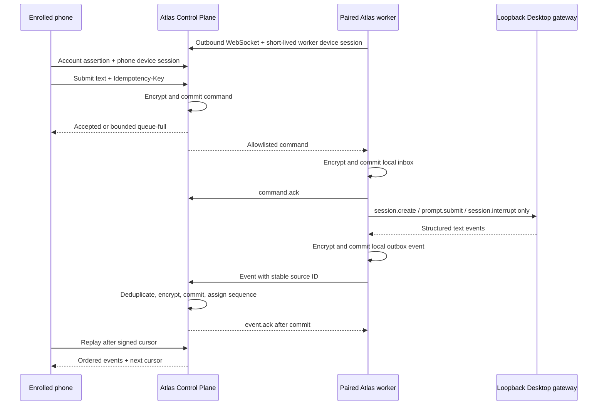

# M02 Mobile Text Relay

## Status and boundary

M02 implements the backend prerequisite for an Atlas mobile companion to send
and replay text through one explicitly paired store worker. It builds on the
WS-05 account/device enrollment contract and does not create an iOS target.

This is a narrow relay, not remote access to the Desktop gateway. A phone can
create a relay session, submit text, request an interrupt, inspect command
state, and replay ordered events. It cannot choose a tenant, store, profile,
workspace, model, tool, shell command, or arbitrary JSON-RPC method.

Deferred to later workstreams:

- the iOS/Xcode application;
- APNs and background notification hints;
- voice capture, transcription, and playback;
- production OIDC and hardware-backed device keys;
- production multi-instance routing and key management.

## Topology



The worker connection is always outbound. The phone never connects to the
worker or `/api/ws`, and neither the phone nor Control Plane can select a local
gateway method beyond the hard-coded adapter allowlist.

## Authentication and scoping

Phone HTTP calls require two independent credentials:

```text
Authorization: Bearer <verified account assertion>
X-Atlas-Device-Session: <short-lived phone device session>
```

The server requires the phone device to be active, Ed25519-enrolled, owned by
the verified user, and granted to the pairing's live store. Pairing derives the
tenant and store from the phone and verifies an active Ed25519 worker with an
exact active agent binding in the same tenant/store.

The worker WebSocket is:

```text
GET /api/v1/mobile/relay/worker/connect
Authorization: Bearer <short-lived worker device session>
```

Query-string credentials and browser `Origin` upgrades are rejected on this
surface. The server closes the socket when its device session expires, so the
worker proves its private key and reconnects with a new session. Device
revocation closes live relay scope, revokes pairings, closes sessions, and
cancels nonterminal commands.

## Phone API

All bodies reject unknown fields. Client-supplied tenant identifiers do not
exist in the contract.

| Method | Path | Purpose |
|---|---|---|
| `POST` | `/api/v1/mobile/relay/pairings` | Pair the authenticated phone with one worker device. |
| `POST` | `/api/v1/mobile/relay/sessions` | Create a relay session and durable `session.create` command. |
| `GET` | `/api/v1/mobile/relay/sessions` | List only this phone's sessions. |
| `GET` | `/api/v1/mobile/relay/sessions/{id}` | Read state and live worker availability. |
| `POST` | `/api/v1/mobile/relay/sessions/{id}/messages` | Queue a bounded text prompt. |
| `POST` | `/api/v1/mobile/relay/sessions/{id}/interrupts` | Queue an interrupt. |
| `GET` | `/api/v1/mobile/relay/commands/{id}` | Inspect accepted/delivered/terminal command state. |
| `GET` | `/api/v1/mobile/relay/sessions/{id}/events` | Replay monotonically ordered events after an opaque signed cursor. |

Every command-creating request requires an `Idempotency-Key` of at most 160
characters. Reusing a key with the same operation returns the original
resource. Reusing it with different content returns
`relay_idempotency_conflict`.

Text is limited to 16,000 characters. Worker event frames default to 128 KiB,
event pages to 200 entries, the pending queue to 32 commands, and the live
delivery window to eight commands. A full queue returns HTTP 429 with
`Retry-After`; it never grows without bound.

## Wire frames

Server to worker:

```json
{
  "type": "command",
  "command": {
    "id": "relay_command_...",
    "session_id": "relay_session_...",
    "worker_sequence": 2,
    "command_type": "prompt.submit",
    "gateway_session_id": "local-runtime-id-or-null",
    "payload": {"text": "..."}
  }
}
```

Worker durable-receipt acknowledgement:

```json
{"type":"command.ack","command_id":"relay_command_..."}
```

Worker event:

```json
{
  "type": "event",
  "source_event_id": "worker:relay_command_...:3:message.complete",
  "session_id": "relay_session_...",
  "command_id": "relay_command_...",
  "event_type": "message.complete",
  "payload": {"text":"...","status":"complete"}
}
```

The Control Plane returns `event.ack` with the durable event ID and assigned
session sequence. A repeated `source_event_id` with identical content returns
the same acknowledgement; conflicting reuse fails closed.

## Persistence and crash semantics

Control Plane command and event payloads are AES-256-GCM encrypted before
SQLite. Separate HMAC-derived keys authenticate payload digests for
idempotency without storing raw content. Audit rows contain identifiers,
event/command types, availability, and outcomes—not prompt or response text.
The prototype derives encryption and cursor keys from the injected Control
Plane signing secret; production requires an independently rotated KMS key.

The worker uses a second encrypted SQLite inbox/outbox. It sends
`command.ack` only after the inbox transaction commits and deletes no outbox
event until the Control Plane acknowledges its commit. Reconnect resends
unacknowledged commands or events by stable identity.

The existing local Desktop `prompt.submit` method is not idempotent. To avoid
silently executing a prompt twice, a worker restart changes a command that was
already marked `executing` to `uncertain`, emits
`local_gateway_outcome_unknown`, and does not replay the local RPC. A command
still in `pending` is safe to execute. Replacing this fail-closed uncertainty
with seamless retry requires the durable Task Thread/idempotent-turn backend to
be promoted into the supported worker runtime.

## Worker configuration

The connector entry point is:

```bash
python -m altas.mobile_relay.worker
```

Required configuration:

```text
ATLAS_CONTROL_PLANE_URL
ATLAS_DEVICE_ID
ATLAS_DEVICE_PRIVATE_KEY_FILE
```

The private-key file contains the base64url raw 32-byte Ed25519 private key and
must be a regular, non-symlink file with mode `0600`. The worker uses it to mint
short-lived device sessions and derive a domain-separated local-store key; it
does not send the private key.

Optional local adapter configuration:

```text
ATLAS_LOCAL_GATEWAY_URL
ATLAS_LOCAL_GATEWAY_AUTHORIZATION_FILE
ATLAS_MOBILE_RELAY_WORKSPACE
ATLAS_MOBILE_RELAY_STORE
```

The local gateway URL must resolve syntactically to `localhost`, `127.0.0.1`,
or `::1` and cannot contain a query. The authorization file is also `0600` and
contains `token <value>` for the loopback dashboard or `internal <value>` for a
server-managed integration. The connector inserts it only into the local
WebSocket upgrade. Workspace selection is worker-owned configuration and is
never accepted from a relay command.

## Validation target

The focused tests prove:

- account plus phone-device binding and exact phone ownership;
- exact phone/worker/store/agent pairing;
- offline queueing and reconnect redelivery;
- worker inbox commit before command acknowledgement;
- Control Plane event commit before event acknowledgement;
- command and event idempotency;
- ordered cursor replay and cross-session cursor rejection;
- encrypted-at-rest prompt/event data on both SQLite planes;
- bounded queue backpressure;
- device-revocation cancellation;
- rejection of phone credentials on the worker socket.

This is sufficient backend contract for the next iOS prompt. It is not a
production pilot authorization.
