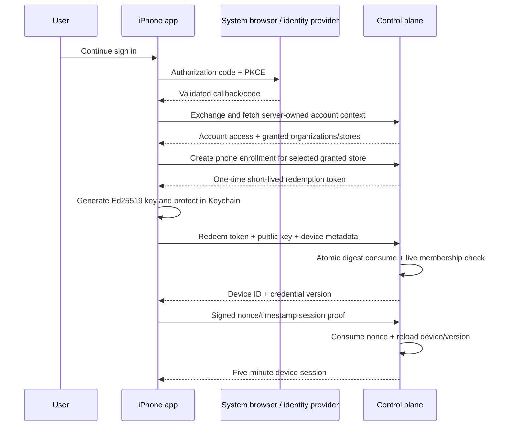

# Atlas Mobile Identity and Enrollment

**Decision:** Separate human account authentication from device possession. The control plane derives all membership and scope, while the enrolled iPhone proves a short-lived session with its device key.

## 1. Existing implementation evidence

The inspected WS-05 implementation already supplies these useful invariants:

- a provider-neutral `IdentityVerifier` and a deterministic provider restricted to seeded loopback development;
- server-loaded users, memberships, roles, store grants, subscriptions, and entitlements;
- one-time random enrollment tokens stored as SHA-256 digests, with a current 600-second default and atomic `BEGIN IMMEDIATE` redemption;
- Ed25519 public-key enrollment and a canonical device-session proof with persisted fresh nonce and 60-second timestamp-skew check;
- five-minute signed device sessions whose credential version and account context are checked live;
- proof-bound key rotation and immediate revocation/version bump;
- owner/operator/member roles, where members may enroll a phone but cannot enroll workers or revoke devices.

It does not yet provide production OIDC/PKCE/MFA/account recovery, iOS Keychain/Secure Enclave integration, App Attest, multi-instance nonce storage, or a production desktop enrollment experience.

## 2. Identities and credentials

| Actor / credential | Purpose | Where held | Authority |
|---|---|---|---|
| Human OIDC session | Authenticate account and initiate enrollment/recovery | Provider and short-lived control-plane exchange | Human identity only |
| Atlas account access | Authorize the human side of phone APIs | Memory; current development assertion is ten minutes | Live user/membership context |
| Rotating account renewal handle | Renew account access without a browser every ten minutes | `ThisDeviceOnly` Keychain; one-time and phone-proof-bound | Session continuity only; specified, not implemented |
| Enrollment token | Authorize one device registration | Digest at server; transient user handoff | Single use, ten-minute current default |
| Phone Ed25519 key | Prove enrolled device possession | `ThisDeviceOnly` iPhone Keychain; public key server-side | Device possession, not membership |
| Device session | Authorize mobile APIs/stream | Memory on phone; signed/validated by control plane | Five-minute current default, live scope checks |
| Worker device session | Authenticate outbound worker relay | Worker key store and memory | Exact worker/agent/pairing only |
| Local gateway bearer | Legacy loopback compatibility | Worker machine only | Never reaches phone/control-plane logs |

There is no client secret in the app. Tenant, store, role, worker, profile, subscription, and entitlement claims from the phone are untrusted hints at most; the server reloads them.

## 3. Human sign-in recommendation

Use OIDC authorization-code flow with PKCE through `ASWebAuthenticationSession`:

1. App creates high-entropy state, nonce, and PKCE verifier/challenge.
2. System browser authenticates the user; the app never receives their password or MFA secret.
3. Callback must match registered scheme/universal link, state, issuer, audience, nonce, and PKCE verifier.
4. Control plane exchanges the code and returns a short-lived Atlas account access credential plus, after phone enrollment, a one-time rotating renewal handle bound to that phone's device proof.
5. Control plane reloads current account membership and granted stores.
6. Multiple memberships produce a server-returned selection list; the phone cannot type or invent an organization ID.

The exact provider-neutral mobile facade is:

1. `POST /api/v1/mobile/auth/transactions` with S256 challenge, allowlisted redirect URI, and client nonce; server returns one-time transaction ID, state, authorization URL, and expiry.
2. Open the returned URL in `ASWebAuthenticationSession`.
3. Validate the callback shape locally, then `POST /api/v1/mobile/auth/exchanges` with transaction ID, code, exact state, verifier, and redirect URI.
4. Server atomically consumes the transaction, validates provider issuer/audience/nonce/code/PKCE/redirect, maps issuer+subject to Atlas user, and returns a short Atlas account-access credential.
5. Fetch `/api/v1/account/context`; server reloads current user, memberships, roles, and grants.

The transaction/exchange messages are versioned in `contracts/mobile/atlas-mobile-identity-v1.schema.json`. They accept no tenant/organization/store authority. The account access is not written to disk.

The production identity vendor, MFA/recovery policy, session duration, and enterprise federation choices require product/security owner approval and remain behind `IdentityVerifier`. The inspected implementation has a ten-minute deterministic development account assertion and no renewal family. M03 must implement the provider-neutral renewal contract or explicitly require browser reauthentication during the isolated slice; production cannot rely on the deterministic issuer.

### Access and renewal credentials

- Phone API calls present both `Authorization: Bearer <account-access>` and `X-Atlas-Device-Session: <device-session>` to preserve the implemented two-party check: authenticated human plus exact enrolled phone owned by that human.
- Account access remains in memory and is short-lived (ten minutes in the current development implementation; production TTL is a security-owner decision).
- After enrollment, the control plane may issue a random opaque renewal handle only with a live account session plus device proof. The handle is stored `WhenUnlockedThisDeviceOnly`, server-hashed, environment/device/user bound, single-use, and rotated on every successful renewal.
- A renewal request presents the current handle plus a fresh signed device nonce/timestamp. The server atomically consumes it, reloads account/membership/grants/device/version, and returns new account access + replacement handle.
- Reuse, family mismatch, device revocation, membership loss, key rotation mismatch, or environment mismatch revokes the renewal family and forces browser sign-in. No reusable client secret is embedded in the app.
- M03 test settings may use current 600-second account / 300-second device access TTLs. M02 does not silently set a production renewal lifetime.

The proposed renewal proof signs these exact UTF-8 bytes; the handle digest is unpadded base64url SHA-256 of the opaque handle:

```text
atlas-account-renewal-proof-v1
<device_id>
<renewal_handle_digest>
<unix_timestamp>
<nonce>
```

The current WS-05 backend does not implement this proof or renewal family. It is a versioned M03 addition, not a reinterpretation of the existing device-session proof.

## 4. Enrollment flow



Self-enrollment after strong browser authentication is the primary phone flow and matches the implemented account/enrollment endpoints. An authorized second surface may instead display an environment-bound QR/universal link for assisted enrollment or recovery; it creates the same one-time server transaction and conveys no lasting authority.

Enrollment payload requirements:

- random token with at least 128 bits of entropy;
- issuer/environment binding;
- intended device kind `phone`;
- expiry and one-time digest;
- optional human-readable verification code to resist wrong-environment QR substitution;
- no bearer worker credential, provider secret, tenant authority, or reusable password.

If key generation succeeds but redemption fails, delete the provisional key unless the server can resolve the exact idempotent enrollment attempt. Never enroll a second hidden key on Retry.

## 5. Device-session proof

Use the implemented versioned canonical form exactly; codegen supplies field order and UTF-8/newline rules:

```text
atlas-device-session-proof-v1
<device_id>
<unix_timestamp>
<nonce>
```

The server:

- looks up the active device and algorithm;
- consumes a fresh persisted nonce atomically;
- rejects timestamps outside the configured skew (currently 60 seconds);
- verifies the Ed25519 signature and credential version;
- reloads active user, membership, role, store grants, subscription, and entitlements;
- issues a short-lived session bound to the live device and credential version; phone APIs separately require and correlate the account assertion;
- checks expiry and credential version again on each API request and stream heartbeat.

The app keeps device and account access sessions in memory and mints another device session using a new nonce when near expiry. Account continuity uses the single-use proof-bound renewal handle above, not a reusable bearer. A single renewal attempt is allowed after an expired response; reuse/revocation/forbidden responses do not loop.

## 6. iPhone key storage decision

The backend currently requires Ed25519. The installed Xcode 26.6 iPhoneOS CryptoKit Swift interface exposes `Curve25519.Signing.PrivateKey` separately from `SecureEnclave.P256.Signing.PrivateKey` and has no Secure Enclave Ed25519 signing type. Therefore:

- M03 generates `Curve25519.Signing.PrivateKey` on device;
- stores its private representation in a Keychain generic-password item using `kSecAttrAccessibleWhenUnlockedThisDeviceOnly`;
- sets `kSecAttrSynchronizable` false and uses an environment-specific access group;
- never exports it from `DeviceKeyStore`, includes it in backup, analytics, logs, diagnostics, or crash reports;
- deletes it on sign-out/revocation and treats an unreadable/missing item as unenrolled.

This provides OS/Keychain protection and backup exclusion but is not a hardware-backed Ed25519 claim. Before production, choose one:

1. add a versioned P-256 device-proof algorithm and migrate capable phones to Secure Enclave; **recommended**;
2. accept Keychain-protected Ed25519 with a documented threat model and compensating App Attest/risk controls.

The wire contract advertises supported algorithms so this migration does not change account or relay semantics.

## 7. Worker and scope association

- A phone may pair only with an active Ed25519 worker owned by the same server-derived tenant/store and associated with an active agent.
- The current relay repository verifies phone ownership, live membership/store grant, worker activity, tenant/store equality, and agent activity when a pairing is created.
- Profiles/capabilities are server-returned and tied to the selected worker. The phone cannot broaden them.
- Scope change cancels foreground subscriptions, clears decrypted feature state, obtains a fresh snapshot/cursor, and reauthorizes notifications.
- Pairing and enrollment are different: enrollment establishes phone identity; pairing grants an exact relay relationship. Revoking either invalidates dependent relay sessions.

The current WS-05 `devices` record binds a phone to one store because `store_id` is mandatory at enrollment. M03 deliberately proves one store with that model. The complete multi-store product must not create one hidden phone key/device per store. Before M07, migrate phone identity to user + organization scope and add explicit server-authorized store/worker bindings; keep workers store-bound. The mobile API remains stable while a migration maps the original store-bound record into its first binding.

## 8. Rotation and recovery

### Planned rotation

The active device key proves a replacement public key. Server atomically increments credential version, installs the replacement, and invalidates all prior sessions. The app commits the replacement Keychain item only after the server confirms, using a two-slot pending/active record to survive interruption.

The implemented rotation proof signs:

```text
atlas-device-key-rotation-v1
<device_id>
<new_public_key>
<unix_timestamp>
<nonce>
```

### Lost or stolen phone

An owner/operator signs in on another authorized Atlas surface, identifies the device by safe metadata, and revokes it. Revocation increments credential version, closes phone streams, cancels dependent pairings/jobs as specified, and denies future session proof. APNs device tokens are deleted. The stolen phone erases decrypted state on the next denial; server-side access does not depend on that erase occurring.

### Account recovery

Account recovery belongs to the production identity provider and control-plane policy. Recovery does not automatically trust a previous phone or restore a `ThisDeviceOnly` key. The recovered user must perform new enrollment, and high-risk recovery may require owner/security review.

### App reinstall or device migration

`ThisDeviceOnly` key material does not migrate. Reinstall/migration is a new enrollment. Server UI should let the operator revoke orphaned records; the app must not weaken Keychain accessibility for convenience.

## 9. Sign-out, revoke, and erase semantics

| Action | Server effect | Local effect |
|---|---|---|
| Sign out | Idempotently self-revoke this phone, renewal family, sessions, pairings and push registration; no effect on other devices | Delete access sessions, renewal handle, device key, cache key/data, cursors and drafts even if network fails; warn about remote revoke |
| Revoke this phone | Revoke device/version and dependent pairings/sessions | Same purge after confirmed response; fail closed if response is uncertain |
| Remote revoke | Server denial/stream close on next check | Privacy shield, purge decrypted state, delete credentials, recovery screen |
| Clear local data | No authority change | Delete cache/drafts/diagnostics; keep enrollment key only after explicit explanation |

For the first release, **Sign out removes this phone's server trust and local enrollment key and requires re-enrollment**. This is easier to reason about than a signed-out-but-still-possessed key. WS-05 currently lets only owner/operator roles call the general device-revoke endpoint, so M03 needs a narrow idempotent self-revoke route available to the authenticated owner of that exact phone; it must not grant members authority over other devices.

## 10. Biometric reauthentication

Face ID/Touch ID is user-presence confirmation, not account or device authentication.

- Required immediately before approving a consequential managed action and before rotating/revoking this device from the phone.
- Optional for opening the app only if product owners request an extra local privacy lock; protected data and account auth already remain mandatory.
- Evaluation context is created fresh; success expires when the approval sheet is dismissed, app backgrounds, scope changes, or 60 seconds elapse—whichever occurs first.
- No biometric result is sent to the server. The server receives the exact authorized decision plus fresh device session and action version/digest.
- Biometry change/lockout uses explicit device-passcode fallback only for allowed risk tiers; otherwise Deny or recover through another authorized surface.

## 11. Authorization matrix for v1

| Operation | Member | Operator | Owner | Server checks |
|---|---:|---:|---:|---|
| Enroll own phone | yes | yes | yes | active membership + one-time token |
| Read granted threads/activity | yes | yes | yes | live grant + entitlement + pairing |
| Submit text / interrupt | policy/profile | policy/profile | policy/profile | exact scope + allowlisted command |
| Respond to managed approval | no by current plan | yes | yes | exact role + digest/version/context |
| Self-revoke exact authenticated phone | specified M03 gap | yes | yes | exact account owner + phone session; no arbitrary device ID |
| Revoke another/account device | no | yes | yes | live role + store grant + target device scope |
| Enroll/revoke worker | no | yes | yes | never offered in iPhone v1 UI |

The backend remains authoritative; this table determines visible affordances but is not a client enforcement boundary.

## 12. Identity failure states

- **Expired device session:** mint once with a fresh proof; preserve draft.
- **Expired account access:** rotate the proof-bound renewal handle once; reused/invalid family forces browser sign-in.
- **Consumed/expired nonce:** request another nonce; never reuse signature.
- **Clock skew:** block renewal, show system-date guidance and diagnostics; do not widen server skew automatically.
- **Credential version mismatch / device revoked:** purge protected state and enter Revoked.
- **Membership/store grant lost:** clear scope and refetch; no cached access.
- **Algorithm unsupported:** require app/server upgrade; never downgrade silently.
- **Provider unavailable:** existing short-lived device session may finish safe reads until expiry; no bypass provider.
- **Key missing/corrupt:** treat as unenrolled and require a new one-time enrollment.

## 13. M03 identity acceptance

- Concurrent redemption proves one winner and no reusable token.
- Cross-user, cross-tenant, cross-store, wrong-device, wrong-algorithm, stale timestamp, reused nonce, wrong credential version, and revoked-device cases fail closed.
- Keychain item is absent from backup/sync and inaccessible while locked.
- Device session/token/key never appears in logs, screenshots, pasteboard, crash output, analytics, or safe diagnostics.
- Remote revocation closes the stream and denies the next API/heartbeat in a deterministic test.
- Reinstall/migration requires new enrollment.
- Physical-device evidence proves browser callback, enrollment, renewal, biometric approval, sign-out purge, and remote revocation.
