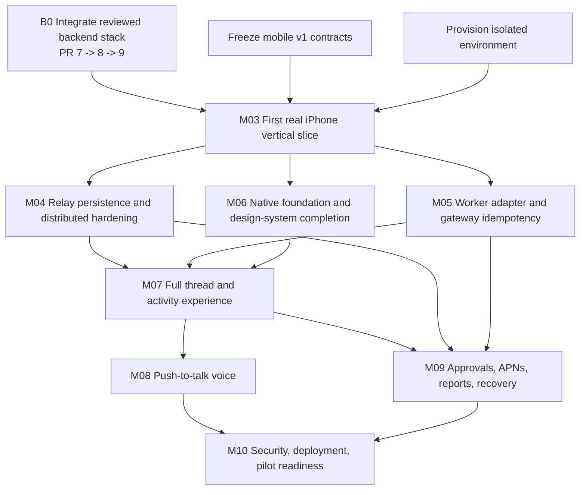

# Atlas Native iPhone Implementation Roadmap

**Program decision:** M03 is one narrow, production-shaped iPhone vertical slice. Subsequent workstreams harden or broaden one seam at a time. No team starts from `main` while the identity → relay → approval stack exists only as stacked draft branches.

## 1. Advancement decision

**Gated GO for M03 engineering; NO-GO for production/pilot.**

M03 may start when all of these are true:

1. WS-05 identity (draft PR 7, inspected head `20997113…`), durable relay (draft PR 8, `cf7bec22…`), and WS-09 approvals (draft PR 9, `85443dad…`) have been reviewed in dependency order and integrated into one clean, named base.
2. The `contracts/mobile/` v1 schemas in this M02 workstream are reviewed and frozen for the slice.
3. An isolated hosted control-plane environment, synthetic organization/store/account, and outbound worker are named; no production data or live connector credentials.
4. iOS signing/bundle ID/test device access and an immutable internal base URL are confirmed by owners.
5. The first slice remains text + one synthetic no-write approval. Voice, general actions, and production launch cannot expand it.

If the branch stack is not integrated or mobile-safe event projection is not implemented, M03 is NO-GO rather than an invitation to mock the missing hops.

## 2. Dependency graph

M04, M05, and M06 may run in parallel after M03 if ownership remains nonoverlapping. M07 is the integration convergence. M08 and most of M09 can then run in parallel; M10 consumes all of them.

## 3. Program ownership rules

- One integration owner controls the target branch, Xcode project, shared dependency container, generated contract update, and merge order.
- Contracts owner alone edits `contracts/mobile/**`; producers and consumers submit contract proposals there first.
- iOS feature owners work in `apps/ios/Features/<Feature>/**`. Core owners work in one named `apps/ios/Core/<Area>/**` boundary.
- Relay/control-plane owners own `apps/control_center/api/**` relay/identity/approval persistence and endpoints; worker owners own `apps/worker/**`/adapter paths; gateway owners own exact RPC/idempotency semantics.
- Design-system owner owns tokens/components/assets; feature owners consume them and do not fork visual primitives.
- Every branch rebases/merges the named integration base before handoff, reports exact SHA/dirty state/tests/screens, and does not merge itself.
- Shared choke points require an integration-owner reservation before editing. Conflicting Xcode project-file edits are centralized or generated.

## 4. Pre-M03 integration gate (B0)

**Purpose:** turn reviewed stacked prototypes into one auditable M03 backend base.

- **Dependencies:** M01 base plus PR 7 → PR 8 → PR 9.
- **Owned paths:** backend integration branch and conflict resolutions only; preserve each feature's docs/tests.
- **Consumes/produces:** consumes implemented identity/relay/approval contracts; produces one exact clean SHA and combined schema/migration inventory.
- **Acceptance:** full backend suite, clean database setup, migration/constraint inventory, all targeted cross-scope/revocation/replay/approval tests.
- **Security:** deterministic identity remains loopback/test-only; real connector writes disabled; synthetic export asserts no artifact/write.
- **Evidence/handoff:** dependency graph, resolved conflicts, test counts, migration inventory, exact SHA, known prototype limitations.
- **Merge order:** strict PR 7, 8, 9. The architecture M02 handoff supersedes PR 8's same-path backend handoff; preserve relay detail in `M02_TEXT_RELAY.md`.
- **Avoid now:** production datastore/provider/cloud/key vendor choices, broad API renaming, legacy auth removal unrelated to slice.

## 5. M03 — First real iPhone vertical slice

**Purpose:** prove one physical-device path across native UI, identity, control plane, outbound worker, gateway, replay, and one synthetic approval.

- **Dependencies:** B0, frozen v1 schemas, isolated environment, iOS signing/device.
- **Owned paths:** `apps/ios/**`; narrowly scoped phone stream/mobile projection additions; generated contract clients; M03 evidence/handoff.
- **Consumes:** identity enrollment/session proof, relay pairing/session/message/interrupt/events, managed-approval endpoints, `atlas.mobile.*.v1` schemas.
- **Produces:** native app shell, PKCE seam, enrollment/Keychain, Today/Threads/Settings minimum screens, HTTP commands, phone foreground stream, replay cache, one approval sheet, one content-minimal completion APNs/deep link, diagnostics, physical-device/cellular evidence.
- **Functional acceptance:** exact 16-step slice in `IOS_PRODUCT_SPEC.md`; no hidden mocks in shipping path.
- **Security acceptance:** mobile-safe projection, cross-scope matrix, short-lived in-memory sessions, Keychain protection, remote revoke, biometric decision, secret/log/push scan, uncertain outcome.
- **Visual evidence:** light/dark enrollment, Today, active/replaying/offline/revoked thread, tool lifecycle, approval pending/resolved, largest text, Reduce Motion/Transparency; physical-device video.
- **Handoff:** app/backend/contract SHAs, build/install procedure, environment, test logs, correlation timeline, screenshots/video, risks, rollback/purge instructions.
- **Merge order:** contracts → backend projection/phone stream → iOS Core → identity/enrollment → Threads → approval → integration/evidence.
- **Avoid now:** voice, notification categories beyond the one completion proof, multiple stores/workers, downloads, real connectors, analytics SDK, App Store submission, broad desktop changes.

M03 subtrack ownership may run in parallel only after contracts freeze:

| Subtrack | Owned area | Must not edit |
|---|---|---|
| M03-C Contracts | `contracts/mobile/**`, generation config | feature UI/backend behavior |
| M03-I Identity | `Core/Identity`, `Features/Authentication`, `Features/Enrollment` | relay protocol, thread UI |
| M03-R Relay | backend mobile projection/phone stream, `Core/Relay` | iOS feature layout |
| M03-U Native UI | app shell, design primitives, Today/Threads/Settings | backend/auth cryptography |
| M03-A Approval | approval client/sheet and narrow backend projection | general tool execution |
| M03-X Integration | Xcode project/composition, environment, end-to-end tests/evidence | unreviewed feature redesign |

## 6. M04 — Relay persistence and distributed hardening

**Purpose:** replace single-process/prototype control-plane assumptions while preserving v1 mobile behavior.

- **Dependencies:** M03 evidence and observed load/failure traces.
- **Owned paths:** relay repositories, database migrations/constraints, connection routing/presence, KMS envelope layer, relay ops/tests.
- **Consumes/produces:** consumes v1 commands/events/errors; produces version-preserving durable storage, distributed route ownership, replay and key-rotation operational contracts.
- **Acceptance:** multi-instance reconnect/drain, failover, PITR/restore, cursor continuity, durable ACK, load/backpressure, key rotation, zero cross-tenant results.
- **Security:** managed service identities/KMS, row/scope constraints, encrypted backups, access audit, abuse limits.
- **Visual evidence:** only operator/phone failure-state renders affected by failover; dashboards and trace timeline.
- **Handoff:** topology, migrations, restore/key-rotation/runbooks, SLO proposal for owner approval, exact load evidence.
- **Merge order:** storage abstraction → migrations → distributed routing → ops; client contract stays unchanged.
- **Avoid now:** silently selecting production region/retention/SLO/pricing or breaking v1 for internal convenience.

## 7. M05 — Worker adapter and gateway idempotency

**Purpose:** make the worker boundary typed, redacted, resilient, and able to resolve execution outcomes.

- **Dependencies:** M03 safe projection and uncertain-outcome evidence.
- **Owned paths:** worker relay client/store/adapter, gateway exact mobile RPC seam, event mapper/redaction, idempotency/outcome records.
- **Consumes/produces:** consumes v1 commands; produces v1 mobile events and a gateway idempotency/outcome-resolution contract.
- **Acceptance:** deny-by-default projection for every catalog event; restart at every dispatch boundary; no duplicate execution; explicit outcome resolver; worker upgrade compatibility/drain.
- **Security:** loopback enforcement, 0600/non-symlink secrets, payload fuzzing, secret canaries, hostile tool/provider frames, revoke/supersede.
- **Visual evidence:** phone correctly shows tool lifecycle, unavailable, failed, and uncertain/resolved states; no raw payload.
- **Handoff:** adapter mapping table, compatibility matrix, worker packaging/update path, tests and captured boundary scan.
- **Merge order:** gateway idempotency contract → worker durable state → typed projection → relay integration.
- **Avoid now:** arbitrary remote procedure calls, phone shell, direct worker ingress, real consequential connector actions.

## 8. M06 — Native foundation and design-system completion

**Purpose:** turn the vertical-slice shell into a maintainable premium native foundation without widening product scope.

- **Dependencies:** M03 app architecture/render evidence.
- **Owned paths:** app composition/router, networking/persistence/security/diagnostics core, design-system tokens/components/assets, CI/build tooling.
- **Consumes/produces:** consumes v1 generated types; produces stable feature APIs, component catalog, accessibility contracts, local DB migration policy.
- **Acceptance:** strict concurrency, lifecycle/task leak tests, generated-code drift CI, local migration/purge tests, component state matrix, performance budgets.
- **Security:** environment separation, production build has no fixture selector, privacy manifest, dependency/SBOM/secret scan.
- **Visual evidence:** complete component gallery across appearances/accessibility settings and target devices.
- **Handoff:** architecture map, owner boundaries, build matrix, dependency licenses, component catalog/screens.
- **Merge order:** build/composition → Core contracts → design tokens → components → feature migrations.
- **Avoid now:** speculative packages, custom glass renderer, third-party analytics/auth/network frameworks without review.

## 9. M07 — Full thread and activity experience

**Purpose:** expand from one thread to production-shaped thread discovery, lifecycle, activity, reports, and multiple granted scopes.

- **Dependencies:** M04 durability, M05 adapter/idempotency, M06 foundation.
- **Owned paths:** `Features/Threads`, `Features/Today`, `Features/Activity`, bounded server query/projection endpoints.
- **Consumes/produces:** consumes stable v1 event/command contracts; may propose additive optional fields through contracts owner; produces pagination/search/filter/report-summary domain contracts.
- **Acceptance:** multiple stores/workers, paged history, create/close where authorized, interrupt, cursor expiry, large transcripts, report summary, all empty/offline/revoked states.
- **Data migration:** separate the M03 store-bound phone record into organization/user device identity plus explicit live store bindings before enabling multi-store UI; migrate its original store atomically as the first binding.
- **Security:** server-authorized search/filter, cache separation on scope change, hostile content/links, report access expiry.
- **Visual evidence:** all primary IA states, long content, large text, slow/reconnect paths, iPhone sizes.
- **Handoff:** query/index impact, performance/memory traces, screenshots, contract changes, migration/replay behavior.
- **Merge order:** backend projections → generated contracts → repositories → Today/Threads → Activity/report UI.
- **Avoid now:** raw audit-log mobile port, local full-text upload, arbitrary artifact downloads, desktop configuration parity.

## 10. M08 — Push-to-talk voice

**Purpose:** add intentional audio capture that resolves to a reviewable text prompt on the existing command path.

- **Dependencies:** M07 stable composer/thread semantics; owner decisions for speech processing location/provider and retention.
- **Owned paths:** `Features/Voice`, audio session/capture/upload/transcription seam, voice tests/evidence.
- **Consumes/produces:** consumes prompt command contract; produces versioned audio-upload/transcription result contract without changing execution semantics.
- **Acceptance:** hold/release and accessible toggle, cancel, permission denied, interruptions/routes, background, retry, edit transcript, explicit send, localization/noise tests.
- **Security:** no ambient/background recording, ephemeral files, protected upload, owner-approved deletion, no audio/transcript analytics/push/logs.
- **Visual evidence:** permission, recording, canceled, transcribing, error, review/edit, Reduce Motion and VoiceOver on device.
- **Handoff:** audio codec/limits, provider/location/data-flow decision, retention/deletion evidence, energy/network traces.
- **Merge order:** owner decision + contract → audio core → upload/transcription → Voice UI → composer integration.
- **Avoid now:** wake word, always listening, automatic submit, voice cloning, background agent execution.

## 11. M09 — Approvals, APNs, reports, and recovery

**Purpose:** complete attention/recovery loops once core thread truth is stable.

- **Dependencies:** M04 durable control plane, M05 exact action guard, M07 IA; can overlap M08.
- **Owned paths:** `Features/Approvals`, notification registration/routing, approval projection/APNs producer, device recovery/report access.
- **Consumes/produces:** approval schema and lifecycle; produces opaque push contract, notification/deep-link categories, recovery runbook/UI.
- **Acceptance:** pending/list/detail/respond, expiry/cancel/consume, background push/open/refetch, duplicate/collapsed notifications, remote revoke/lost phone, report authorization.
- **Security:** generic payload, APNs key/token hygiene, exact action version/digest, biometric risk policy, cross-scope deep links, screenshot/capture behavior.
- **Visual evidence:** approval states from notification and foreground, expired/stale/offline, recovery/revoke, notification privacy variants approved by owner.
- **Handoff:** APNs environment/key ownership, token deletion, notification policy decision, approval alert/incident runbooks.
- **Merge order:** server approval projection → push registration → app deep-link/refetch → approval/recovery UI → ops.
- **Avoid now:** auto-approval, notification action approving from lock screen, real connector writes without separate authorization workstream.

## 12. M10 — Security, deployment, and pilot readiness

**Purpose:** decide whether evidence supports a bounded external pilot; it is not an automatic release.

- **Dependencies:** M04–M09 complete plus owner decisions in `MOBILE_DECISION_LOG.md`.
- **Owned paths:** production deployment/config/IaC, release signing, privacy/support/ops docs, security fixes, pilot evidence.
- **Consumes/produces:** all contracts/runbooks; produces threat-model review, recovery/incident/rollback plan, release artifact/provenance, pilot GO/NO-GO packet.
- **Acceptance:** production OIDC/MFA/recovery, TLS/DB/KMS/distributed relay/APNs, backups/restore, monitoring/on-call, privacy/retention/deletion, dependency/security review, TestFlight install/rollback, support path.
- **Security:** external assessment proportional to risk, abuse tests, admin access review, key rotation, incident game day, App Attest decision, data-flow/privacy sign-off.
- **Visual evidence:** final device matrix/accessibility/localization, privacy/permission flows, no internal/dev labels or fixtures.
- **Handoff:** exact environment/account/project IDs verified, signed artifact/build SHA, operational owners, residual-risk acceptance, pilot cohort and stop conditions.
- **Merge order:** infrastructure/security controls → staging rehearsal → release candidate → owner review → bounded TestFlight/pilot only after explicit approval.
- **Avoid now:** App Store submission, pricing, broad customer data, live writes, or production cutover without explicit user/owner authorization.

## 13. Merge and release sequence

1. Preserve every current worktree; integrate through reviewed commits, never filesystem copying.
2. Review/land backend dependency stack PR 7 → 8 → 9 or name an equivalent combined integration SHA.
3. Land M02 docs/contracts. Resolve the `docs/altas/workstreams/M02-HANDOFF.md` conflict by retaining this architecture handoff and the relay-specific `M02_TEXT_RELAY.md` evidence.
4. Create M03 branches from the named integrated base, one owner/path set each.
5. Merge contracts first, regenerate clients, then backend projection/stream, iOS Core, features, and integration evidence.
6. Tag the exact isolated slice candidate only after the full test/evidence gate.
7. Do not merge or ship on the basis of handoff prose alone; integration owner re-runs evidence from a clean checkout.

## 14. Highest-risk dependencies

1. Current worker projection is type-allowlisted but not yet a fully typed/redacted mobile boundary.
2. Local gateway lacks a persisted idempotency/outcome contract, leaving an honest uncertain state.
3. Production identity, deployment, storage, KMS, routing/presence, and APNs are absent.
4. Ed25519 phone key cannot be claimed Secure-Enclave-backed; algorithm migration decision remains.
5. Premium native UI and physical-device lifecycle are entirely unimplemented.
6. Product owners must decide identity/cloud/retention/push/speech/pilot/write policies without being bypassed by engineering defaults.
