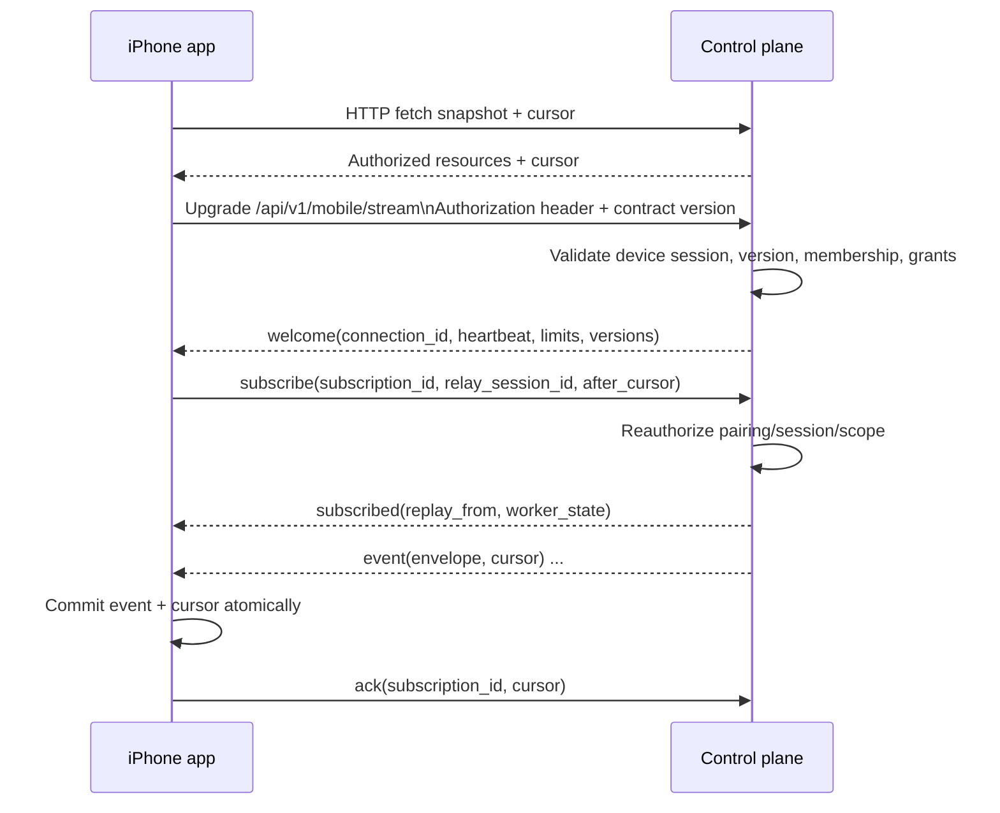
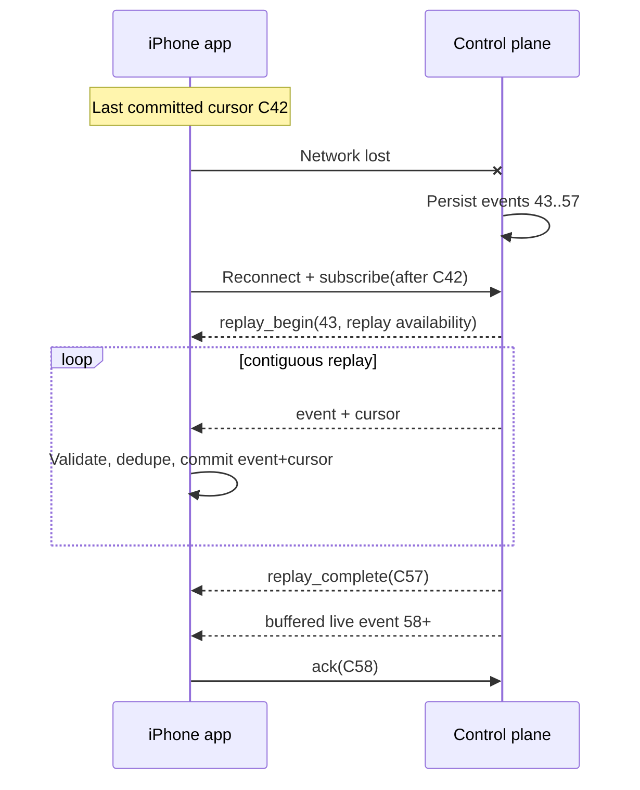
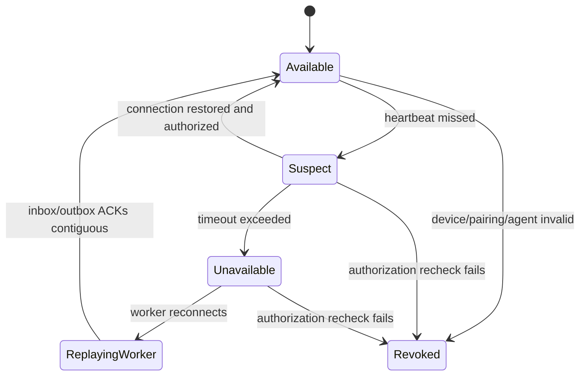
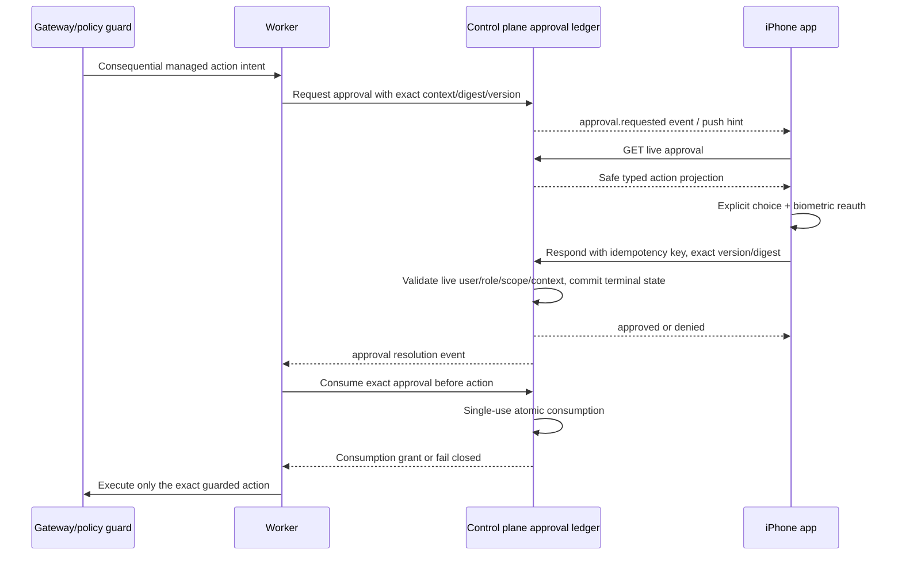

# Atlas Mobile Relay Protocol

**Protocol decision:** The control plane is the only public mobile endpoint. Workers connect outward. The iPhone uses HTTP for authoritative snapshots/commands and a foreground WebSocket for low-latency versioned events, with durable cursor replay as the correctness path.

## 1. Status legend

- **Implemented:** present in the inspected stacked backend branches.
- **Specified for M03:** required by this document and `contracts/mobile/`, but not yet implemented.
- **Deferred:** production choice or later capability; no M03 claim.

The current relay implementation proves durable command/event storage, outbound worker connection, ACK/replay, signed cursors, idempotency, encryption at rest, and narrow commands. It does **not** yet implement the phone WebSocket, APNs, distributed presence/routing, hosted production storage/keys, or a fully typed mobile-safe projection of gateway payloads.

## 2. Trust and topology invariants

1. No inbound connection to a customer worker or local gateway.
2. A phone presents a live human account assertion plus its own active enrolled-device session. A worker presents its own enrolled-device session. None is interchangeable.
3. Query-string, browser-Origin, and long-lived bearer authentication are rejected for worker/phone streams.
4. The control plane derives tenant/store/user/role/subscription/entitlement and verifies exact phone-worker pairing.
5. Only `session.create`, `prompt.submit`, and `session.interrupt` are accepted from mobile in the first text slice.
6. A worker ACKs a command only after its durable inbox commit. The control plane ACKs a worker event only after its durable event commit.
7. The iPhone treats replay, not uninterrupted WebSocket delivery, as correctness.
8. The worker must project gateway events into the allowlisted mobile schema. Raw gateway/provider/tool payloads never cross the public relay.

## 3. Implemented API inventory

All paths are relative to the control-plane origin.

| Method | Path | Purpose | Status |
|---|---|---|---|
| `GET` upgrade | `/api/v1/mobile/relay/worker/connect` | Outbound worker WebSocket using `atlas-mobile-relay-v1` | Implemented |
| `POST` | `/api/v1/mobile/relay/pairings` | Pair authenticated phone with one exact worker | Implemented |
| `POST` | `/api/v1/mobile/relay/sessions` | Create relay session and durable `session.create` command | Implemented |
| `GET` | `/api/v1/mobile/relay/sessions` | List this phone's authorized sessions | Implemented |
| `GET` | `/api/v1/mobile/relay/sessions/{id}` | Fetch session plus worker availability | Implemented |
| `POST` | `/api/v1/mobile/relay/sessions/{id}/messages` | Enqueue bounded text prompt | Implemented |
| `POST` | `/api/v1/mobile/relay/sessions/{id}/interrupts` | Enqueue interrupt | Implemented |
| `GET` | `/api/v1/mobile/relay/commands/{id}` | Resolve accepted/delivered/terminal command state | Implemented |
| `GET` | `/api/v1/mobile/relay/sessions/{id}/events` | Replay ordered events after signed opaque cursor | Implemented |
| `GET` upgrade | `/api/v1/mobile/stream` | Phone foreground event stream | Specified for M03 |
| `POST` | `/api/v1/mobile/push/registrations` | Register environment-scoped APNs token | Specified after text path; required before background slice |
| `DELETE` | `/api/v1/mobile/push/registrations/{id}` | Remove APNs registration | Specified after text path |

Identity/device endpoints are defined by WS-05 and `MOBILE_IDENTITY_AND_ENROLLMENT.md`. Approval endpoints are defined by WS-09 and the approval contract; M03 clients consume them through the same control-plane origin.

## 4. Contract and negotiation

The wire source of truth is:

- `contracts/mobile/atlas-mobile-events-v1.schema.json`
- `contracts/mobile/atlas-mobile-commands-v1.schema.json`
- `contracts/mobile/atlas-mobile-approvals-v1.schema.json`
- `contracts/mobile/atlas-mobile-errors-v1.schema.json`
- `contracts/mobile/atlas-mobile-identity-v1.schema.json`
- `contracts/mobile/atlas-mobile-stream-v1.schema.json`
- `contracts/mobile/atlas-mobile-threads-v1.schema.json`

HTTP requests send:

```text
Authorization: Bearer <short-lived-account-access>
X-Atlas-Device-Session: <short-lived-phone-device-session>
Atlas-Contract-Version: atlas.mobile.v1
Atlas-App-Version: <semantic app version/build>
Atlas-Correlation-ID: <UUID>
Idempotency-Key: <UUID or stable opaque key>   # required for commands/decisions
```

Responses return the selected contract version and a correlation ID. A server advertises supported versions from an authenticated capabilities endpoint or the stream welcome frame. M03 supports exactly `atlas.mobile.v1`; unsupported major versions fail closed with an upgrade state. Additive optional fields are permitted within v1; changing meaning, requiredness, identifiers, ordering, or redaction requires a new major contract.

### Complete mobile API surface

This is the product-facing inventory. “Implemented” refers only to the inspected stacked draft branches, not `main` or production deployment.

| Area | Endpoint / operation | Status and authority |
|---|---|---|
| Browser auth | `POST /api/v1/mobile/auth/transactions`, system authorization URL/callback, `POST /api/v1/mobile/auth/exchanges` | Specified authorization-code + PKCE transaction/exchange; provider unresolved. Current `/api/v1/dev/identity/token` is loopback development only and forbidden in shipping builds. |
| Account renewal | `POST /api/v1/mobile/auth/renewals`, `DELETE /api/v1/mobile/auth/session` | Specified proof-bound rotating handle; not implemented |
| Account context | `GET /api/v1/account/context` | Implemented; server returns user/memberships/granted stores |
| Enrollment creation | `POST /api/v1/account/enrollments` | Implemented for authenticated self-enrollment after selecting a returned granted store; assisted QR enrollment is an optional second-surface presentation |
| Enrollment redeem | `POST /api/v1/device/enrollments/redeem` | Implemented; one-time token + public key |
| Device session | `POST /api/v1/device/sessions` | Implemented; signed timestamp/nonce proof |
| Credential rotation | `POST /api/v1/device/credentials/rotate` | Implemented; replacement-key proof and version bump |
| Device discovery/revoke | `GET /api/v1/account/devices`, `POST /api/v1/account/devices/{id}/revoke` | Implemented; owner/operator and live grant checks |
| Phone self-revoke/sign-out | `DELETE /api/v1/mobile/device/self` | Specified idempotent exact-phone route so a member can remove only their own authenticated phone; not implemented |
| Worker/profile discovery | `GET /api/v1/mobile/stores/{store_id}/workers`, `GET /api/v1/mobile/stores/{store_id}/workers/{worker_id}/profiles` | Specified projection; current device/account data can be adapted but no complete phone resource exists |
| Relay pairing | `POST /api/v1/mobile/relay/pairings` | Implemented exact phone/worker/store/agent checks |
| Product threads | `GET/POST /api/v1/mobile/stores/{store_id}/threads`, `GET /api/v1/mobile/threads/{thread_id}` | Specified product facade over authoritative gateway/relay session; list supports worker/profile/state/query/cursor/limit |
| Thread lifecycle | `POST /api/v1/mobile/threads/{thread_id}/resume`, `/rename`, `/archive`, `/fork` | Specified exact version/idempotency operations; not implemented |
| Transcript | `GET /api/v1/mobile/threads/{thread_id}/events?after=&limit=` plus current relay events endpoint | Event replay implemented under relay session; product-safe snapshot/thread adapter specified |
| Messages/interrupt | `POST /api/v1/mobile/threads/{thread_id}/messages`, `/interrupts` mapping to current relay endpoints | Current narrow text/interrupt commands implemented under relay paths; product facade specified |
| Phone stream | `GET` upgrade `/api/v1/mobile/stream` | Specified for M03 |
| Approvals | `GET /api/v1/mobile/relay/approvals`, `GET .../{id}`, `POST .../{id}/responses` | Implemented on WS-09 stack |
| Reports | `GET /api/v1/mobile/reports`, `GET /api/v1/mobile/reports/{id}` | Specified safe summaries/authorized artifact metadata; not implemented |
| Notifications | `POST /api/v1/mobile/push/registrations`, `DELETE .../{id}`, `GET/PUT /api/v1/mobile/notification-preferences` | Specified phone/environment token lifecycle plus category/store scope; APNs not implemented |
| Diagnostics | `GET /api/v1/mobile/diagnostics` plus local safe bundle | Specified content-free projection; not implemented |

Thread lifecycle uses explicit version/idempotency operations rather than generic PATCH. `rename` accepts exact current version plus a 1–160 character title; `archive`/`resume` accept exact version; `fork` accepts exact version and optional server-visible source event. Search is a scoped GET over server-authorized metadata/content projection. The exact routes above are the recommendation; M03 may version them but may not substitute raw gateway RPC.

## 5. Production data model and authority

| Entity | Authority / persistence | Existing status | Mobile rule |
|---|---|---|---|
| `MobileDevice` | Control-plane transactional database | Existing `devices` records | Identifies phone class/status/owner/store; never trusts local label |
| `MobileEnrollment` | Control-plane transactional database | Existing hashed one-time enrollment | Atomically consumed; plaintext returned once |
| `MobileCredential` | Control-plane transactional database public key/thumbprint/version; private key only on device | Existing Ed25519 credential | Version/revocation checked live |
| `MobileStoreBinding` | Control-plane transactional database linking one phone identity to a current granted store | Specified migration; current phone device itself is store-bound | Server creates/removes from live membership grants; worker pairing references it |
| `AccountRenewalFamily` | Control-plane transactional database, hashed rotating handles | Specified gap | User/phone/environment bound; reuse revokes family |
| `WorkerRelayConnection` | Live relay router plus durable connection epoch/last observation | Process-local `RelayHub` today | Connection is not canonical worker health; distributed production replacement required |
| `MobileSessionBinding` | Control-plane transactional database | Existing pairing + `relay_sessions` | Exact phone/worker/agent/store relationship; gateway transcript remains authoritative |
| `RelaySubscription` | Relay live state with durable last-ack/authorization epoch where needed | Phone stream absent | Exact resource scopes, reauthorized on reconnect |
| `RelayEvent` | Encrypted durable control-plane event projection | Existing encrypted relay events | Replay projection only; not a second canonical transcript |
| `RelayCursor` | Server-signed opaque scope/position; client stores last committed value | Existing signed cursor | Cannot be forged, edited, or used across scope |
| `PushRegistration` | Control-plane transactional database, APNs token encrypted/hashed as operationally appropriate | Absent | Exact phone/app/environment, rotated/deleted |
| `ApprovalPresentation` | Managed-approval ledger in transactional database | Existing encrypted managed approval | Exact typed display/action digest/version; ledger is authority |
| `MobileAuditEvent` | Server audit store | Existing audit foundation, mobile coverage partial | Content-minimal correlation and security events; phone never owns audit truth |
| `VoiceTurn` | Thread/gateway owns submitted final text; transient audio/transcription service owns bounded processing record | Absent | Partial audio/text is not a canonical thread until explicit prompt acceptance |
| `Thread` / transcript | Existing gateway or future authoritative session service | Gateway sessions/events exist | Control plane stores only bounded relay/query projections until retention/product owners approve otherwise |

Production persistence uses transactional constraints and managed keys; table names and vendor are implementation decisions. Duplicating the complete canonical transcript into the control plane requires a separate retention/privacy/product decision and migration plan.

## 6. Mobile event envelope

Every phone-visible event conforms to `atlas.mobile.event.v1`:

```json
{
  "schema_version": "atlas.mobile.event.v1",
  "event_id": "018f...",
  "sequence": 42,
  "occurred_at": "2026-08-12T23:42:10.123Z",
  "type": "tool.progress",
  "classification": "private_content",
  "scope": {
    "organization_id": "org_...",
    "store_id": "store_...",
    "phone_device_id": "dev_phone_...",
    "worker_device_id": "dev_worker_...",
    "agent_id": "agent_...",
    "relay_session_id": "rs_...",
    "thread_id": "thread_...",
    "turn_id": "turn_...",
    "job_id": "job_...",
    "attempt_id": "attempt_..."
  },
  "correlation_id": "corr_...",
  "payload": {
    "tool_call_id": "tool_...",
    "label": "Inventory read",
    "summary": "Checking the approved source",
    "progress": 0.5
  }
}
```

Rules:

- `sequence` is monotonically increasing within one relay session. It has no cross-session meaning.
- `event_id` is globally unique and deduplicates at-least-once delivery.
- Scope IDs are server-projected; the app validates them against the authorized subscription but never uses them as standalone authority.
- `organization_id` is the mobile-facing server projection of Atlas's tenant/account organization boundary. It is never accepted as client-selected authority; internal `tenant_id` does not need to leak merely because existing services use that name.
- Missing identifiers are omitted only when semantically inapplicable; empty strings and guessed IDs are invalid.
- `classification` is `public_metadata`, `private_content`, or `restricted_action`. `secret` is not a transportable classification.
- `payload` is event-type-specific and rejects unknown properties for security-sensitive events.
- Timestamps communicate ordering context; sequence/cursor, not the phone clock, determines event order.
- The control plane may add a detached integrity/audit digest, but the phone does not become the audit authority.

## 7. Event catalog and ownership

| Event type | Mapping / implementation status | Producer of truth | v1 surface |
|---|---|---|---|
| `connection.ready` | **New relay-owned** phone welcome projected as the first sequenced event/control state | relay auth/router | Global connection |
| `worker.status` | **New relay-owned projection** of current worker connect/disconnect/heartbeat/session state | relay presence from enrolled worker | Today/banner |
| `thread.snapshot` | **New typed projection** from gateway session/history plus relay cursor | gateway/session authority | Thread bootstrap/re-anchor |
| `thread.created` | Maps implemented worker `session.created` after safe normalization | gateway via worker | Threads/Thread |
| `thread.updated` | Maps implemented `session.closed`, `session.failed`, and `status` plus new rename/archive/fork mutations | gateway/session service via worker/relay | Threads/Today/Activity |
| `message.accepted` | **New relay-owned projection** of durable prompt command acceptance (current 202/command record) | control-plane relay | Composer/delivery |
| `message.started` | Maps implemented `message.start`/`message.started` gateway projection | gateway via worker | Thread |
| `message.delta` | Maps implemented `message.delta` after safe text projection | gateway via worker | Thread |
| `message.completed` | Maps implemented `message.complete`/`message.completed` with authoritative final content/digest | gateway via worker | Thread |
| `clarification.requested` | **New typed gateway/relay projection**; no implemented mobile event yet | gateway/agent via worker | Thread waiting state |
| `tool.requested` | **New normalized projection** when an intent precedes execution | gateway/policy via worker | Thread |
| `tool.started` | Maps implemented `tool.start`/`tool.started` | gateway via worker | Thread |
| `tool.progress` | Maps implemented `tool.progress` | gateway via worker | Thread |
| `tool.completed` | Maps implemented `tool.complete`/`tool.completed` | gateway via worker | Thread |
| `tool.failed` | **New normalized failure projection** from tool/error events | gateway via worker | Thread/Activity |
| `turn.interrupted` | Maps implemented interrupt command plus terminal gateway/session event | gateway via worker | Thread/Activity |
| `command.delivered` | Maps implemented relay ACK after worker inbox commit; diagnostic, not execution | relay | Diagnostics |
| `command.uncertain` | Maps implemented worker local-gateway unknown-outcome guard | worker adapter | Blocking Thread state |
| `approval.requested` | Maps implemented WS-09 durable approval event | managed-approval ledger | Today/Thread/Activity |
| `approval.resolved` | Maps implemented WS-09 resolved event; payload state distinguishes approved/denied | managed-approval ledger | Approval/Activity |
| `approval.expired` | Maps implemented WS-09 expiry transition/read-time reconciliation | managed-approval ledger | Approval/Activity |
| `approval.canceled` | Maps implemented WS-09 context cancellation | managed-approval ledger | Approval/Activity |
| `approval.consumed` | Maps implemented WS-09 single-use consume | managed-approval ledger | Thread/Activity |
| `voice.transcript.partial` | **New voice-service relay event**; immediate second slice | selected speech service | Voice |
| `voice.transcript.final` | **New voice-service relay event**; final text remains reviewable before prompt | selected speech service | Voice/composer |
| `audio.started` | **New response-audio event**; later voice slice | voice response service | Voice |
| `audio.completed` | **New response-audio event**; stopping audio has no worker effect | voice response service | Voice |
| `background.completed` | **New relay-owned projection** of a terminal thread/job while app is backgrounded; “background” is presentation context | gateway/job authority | Push/Today/Activity |
| `job.failed` | **New typed control-plane/gateway projection** from current job/audit failure state | job/gateway authority | Today/Activity |
| `policy.denied` | **New safe projection** from existing policy/managed guard denial | policy engine | Thread/Activity |
| `report.available` | **New report-service projection**; synthetic report fixture does not create a real artifact | report/session authority | Today/Activity |
| `access.revoked` | **New identity/relay-owned projection** followed by stream closure; no protected payload | control-plane identity | Global lock |
| `error` | **New relay-owned safe error projection** from typed source failures; never raw exception data | responsible service via relay | Affected feature |

The inspected worker currently allowlists a smaller set (`session.*`, `message.*`, `status`, and `tool.*`) but forwards broadly shaped gateway payloads after type/size checks. M03 must replace that boundary with explicit typed projections above before a physical-device end-to-end claim.

## 8. Phone WebSocket establishment



Requirements:

- TLS `wss` only outside loopback tests; OS trust evaluation; no token in URL, subprotocol, cookie, or diagnostic text.
- Upgrade request uses a live human account access credential and exact phone device session, matching the implemented phone API security boundary. Expiry triggers an explicit `auth_expiring` control frame, then close. The app renews and opens a new connection; in-band token replacement is omitted from v1 to reduce state ambiguity.
- One connection is bound to the selected server-authorized organization and can carry bounded subscriptions within it. A subscription names one server-returned relay session and last durable cursor; organization changes require a new connection.
- Welcome includes maximum frame size, maximum subscriptions, heartbeat interval/timeout, server time, selected contract version, and replay-availability start—not a silent retention promise.
- Client ACKs highest contiguous committed cursor. ACK is for flow control/observability; server durability does not depend on phone ACK.
- Control frames and event frames are discriminated and schema validated. Unknown control frames close with `unsupported_contract`.
- On deploy/maintenance the server sends `server.drain(deadline, reconnect_after_seconds)`, stops accepting new subscriptions, finishes or cursor-anchors in-flight replay, then closes. The app commits its last contiguous cursor and reconnects with jitter; it never interprets a drain as worker failure.

## 9. Command submission

Phone commands use HTTP so durable acceptance is unambiguous even when the foreground socket is reconnecting.

```json
{
  "schema_version": "atlas.mobile.command.v1",
  "command_id": "client_uuid",
  "type": "prompt.submit",
  "relay_session_id": "rs_...",
  "payload": { "text": "Check the latest inventory variance." }
}
```

- `Idempotency-Key` is required, maximum 160 characters in the current implementation, unique within phone/operation scope, and stored durably with the command result.
- Text is non-empty UTF-8, maximum 16,000 characters. Control characters and invalid Unicode are rejected.
- Current queue limits: 32 pending commands per worker, 8 in flight. Server returns 429 with `Retry-After`; the app does not add a hidden client queue.
- `202 Accepted` means the control plane durably owns the command, not that the worker/gateway ran it.
- A repeat with the same key and identical request returns the original resource. Same key/different digest returns conflict.
- `session.interrupt` targets one active relay session/turn if supplied. It cannot undo an already-completed external action.
- No arbitrary RPC name, tool name, model/provider setting, raw gateway payload, file path, URL, or shell command is accepted from mobile.

## 10. Durable worker delivery

The implemented `atlas-mobile-relay-v1` worker channel is retained conceptually:

1. Worker opens an outbound authenticated WebSocket for one exact enrolled worker/agent; query auth and browser origins are rejected.
2. In its hello/capabilities exchange it advertises worker build, relay protocol versions, supported mobile event majors, gateway adapter version, and server-granted capabilities. The server intersects these with the live enrolled agent/store/entitlement; advertising never grants authority.
3. The server selects a compatible version and routes only pairings/sessions for that exact worker/agent/store. This is the worker's authorized subscription; it cannot name a different user/store queue.
4. Control plane assigns sequenced durable commands within bounded inflight capacity.
5. Worker validates envelope, scope, selected version, command allowlist, size, and local store health.
6. Worker writes command to its encrypted local SQLite inbox using a unique command/idempotency constraint.
7. Only after commit does it ACK delivery.
8. Adapter opens/resumes the exact loopback gateway session and maps only the three mobile commands to explicit gateway requests.
9. Adapter maps allowlisted gateway events into the typed/redacted mobile schema, writes encrypted outbox, and sends.
10. Control plane commits/deduplicates the event before ACK.
11. Unacked commands/events replay after reconnect/restart; local inbox/outbox recovery precedes new delivery.
12. Worker reports graceful drain/disconnect; heartbeat loss produces a relay-owned timestamped status. Revocation or supersession closes it and cancels authority, not just the socket.

The worker local gateway is loopback-only; auth/key files must be regular non-symlink files with mode 0600. Worker storage uses WAL/FULL durability. The current process-secret/private-key-derived encryption is sufficient only for the isolated slice; production requires managed keys and documented rotation.

## 11. Idempotency and uncertain outcomes

End-to-end exactly-once execution cannot be claimed while the existing local gateway lacks an idempotency key. The safe contract is:

- exactly-once durable acceptance per phone idempotency scope;
- at-least-once relay delivery with command/event deduplication;
- worker inbox single dispatch while the process is healthy;
- if the worker crashes after marking execution started but before recording the gateway outcome, mark the command `uncertain`, emit `command.uncertain`, and do **not** replay automatically.

M03 UI blocks blind Retry and provides correlation ID/verification guidance. Production-shaped exactly-once semantics require the gateway to accept and persist a command idempotency key or a read-after-write outcome resolver.

## 12. Reconnect and replay



- Backoff uses full jitter, e.g. 0.5s base doubling to 30s while foreground; network-path changes may trigger one immediate attempt.
- Authentication, revocation, contract, and forbidden failures are non-retryable without state change.
- If a cursor is valid but older than server replay availability, return `cursor_expired` with snapshot endpoint and earliest available time. App discards the affected cached projection only after a successful replacement snapshot.
- Production replay/retention duration is unresolved and owner-approved. M03 may use an explicitly labeled test configuration; it must not become an undocumented product promise.
- Duplicated `event_id` is ignored after envelope/scope validation. Same ID/different digest is a security error.
- Sequence gap pauses live rendering and invokes replay. A later event is never shown as though the gap did not exist.

## 13. Worker disconnection behavior



- Presence is currently process-local and therefore not production-safe. M03 isolated deployment may run one relay instance and must label that limitation.
- A missed heartbeat first becomes suspect; the server stops new delivery at the configured threshold and projects timestamped unavailability.
- Commands already accepted remain durable. The phone may view state but cannot pretend they were delivered or run.
- Queue-full returns rate limit before acceptance. No phone-side automatic submission after reconnection.
- Revocation closes the channel and invalidates pairings/sessions/pending command authority; it is not an availability condition.

## 14. Managed approval flow



Unknown managed tools fail `ACTION_UNCLASSIFIED`. `read`/`navigate`/`analyze`/`draft` are non-consequential under `atlas.managed-action.v1`; `download_export`/`send_message`/`submit`/`mutate`/`credential`/`administrative` require approval. The current end-to-end fixture is synthetic export with `artifact_created=false` and `external_write=false`. Real connectors remain out of M03.

## 15. Backpressure and limits

| Limit | M03 contract |
|---|---|
| Prompt text | 16,000 UTF-8 characters |
| Idempotency key | 1–160 characters |
| Worker/mobile event serialized size | 128 KiB maximum |
| Pending worker commands | 32 |
| Inflight worker commands | 8 |
| Replay/list page | 200 maximum |
| Worker local event queue | 1,024 before explicit overflow failure |
| Phone subscriptions/connection | Server-advertised; M03 recommended cap 8, not a production policy |

- Server sends 429 with integer `Retry-After` and stable error code.
- Stream server may pause event emission when unacked bytes exceed advertised window, then close with resumable cursor rather than dropping events silently.
- `message.delta` may be coalesced by the projection layer, but the final message digest/content is authoritative.
- Slow phone consumers are disconnected with a safe reason and resume by cursor.
- Oversize gateway events are rejected/quarantined at the worker adapter and create a safe `tool.failed` or `session.failed` projection where semantically valid; raw data is not truncated into misleading success.

## 16. Redaction and mobile-safe projection

The worker adapter owns a deny-by-default transformation:

- allowlist event types and per-type fields;
- normalize safe status/error enums;
- replace tool/provider names with approved product labels where needed;
- omit secrets, credentials, authorization headers, cookies, private URLs, file paths, shell commands, environment values, raw model frames, internal traces, and connector records;
- cap strings/arrays/nesting and reject control characters/HTML;
- render Markdown through a restrictive client parser with links disabled or allowlisted; never render arbitrary HTML;
- compute a digest of the source event for audit correlation without sending source data;
- classify each event and prohibit `secret` from the public relay.

If projection fails, emit a content-free security/unsupported error with correlation ID and retain the source only under server/worker retention and access policy. Never fall back to raw forwarding.

## 17. Push and background completion

APNs payload is an opaque hint:

```json
{
  "aps": { "alert": { "title": "Atlas needs your attention", "body": "Open Atlas to review." }, "category": "ATLAS_APPROVAL" },
  "environment": "internal-isolated",
  "resource_type": "approval",
  "resource_id": "appr_opaque",
  "event_id": "evt_opaque"
}
```

No message text, store/customer name, tool argument, action argument, token, cursor, or secret enters the payload. On tap, the app selects the matching immutable environment, authenticates, fetches, and authorizes before rendering. Notification content policy and opt-in defaults require product/privacy approval.

## 18. Error contract

All HTTP/stream errors use `atlas.mobile.error.v1` with stable code, safe message, correlation ID, retryability, optional `retry_after_seconds`, and typed safe details. Required codes include:

- `AUTH_REQUIRED`, `SESSION_EXPIRED`, `DEVICE_REVOKED`, `MEMBERSHIP_REVOKED`;
- `SCOPE_FORBIDDEN`, `PAIRING_REVOKED`, `WORKER_UNAVAILABLE`;
- `IDEMPOTENCY_CONFLICT`, `QUEUE_FULL`, `RATE_LIMITED`;
- `CURSOR_INVALID`, `CURSOR_EXPIRED`, `EVENT_GAP`;
- `ACTION_UNCLASSIFIED`, `APPROVAL_STALE`, `APPROVAL_EXPIRED`;
- `OUTCOME_UNCERTAIN`, `UNSUPPORTED_CONTRACT`, `PAYLOAD_TOO_LARGE`.

Messages are safe for the user but not relied upon programmatically. Debug details are absent from production responses.

## 19. M03 relay acceptance

- Contract fixtures generate/validate both Swift and Python types and reject unknown sensitive fields.
- Physical iPhone → hosted isolated control plane → outbound worker → loopback gateway round trip is proven with correlated IDs.
- Kill/relaunch, Wi-Fi/cellular transition, forced packet loss, duplicate frame, reordered frame, cursor expiry, worker disconnect/reconnect, relay restart, and access revocation all produce deterministic truthful UI.
- Duplicate prompt with the same key executes at most once under the tested healthy gateway path; executing-crash path becomes uncertain and never auto-replays.
- Cross-phone, cross-user, cross-tenant, cross-store, wrong-worker, expired session, revoked pairing, and unauthorized subscription tests fail closed.
- No raw gateway payload or prohibited secret field crosses a captured relay boundary.
- The exact implemented-versus-specified gaps above are closed or explicitly block the slice; no documentation-only phone stream is presented as implemented.
